# svg-flags

Clean, Xcode-compatible SVG flags with official colors in multiple shapes.

**[Browse the gallery](https://motomatic-llc.github.io/svg-flags)**

## Why this exists

I use [HatScripts/circle-flags](https://github.com/HatScripts/circle-flags) in many different projects — it's a fantastic collection of 400+ minimal circular SVG flags. But I keep running into the same issues:

**Xcode can't render them.** The circle-flags SVGs use `<mask>` elements for circular clipping. Xcode's SVG renderer has limited support — it doesn't handle masks, CSS `<style>` blocks, or complex filters. Importing these into an Xcode asset catalog produces blank or broken images. This project uses `<clipPath>` instead, which Xcode handles correctly.

**Circle shape isn't always enough.** Circular flags work great for profile badges and map markers, but many UI contexts call for rectangular flags — table rows, settings screens, country pickers, informational displays. This project provides multiple shape variants from simplified icons to full-detail flags.

**Colors are simplified.** circle-flags maps every flag to an 11-color palette for visual consistency. That's a reasonable design choice, but it means the US flag uses `#d80027` instead of Old Glory Red `#B31942`, and `#0052b4` instead of Old Glory Blue `#0A3161`. This project uses the actual official flag colors, sourced from Wikipedia/Wikimedia Commons SVGs, and documents every color below.

**Symlinks cause problems.** The language flags in circle-flags are symlinks pointing to country flags. Symlinks break in Xcode asset catalogs, some npm packaging, and cross-platform workflows. This project duplicates files instead — every flag is a standalone SVG.

## Credits

This project is based on and inspired by [HatScripts/circle-flags](https://github.com/HatScripts/circle-flags), which is MIT licensed. The SVG geometry for circle and rect variants was adapted from that project, with modifications for Xcode compatibility and official color accuracy. Full-size variants are based on Wikimedia Commons SVGs.

## Variants

| Variant | Directory | Source | Description |
|---------|-----------|--------|-------------|
| Circle | `circle/` | circle-flags | 512×512 circular flags, `<mask>` → `<clipPath>`, real colors |
| Rect | `rect/` | circle-flags | 512×512 square, circle-flags geometry without circular clip |
| Full-size simplified | `full-size-simplified/` | circle-flags | True aspect ratio, simplified geometry for complicated flags, real colors |
| Full-size | `full-size/` | Wikipedia | True proportions & detail, based on Wikimedia Commons SVGs |

**circle** and **rect** use the same simplified geometry from circle-flags — just with official colors and Xcode-compatible SVG elements. **full-size-simplified** uses that geometry at the flag's true aspect ratio. **full-size** uses the actual detailed flag SVGs from Wikipedia with proper proportions and accurate geometry.

## Border

Circle and rect variants of mostly-white flags (like Japan) include a subtle grey border ( `#cdcfd3`) to prevent them from disappearing into white backgrounds.

The border is inside the `<clipPath>` group so only the inner half of the stroke is visible — the flag stays full-size. It's marked with a `<!-- border -->` comment:

```xml
<!-- border --><circle cx="256" cy="256" r="256" fill="none" stroke="#cdcfd3" stroke-width="4"/>
```

To remove it, delete the line or strip all borders with:

```bash
sed -i '' '/<!-- border -->/d' circle/**/*.svg rect/**/*.svg
```

## Structure

```
svg-flags/
├── circle/
│   ├── countries/     # UN member states (ISO 3166-1 alpha-2)
│   ├── other/
│   │   ├── locales/   # Non-UN places (tw.svg, northern-cyprus.svg, ...)
│   │   └── orgs/      # Organizations & symbols (nato.svg, un.svg, ...)
│   ├── historical/    # Former states (confederacy.svg, ussr.svg, ...)
│   ├── states/        # Subdivisions (us/ca.svg, us/ny.svg, ...)
│   └── languages/     # Language codes (en.svg, es.svg, ...)
├── rect/
│   └── (same subcategories)
├── full-size-simplified/
│   └── (same subcategories)
├── full-size/
│   └── (same subcategories)
└── index.html         # Visual gallery (open in browser)
```

## Categories

- **countries/** — UN member states, using [ISO 3166-1 alpha-2](https://en.wikipedia.org/wiki/ISO_3166-1_alpha-2) codes
- **other/** — Two subcategories:
  - **other/locales/** — Places with widely recognized flags that are not UN member states (e.g. Taiwan, Northern Cyprus, Kosovo)
  - **other/orgs/** — Organizations, symbols, and novelty flags (e.g. NATO, UN, Olympics, checkered flag)
- **historical/** — Flags of former states and defunct entities (e.g. Confederate battle flag, Soviet Union, Prussia)
- **states/** — Subnational divisions (e.g. US states, Canadian provinces), using [ISO 3166-2](https://en.wikipedia.org/wiki/ISO_3166-2) codes
- **languages/** — Language flags (duplicated files, not symlinks)

## Progress

### Countries (UN member states)

| Code | Name | Circle | Rect | Simplified | Full-size | Colors | Source |
|------|------|:------:|:----:|:----------:|:---------:|--------|--------|
| `fr` | [France](https://en.wikipedia.org/wiki/France) | 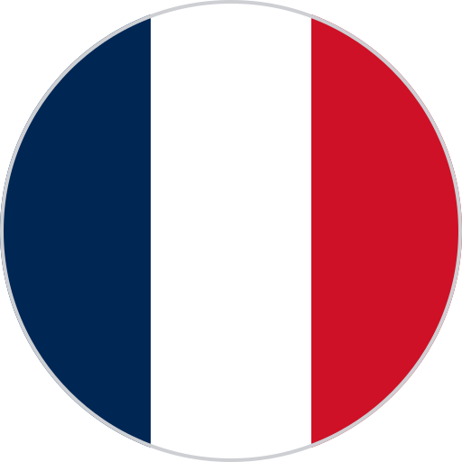 |  | [✓](full-size-simplified/countries/fr.svg) | [✓](full-size/countries/fr.svg) | &nbsp;`#002654`<br>&nbsp;`#CE1126` | [Wikipedia](https://en.wikipedia.org/wiki/File:Flag_of_France.svg) |
| `de` | [Germany](https://en.wikipedia.org/wiki/Germany) | 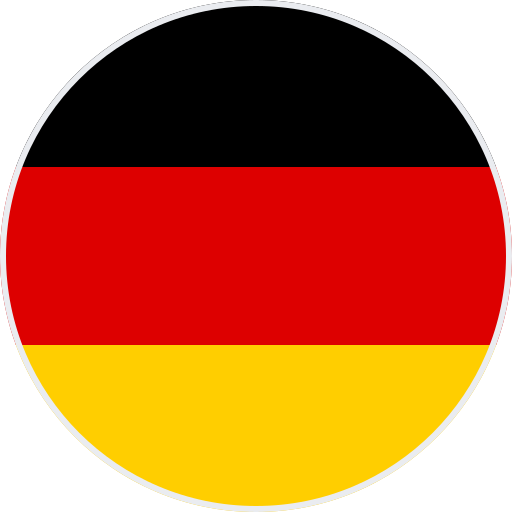 |  | [✓](full-size-simplified/countries/de.svg) | [✓](full-size/countries/de.svg) | &nbsp;`#000000`<br>&nbsp;`#DD0000`<br>&nbsp;`#FFCE00` | [Wikipedia](https://en.wikipedia.org/wiki/File:Flag_of_Germany.svg) |
| `jp` | [Japan](https://en.wikipedia.org/wiki/Japan) | 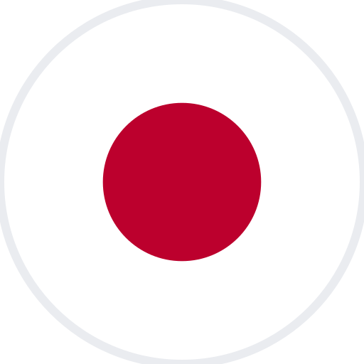 |  | [✓](full-size-simplified/countries/jp.svg) | [✓](full-size/countries/jp.svg) | &nbsp;`#BC002D` | [Wikipedia](https://en.wikipedia.org/wiki/File:Flag_of_Japan.svg) |
| `gb` | [United Kingdom](https://en.wikipedia.org/wiki/United_Kingdom) | 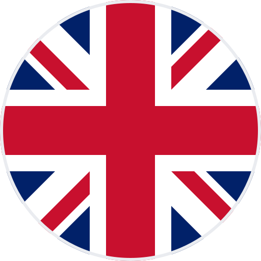 | 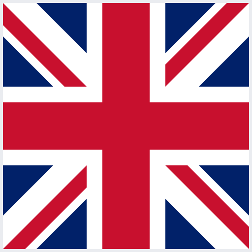 | [✓](full-size-simplified/countries/gb.svg) | [✓](full-size/countries/gb.svg) | &nbsp;`#C8102E`<br>&nbsp;`#012169` | [Wikipedia](https://en.wikipedia.org/wiki/File:Flag_of_the_United_Kingdom.svg) |
| `us` | [United States](https://en.wikipedia.org/wiki/United_States) | 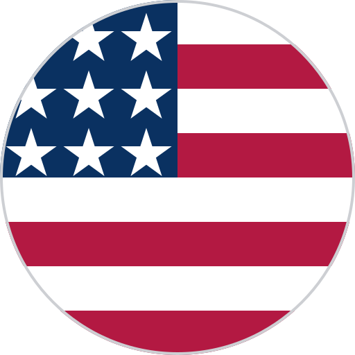 | 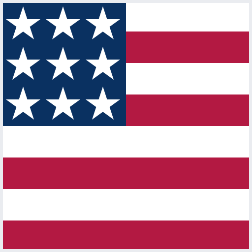 | [✓](full-size-simplified/countries/us.svg) | [✓](full-size/countries/us.svg) | &nbsp;`#B31942`<br>&nbsp;`#0A3161` | [Wikimedia](https://commons.wikimedia.org/wiki/File:Flag_of_the_United_States.svg) |
| `ar` | [Argentina](https://en.wikipedia.org/wiki/Argentina) | | | | | | |
| `au` | [Australia](https://en.wikipedia.org/wiki/Australia) | | | | | | |
| `br` | [Brazil](https://en.wikipedia.org/wiki/Brazil) | | | | | | |
| `ca` | [Canada](https://en.wikipedia.org/wiki/Canada) | | | | | | |
| `cn` | [China](https://en.wikipedia.org/wiki/China) | | | | | | |
| `in` | [India](https://en.wikipedia.org/wiki/India) | | | | | | |
| `ie` | [Ireland](https://en.wikipedia.org/wiki/Republic_of_Ireland) | | | | | | |
| `it` | [Italy](https://en.wikipedia.org/wiki/Italy) | | | | | | |
| `mx` | [Mexico](https://en.wikipedia.org/wiki/Mexico) | | | | | | |
| `nl` | [Netherlands](https://en.wikipedia.org/wiki/Netherlands) | | | | | | |
| `nz` | [New Zealand](https://en.wikipedia.org/wiki/New_Zealand) | | | | | | |
| `no` | [Norway](https://en.wikipedia.org/wiki/Norway) | | | | | | |
| `pl` | [Poland](https://en.wikipedia.org/wiki/Poland) | | | | | | |
| `pt` | [Portugal](https://en.wikipedia.org/wiki/Portugal) | | | | | | |
| `ru` | [Russia](https://en.wikipedia.org/wiki/Russia) | | | | | | |
| `za` | [South Africa](https://en.wikipedia.org/wiki/South_Africa) | | | | | | |
| `kr` | [South Korea](https://en.wikipedia.org/wiki/South_Korea) | | | | | | |
| `es` | [Spain](https://en.wikipedia.org/wiki/Spain) | | | | | | |
| `se` | [Sweden](https://en.wikipedia.org/wiki/Sweden) | | | | | | |
| `ch` | [Switzerland](https://en.wikipedia.org/wiki/Switzerland) | | | | | | |

### Other locales (non-UN entities)

| Code | Name | Circle | Rect | Simplified | Full-size | Colors | Source |
|------|------|:------:|:----:|:----------:|:---------:|--------|--------|
| `xk` | [Kosovo](https://en.wikipedia.org/wiki/Kosovo) | | | | | | |
| `northern-cyprus` | [Northern Cyprus](https://en.wikipedia.org/wiki/Northern_Cyprus) | | | | | | |
| `tw` | [Taiwan](https://en.wikipedia.org/wiki/Taiwan) | | | | | | |

### Organizations & symbols

| Code | Name | Circle | Rect | Simplified | Full-size | Colors | Source |
|------|------|:------:|:----:|:----------:|:---------:|--------|--------|
| `checkered` | [Checkered flag](https://en.wikipedia.org/wiki/Racing_flags#Chequered_flag) | 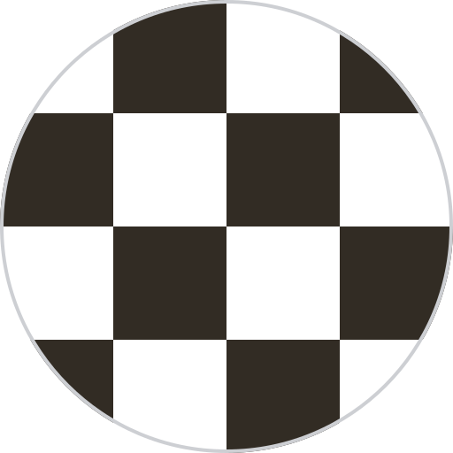 |  | | | &nbsp;`#000000` | — |
| `nato` | [NATO](https://en.wikipedia.org/wiki/NATO) |  |  | | | &nbsp;`#004990` | [Wikipedia](https://en.wikipedia.org/wiki/File:NATO_flag.svg) |
| `olympics` | [Olympics](https://en.wikipedia.org/wiki/Olympic_symbols) | 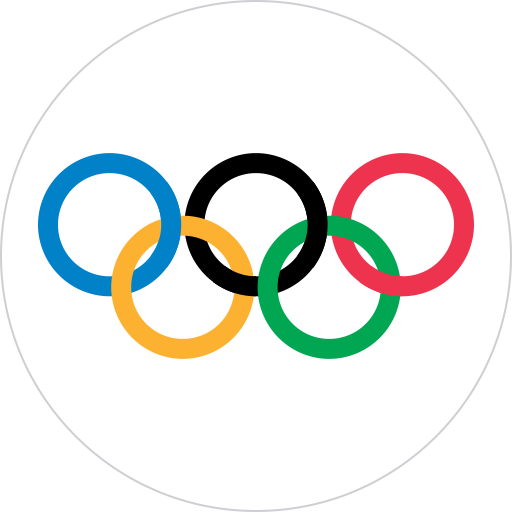 |  | | | &nbsp;`#0081C8`<br>&nbsp;`#EE334E`<br>&nbsp;`#FCB131`<br>&nbsp;`#00A651` | [Wikipedia](https://en.wikipedia.org/wiki/File:Olympic_flag.svg) |
| `un` | [United Nations](https://en.wikipedia.org/wiki/United_Nations) |  |  | | | &nbsp;`#009EDB` | [Wikipedia](https://en.wikipedia.org/wiki/File:Flag_of_the_United_Nations.svg) |

### US states

| Code | Name | Circle | Rect | Simplified | Full-size | Colors | Source |
|------|------|:------:|:----:|:----------:|:---------:|--------|--------|
| `us/ca` | [California](https://en.wikipedia.org/wiki/California) | 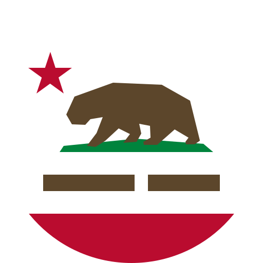 | 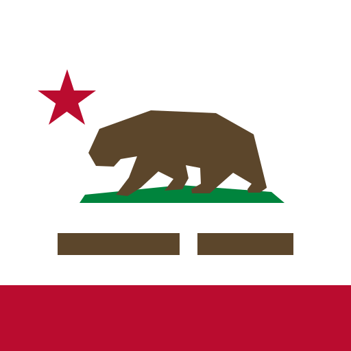 | [✓](full-size-simplified/states/us/ca.svg) | [✓](full-size/states/us/ca.svg) | &nbsp;`#BA0C2F`<br>&nbsp;`#5C462B`<br>&nbsp;`#00843D`<br>&nbsp;`#B58150` | [Wikimedia](https://commons.wikimedia.org/wiki/File:Flag_of_California.svg) |

### Historical

| Code | Name | Circle | Rect | Simplified | Full-size | Colors | Source |
|------|------|:------:|:----:|:----------:|:---------:|--------|--------|
| `confederacy` | [Confederate battle flag](https://commons.wikimedia.org/wiki/File:Battle_flag_of_the_Confederate_States_of_America_(3-5).svg) | 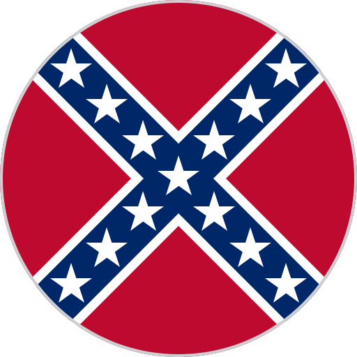 |  | [✓](full-size-simplified/historical/confederacy.svg) | [✓](full-size/historical/confederacy.svg) | &nbsp;`#bf0a30`<br>&nbsp;`#002868` | [Wikimedia](https://commons.wikimedia.org/wiki/File:Battle_flag_of_the_Confederate_States_of_America_(3-5).svg) |

## SVG Design Rules

All SVGs in this project follow these rules for maximum compatibility:

- No `<mask>` elements (Xcode doesn't support them)
- No `<style>` tags or CSS
- No `class` attributes
- No `<use>` / `xlink:href` references (Xcode has inconsistent support)
- No symlinks — every file is standalone
- Circle variants use `<clipPath>` with `<circle>` for clipping
- All styling via inline `fill` attributes
- `viewBox`-based sizing for clean scaling
- Official flag colors sourced from [Wikipedia](https://en.wikipedia.org/wiki/Main_Page)/[Wikimedia Commons](https://commons.wikimedia.org/) SVGs (see Colors column in progress tables)

## Usage

### Xcode Asset Catalog

Drag any SVG directly into your asset catalog. Works out of the box — no conversion needed.

### SwiftUI

```swift
Image("us") // after adding to asset catalog
```

### HTML

```html

```

## License

MIT — see [LICENSE](LICENSE). Based on [circle-flags](https://github.com/HatScripts/circle-flags) by HatScripts.
