# svg-flags

Clean, Xcode-compatible SVG flags with official colors in multiple shapes.

**[Browse the gallery](https://ciscoriordan.github.io/svg-flags)**

## Table of contents

- [Why this exists](#why-this-exists)
- [Credits](#credits)
- [Variants](#variants)
- [Xcode compatibility](#xcode-compatibility)
- [Border](#border)
- [Structure](#structure)
- [Categories](#categories)
- [Progress](#progress)
  - [Countries (UN member states)](#countries-un-member-states)
  - [Languages](#languages)
  - [Other locales (non-UN entities)](#other-locales-non-un-entities)
  - [Organizations & symbols](#organizations--symbols)
  - [Subdivisions (ISO 3166-2)](#subdivisions-iso-3166-2)
  - [Historical](#historical)
- [SVG Design Rules](#svg-design-rules)
- [Usage](#usage)
- [License](#license)

## Why this exists

I use [HatScripts/circle-flags](https://github.com/HatScripts/circle-flags) in many different projects — it's a fantastic collection of 400+ minimal circular SVG flags. But I keep running into the same issues:

**Xcode can't render them.** The circle-flags SVGs use `<mask>` elements for circular clipping. Xcode's SVG renderer has limited support — it doesn't handle masks, CSS `<style>` blocks, or complex filters. Importing these into an Xcode asset catalog produces blank or broken images. This project uses `<clipPath>` instead, which Xcode handles correctly.

**Circle shape isn't always enough.** Circular flags work great for profile badges and map markers, but many UI contexts call for rectangular flags — table rows, settings screens, country pickers, informational displays. This project provides multiple shape variants from simplified icons to full-detail flags.

**Colors are simplified.** circle-flags maps every flag to an 11-color palette for visual consistency. That's a reasonable design choice, but it means the US flag uses `#d80027` instead of Old Glory Red `#B31942`, and `#0052b4` instead of Old Glory Blue `#0A3161`. This project uses the actual official flag colors, sourced from Wikipedia/Wikimedia Commons SVGs, and documents every color below.

| svg-flags | circle-flags |
|:---:|:---:|
|  |  |
| Official colors  | Simplified palette  |

**Symlinks cause problems.** The language flags in circle-flags are symlinks pointing to country flags. Symlinks break in Xcode asset catalogs, some npm packaging, and cross-platform workflows. This project duplicates files instead — every flag is a standalone SVG.

## Credits

This project is based on and inspired by [HatScripts/circle-flags](https://github.com/HatScripts/circle-flags), which is MIT licensed. Circle variant geometry was adapted from that project, with `<mask>` replaced by `<clipPath>` for Xcode compatibility and official colors replacing the simplified palette. Square variant geometry comes from [kapowaz/square-flags](https://github.com/kapowaz/square-flags), again with official Wikipedia colors. Full-size variants are based on Wikimedia Commons SVGs.

## Variants

| Variant | Directory | Source | Description |
|---------|-----------|--------|-------------|
| Circle | `circle/` | circle-flags | 512×512 circular flags, `<mask>` → `<clipPath>`, real colors |
| Square | `square/` | square-flags | 512×512 square, square-flags geometry with official colors |
| Full-size simplified | `full-size-simplified/` | square-flags | True aspect ratio, simplified geometry for complicated flags, real colors |
| Full-size | `full-size/` | Wikipedia | True proportions & detail, based on Wikimedia Commons SVGs |

**circle** uses simplified geometry from circle-flags, **square** and **full-size-simplified** use geometry from square-flags — all with official Wikipedia colors and Xcode-compatible SVG elements. **full-size** uses the actual detailed flag SVGs from Wikimedia Commons with proper proportions and accurate geometry.

## Xcode compatibility

Xcode's SVG renderer has limited support compared to browsers. These SVGs are cleaned to avoid elements Xcode can't handle:

- **No `<mask>`** — replaced with `<clipPath>` (circle and square variants)
- **No `<style>` or CSS** — all styling uses inline `fill`/`stroke` attributes
- **No `<use>` or `xlink:href`** — Wikimedia SVGs often define a shape once (e.g. a star) in `<defs>` and then reference it multiple times with `<use xlink:href="#id" x="..." y="..." transform="...">`. Xcode doesn't support `<use>`, so every instance is expanded into an inline copy with the correct `transform="translate(x,y)"` or `transform="rotate(N)"`. Recursive `<use>` patterns (where elements reference other compound elements to build up star rings, sun rays, wheel spokes, etc.) are fully unrolled.
- **No symlinks** — language flags are duplicated files, not symlinks

## Border

Circle and square variants of mostly-white flags (like Japan) include a subtle grey border (`#cdcfd3`) to prevent them from disappearing into white backgrounds.

The border is inside the `<clipPath>` group so only the inner half of the stroke is visible — the flag stays full-size. It's marked with a `<!-- border -->` comment:

```xml
<!-- border --><circle cx="256" cy="256" r="256" fill="none" stroke="#cdcfd3" stroke-width="4"/>
```

To remove it, delete the line or strip all borders with:

```bash
sed -i '' '/<!-- border -->/d' circle/**/*.svg square/**/*.svg
```

## Structure

```
svg-flags/
├── circle/
│   ├── countries/     # UN member states (ISO 3166-1 alpha-2)
│   ├── other/
│   │   ├── locales/   # Non-UN places (tw.svg, northern-cyprus.svg, ...)
│   │   └── orgs/      # Organizations & symbols (nato.svg, un.svg, ...)
│   ├── historical/    # Former states (confederacy.svg, ussr.svg, ...)
│   ├── states/        # Subdivisions (us-ca.svg, us-ny.svg, ...)
│   └── languages/     # Language codes (en.svg, es.svg, ...)
├── square/
│   └── (same subcategories)
├── full-size-simplified/
│   └── (same subcategories)
├── full-size/
│   └── (same subcategories)
└── index.html         # Visual gallery (open in browser)
```

## Categories

- **countries/** — UN member states, using [ISO 3166-1 alpha-2](https://en.wikipedia.org/wiki/ISO_3166-1_alpha-2) codes
- **other/** — Two subcategories:
  - **other/locales/** — Places with widely recognized flags that are not UN member states (e.g. Taiwan, Northern Cyprus, Kosovo)
  - **other/orgs/** — Organizations, symbols, and novelty flags (e.g. NATO, UN, Olympics, F1 chequered flag)
- **historical/** — Flags of former states and defunct entities (e.g. Confederate battle flag, Soviet Union, Prussia)
- **states/** — Subdivisions ([ISO 3166-2](https://en.wikipedia.org/wiki/ISO_3166-2)), grouped by country code prefix (e.g. `ca-bc`, `us-ca`)
- **languages/** — Language flags (duplicated files, not symlinks)

## Progress

### Countries (UN member states)

| Code | Name | Circle | Square | Simplified | Full-size | Colors |
|------|------|:------:|:----:|:----------:|:---------:|--------|
| `fr` | [France](https://en.wikipedia.org/wiki/France) |  | 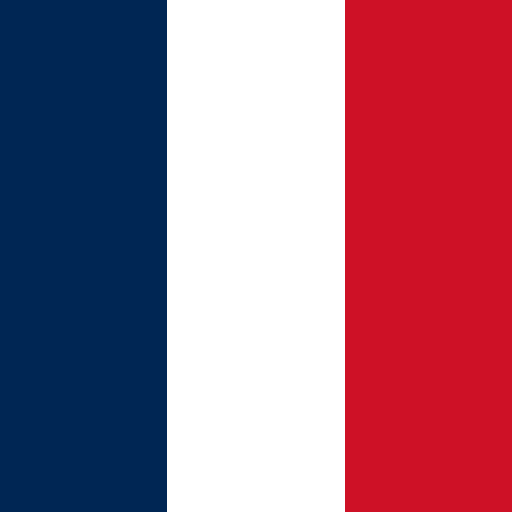 |  | [✓](full-size/countries/fr.svg) | [`#002654`](https://en.wikipedia.org/wiki/File:Flag_of_France.svg)<br>[`#FFFFFF`](https://en.wikipedia.org/wiki/File:Flag_of_France.svg)<br>[`#CE1126`](https://en.wikipedia.org/wiki/File:Flag_of_France.svg) |
| `gr` | [Greece](https://en.wikipedia.org/wiki/Greece) | 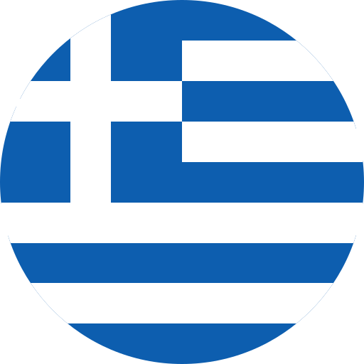 |  | 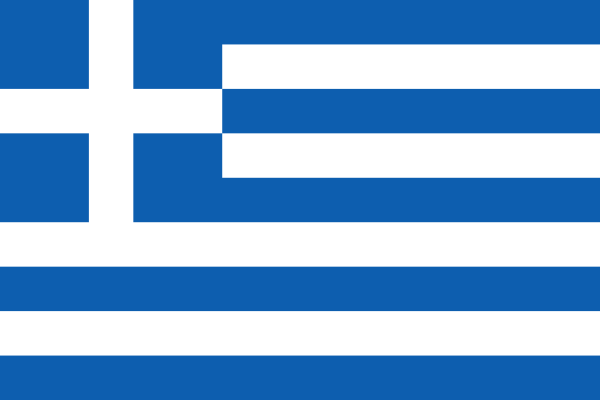 | [✓](full-size/countries/gr.svg) | [`#0D5EAF`](https://en.wikipedia.org/wiki/File:Flag_of_Greece.svg)<br>[`#FFFFFF`](https://en.wikipedia.org/wiki/File:Flag_of_Greece.svg) |
| `de` | [Germany](https://en.wikipedia.org/wiki/Germany) |  | 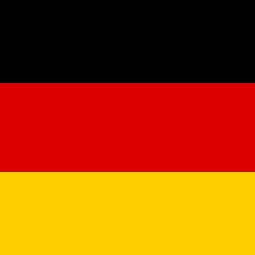 | 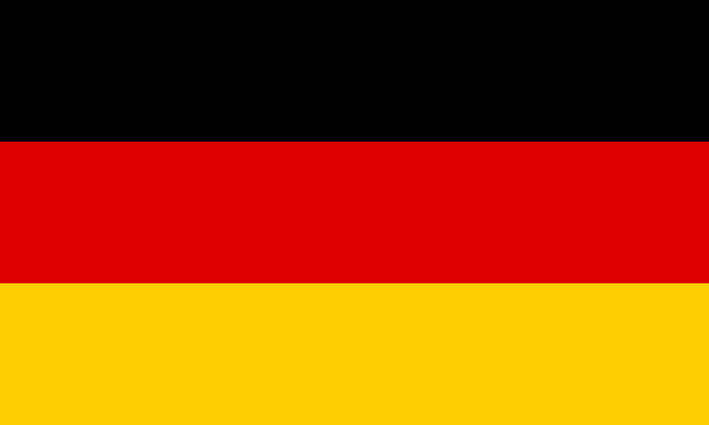 | [✓](full-size/countries/de.svg) | [`#000000`](https://en.wikipedia.org/wiki/File:Flag_of_Germany.svg)<br>[`#DD0000`](https://en.wikipedia.org/wiki/File:Flag_of_Germany.svg)<br>[`#FFCE00`](https://en.wikipedia.org/wiki/File:Flag_of_Germany.svg) |
| `jp` | [Japan](https://en.wikipedia.org/wiki/Japan) |  | 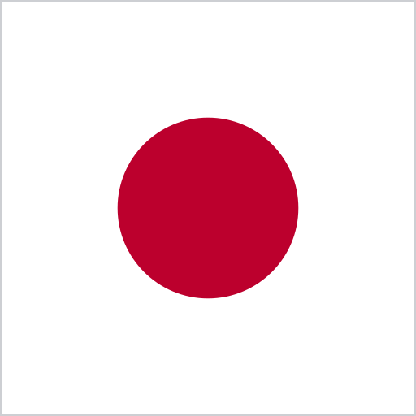 | 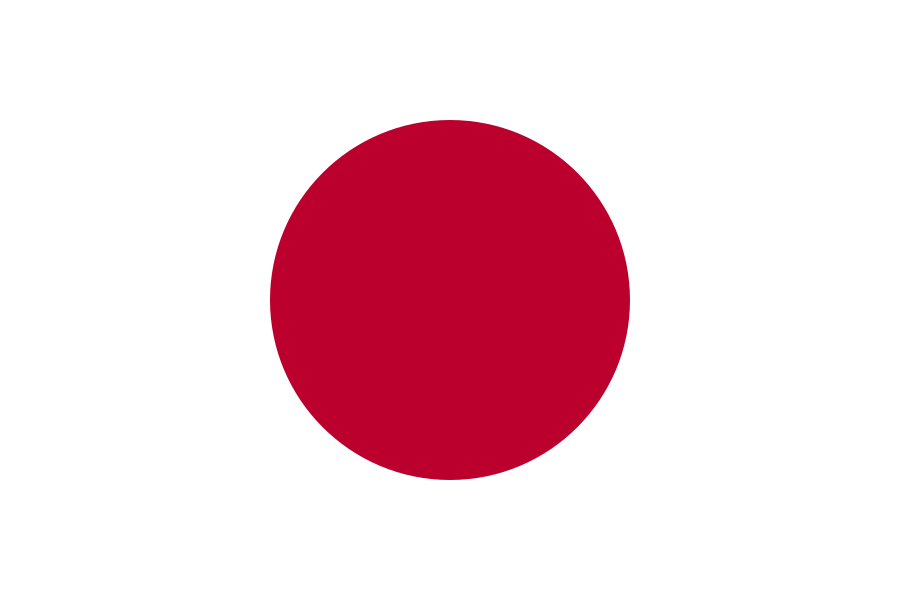 | [✓](full-size/countries/jp.svg) | [`#FFFFFF`](https://en.wikipedia.org/wiki/File:Flag_of_Japan.svg)<br>[`#BC002D`](https://en.wikipedia.org/wiki/File:Flag_of_Japan.svg) |
| `ke` | [Kenya](https://en.wikipedia.org/wiki/Kenya) | 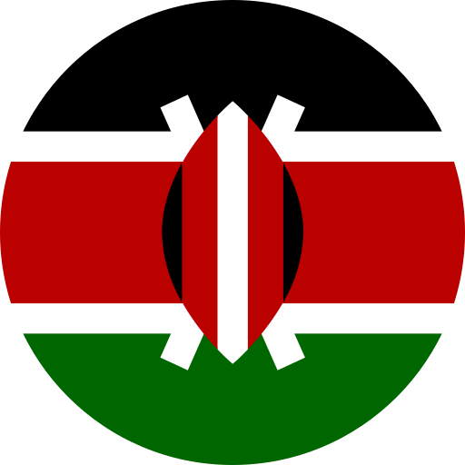 |  | 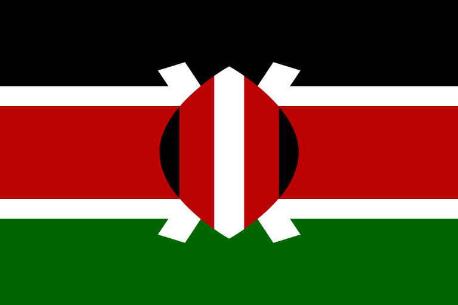 | [✓](full-size/countries/ke.svg) | [`#000000`](https://en.wikipedia.org/wiki/File:Flag_of_Kenya.svg)<br>[`#BB0000`](https://en.wikipedia.org/wiki/File:Flag_of_Kenya.svg)<br>[`#FFFFFF`](https://en.wikipedia.org/wiki/File:Flag_of_Kenya.svg)<br>[`#006600`](https://en.wikipedia.org/wiki/File:Flag_of_Kenya.svg) |
| `gb` | [United Kingdom](https://en.wikipedia.org/wiki/United_Kingdom) |  |  | 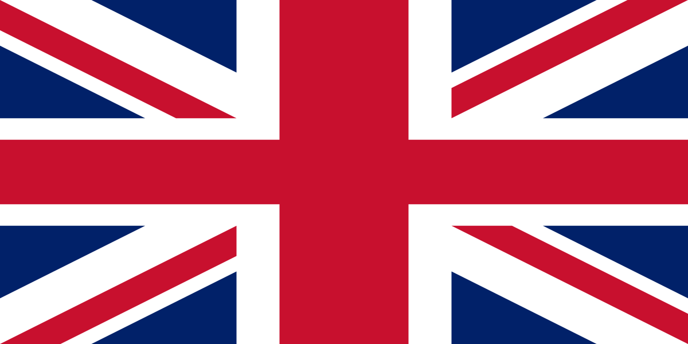 | [✓](full-size/countries/gb.svg) | [`#C8102E`](https://en.wikipedia.org/wiki/File:Flag_of_the_United_Kingdom.svg)<br>[`#FFFFFF`](https://en.wikipedia.org/wiki/File:Flag_of_the_United_Kingdom.svg)<br>[`#012169`](https://en.wikipedia.org/wiki/File:Flag_of_the_United_Kingdom.svg) |
| `us` | [United States](https://en.wikipedia.org/wiki/United_States) |  | 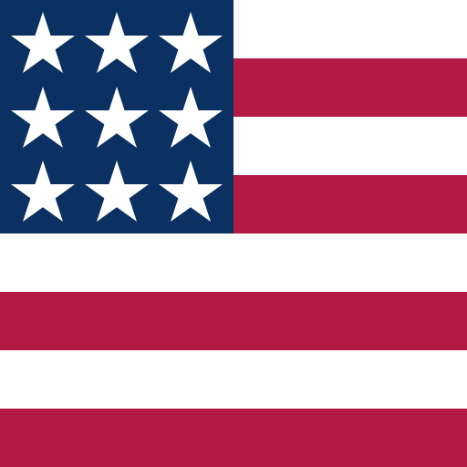 | 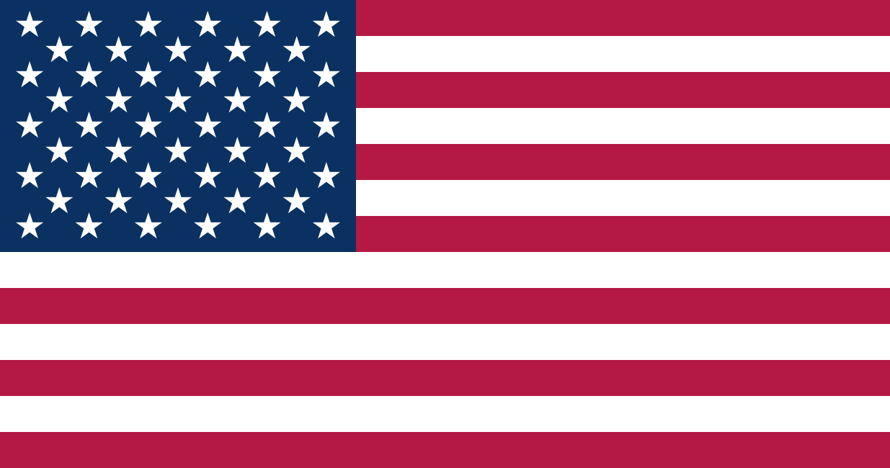 | [✓](full-size/countries/us.svg) | [`#B31942`](https://commons.wikimedia.org/wiki/File:Flag_of_the_United_States.svg)<br>[`#FFFFFF`](https://commons.wikimedia.org/wiki/File:Flag_of_the_United_States.svg)<br>[`#0A3161`](https://commons.wikimedia.org/wiki/File:Flag_of_the_United_States.svg) |
| `af` | [Afghanistan](https://en.wikipedia.org/wiki/Afghanistan) |  |  |  | [✓](full-size/countries/af.svg) | [`#000000`](https://en.wikipedia.org/wiki/File:Flag_of_Afghanistan_(2013–2021).svg)<br>[`#D32011`](https://en.wikipedia.org/wiki/File:Flag_of_Afghanistan_(2013–2021).svg)<br>[`#007A36`](https://en.wikipedia.org/wiki/File:Flag_of_Afghanistan_(2013–2021).svg)<br>[`#FFFFFF`](https://en.wikipedia.org/wiki/File:Flag_of_Afghanistan_(2013–2021).svg) |
| `al` | [Albania](https://en.wikipedia.org/wiki/Albania) |  |  | 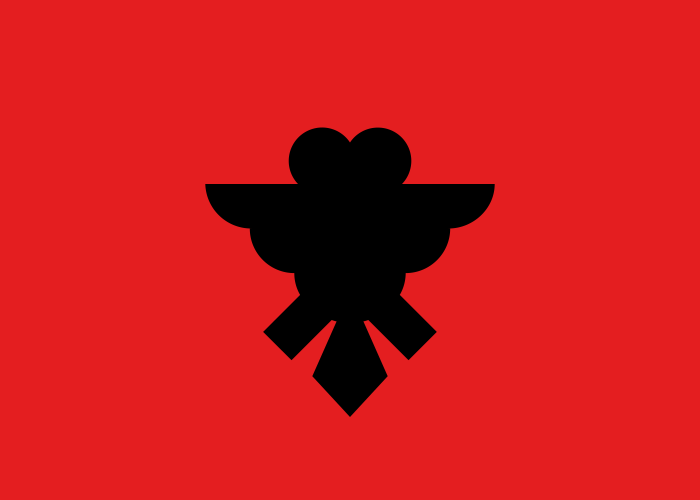 | [✓](full-size/countries/al.svg) | [`#E41E20`](https://en.wikipedia.org/wiki/File:Flag_of_Albania.svg)<br>[`#000000`](https://en.wikipedia.org/wiki/File:Flag_of_Albania.svg) |
| `dz` | [Algeria](https://en.wikipedia.org/wiki/Algeria) | 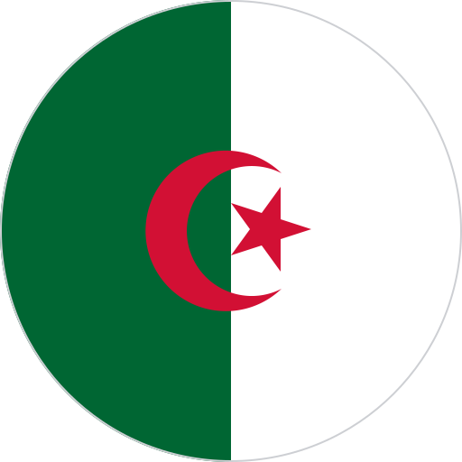 | 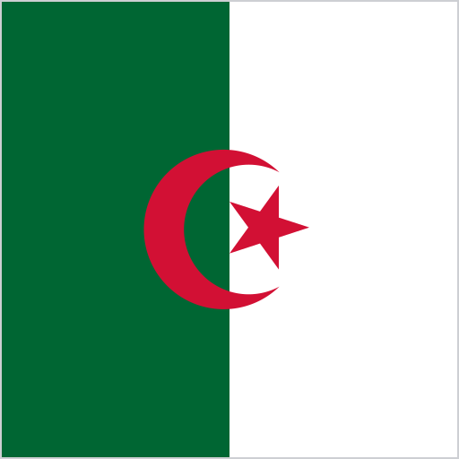 |  | [✓](full-size/countries/dz.svg) | [`#006633`](https://commons.wikimedia.org/wiki/File:Flag_of_Algeria.svg)<br>[`#FFFFFF`](https://commons.wikimedia.org/wiki/File:Flag_of_Algeria.svg)<br>[`#D21034`](https://commons.wikimedia.org/wiki/File:Flag_of_Algeria.svg) |
| `ad` | [Andorra](https://en.wikipedia.org/wiki/Andorra) |  |  | 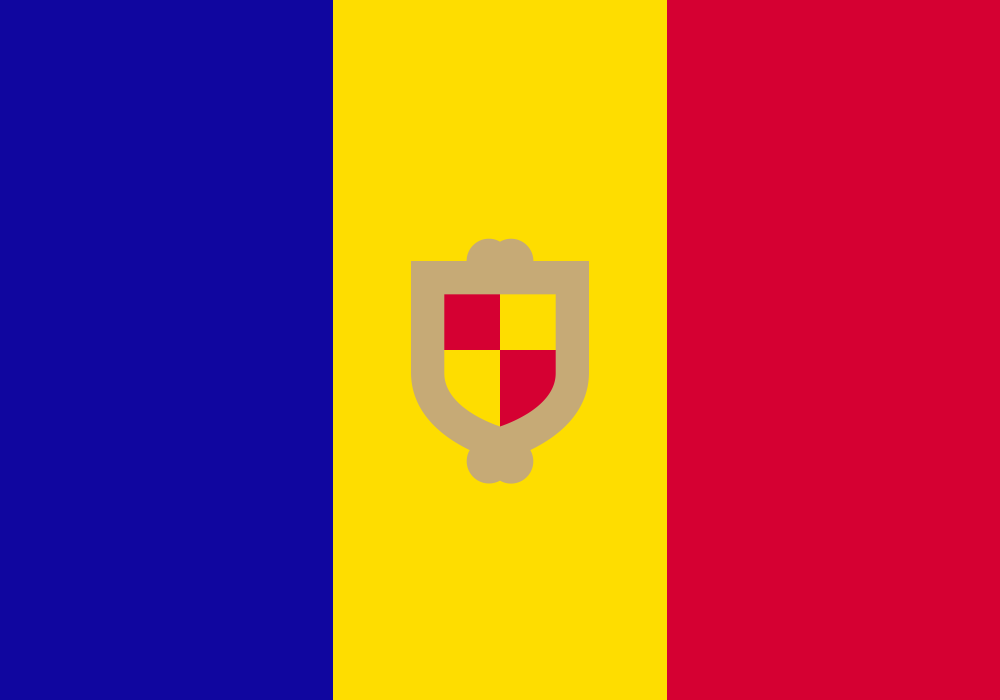 | [✓](full-size/countries/ad.svg) | [`#D50032`](https://commons.wikimedia.org/wiki/File:Flag_of_Andorra.svg)<br>[`#10069F`](https://commons.wikimedia.org/wiki/File:Flag_of_Andorra.svg)<br>[`#713F2A`](https://commons.wikimedia.org/wiki/File:Flag_of_Andorra.svg)<br>[`#FFFFFF`](https://commons.wikimedia.org/wiki/File:Flag_of_Andorra.svg)<br>[`#005EB8`](https://commons.wikimedia.org/wiki/File:Flag_of_Andorra.svg) |
| `ao` | [Angola](https://en.wikipedia.org/wiki/Angola) |  | 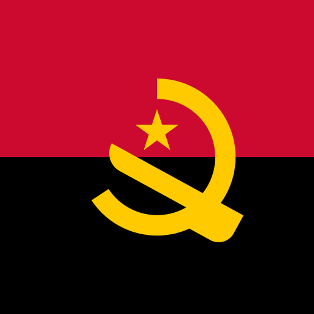 | 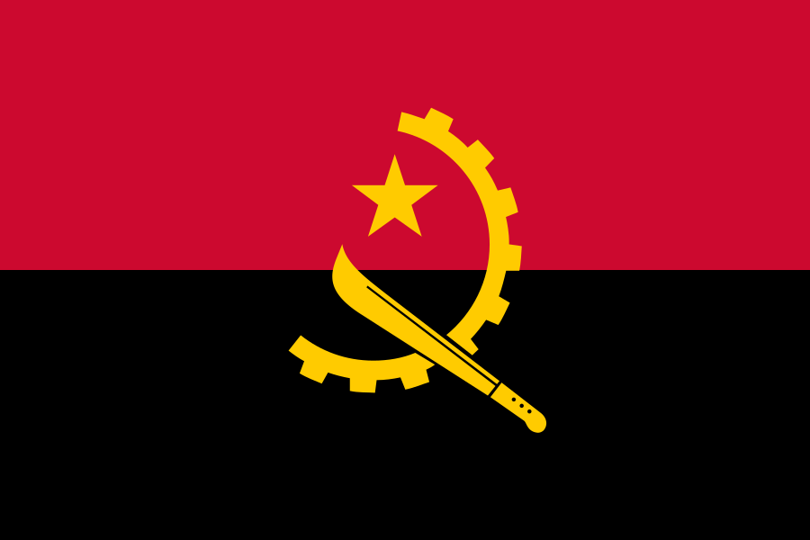 | [✓](full-size/countries/ao.svg) | [`#CC092F`](https://commons.wikimedia.org/wiki/File:Flag_of_Angola.svg)<br>[`#FFCB00`](https://commons.wikimedia.org/wiki/File:Flag_of_Angola.svg) |
| `ag` | [Antigua and Barbuda](https://en.wikipedia.org/wiki/Antigua_and_Barbuda) | 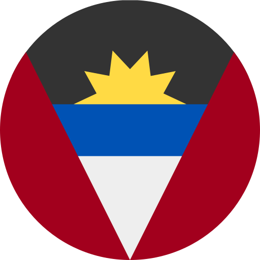 | 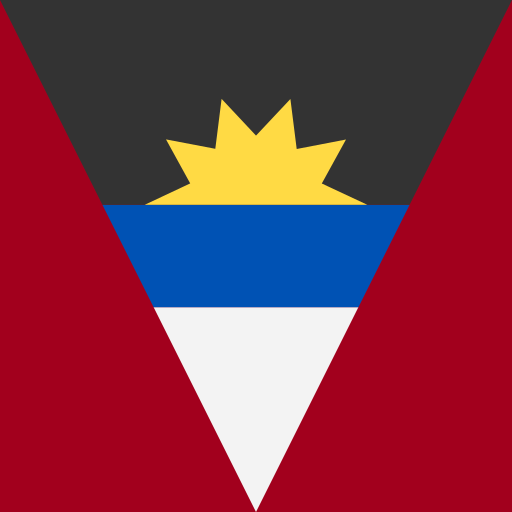 | 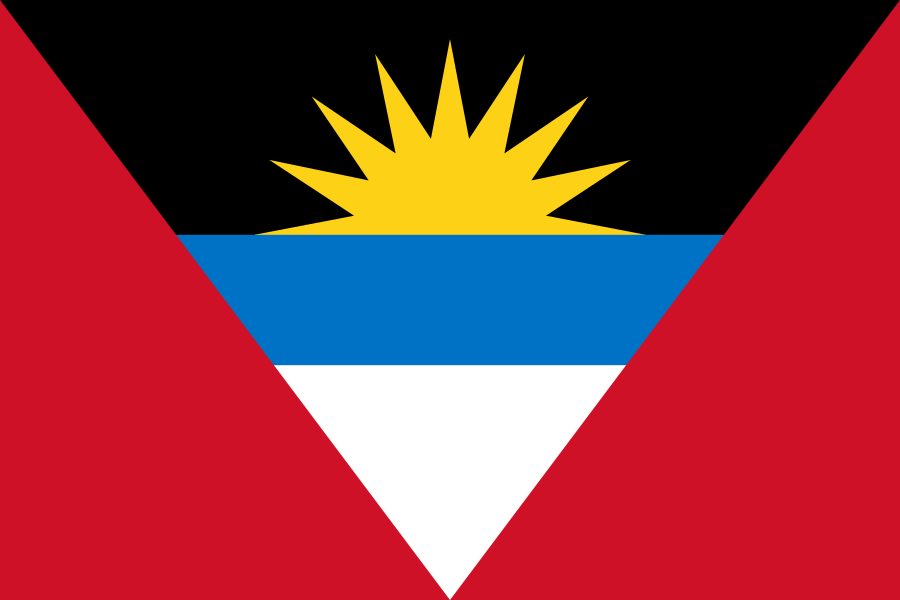 | [✓](full-size/countries/ag.svg) | [`#FFFFFF`](https://commons.wikimedia.org/wiki/File:Flag_of_Antigua_and_Barbuda.svg)<br>[`#FCD116`](https://commons.wikimedia.org/wiki/File:Flag_of_Antigua_and_Barbuda.svg)<br>[`#0072C6`](https://commons.wikimedia.org/wiki/File:Flag_of_Antigua_and_Barbuda.svg)<br>[`#CE1126`](https://commons.wikimedia.org/wiki/File:Flag_of_Antigua_and_Barbuda.svg) |
| `ar` | [Argentina](https://en.wikipedia.org/wiki/Argentina) |  |  |  | [✓](full-size/countries/ar.svg) | [`#74ACDF`](https://commons.wikimedia.org/wiki/File:Flag_of_Argentina.svg)<br>[`#FFFFFF`](https://commons.wikimedia.org/wiki/File:Flag_of_Argentina.svg)<br>[`#F6B40E`](https://commons.wikimedia.org/wiki/File:Flag_of_Argentina.svg)<br>[`#85340A`](https://commons.wikimedia.org/wiki/File:Flag_of_Argentina.svg) |
| `am` | [Armenia](https://en.wikipedia.org/wiki/Armenia) | 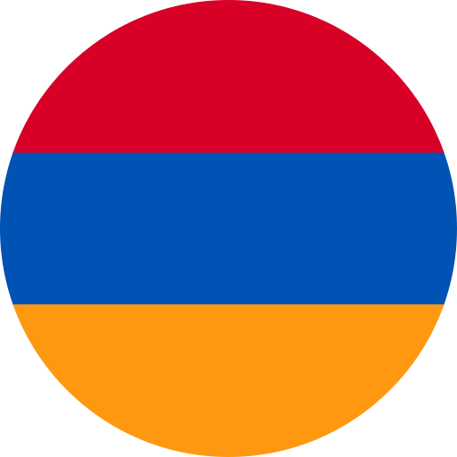 | 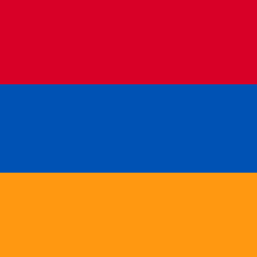 | 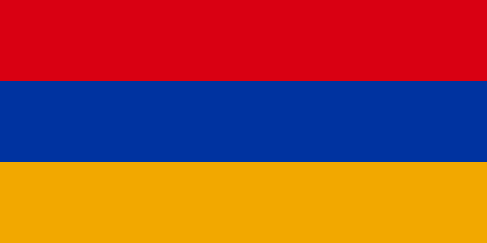 | [✓](full-size/countries/am.svg) | [`#F2A800`](https://commons.wikimedia.org/wiki/File:Flag_of_Armenia.svg)<br>[`#0033A0`](https://commons.wikimedia.org/wiki/File:Flag_of_Armenia.svg)<br>[`#D90012`](https://commons.wikimedia.org/wiki/File:Flag_of_Armenia.svg) |
| `au` | [Australia](https://en.wikipedia.org/wiki/Australia) |  | 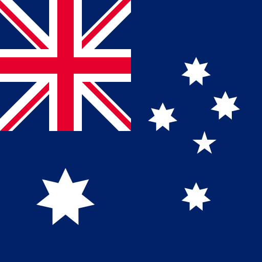 | 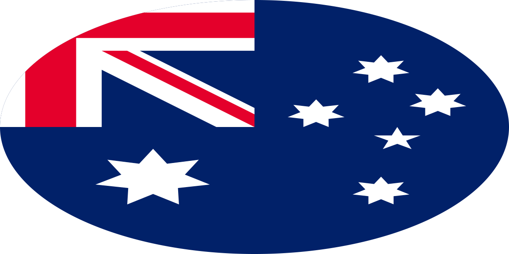 | [✓](full-size/countries/au.svg) | [`#012169`](https://commons.wikimedia.org/wiki/File:Flag_of_Australia_(converted).svg)<br>[`#E4002B`](https://commons.wikimedia.org/wiki/File:Flag_of_Australia_(converted).svg)<br>[`#FFFFFF`](https://commons.wikimedia.org/wiki/File:Flag_of_Australia_(converted).svg) |
| `at` | [Austria](https://en.wikipedia.org/wiki/Austria) | 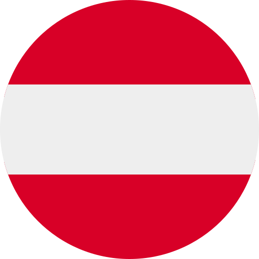 | 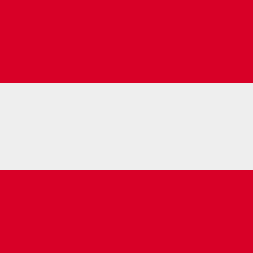 | 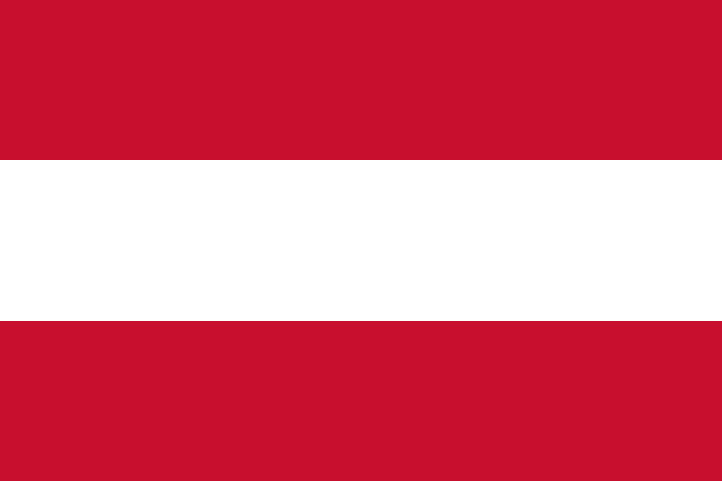 | [✓](full-size/countries/at.svg) | [`#C8102E`](https://commons.wikimedia.org/wiki/File:Flag_of_Austria.svg)<br>[`#FFFFFF`](https://commons.wikimedia.org/wiki/File:Flag_of_Austria.svg) |
| `az` | [Azerbaijan](https://en.wikipedia.org/wiki/Azerbaijan) |  |  |  | [✓](full-size/countries/az.svg) | [`#00B5E2`](https://commons.wikimedia.org/wiki/File:Flag_of_Azerbaijan.svg)<br>[`#EF3340`](https://commons.wikimedia.org/wiki/File:Flag_of_Azerbaijan.svg)<br>[`#509E2F`](https://commons.wikimedia.org/wiki/File:Flag_of_Azerbaijan.svg)<br>[`#FFFFFF`](https://commons.wikimedia.org/wiki/File:Flag_of_Azerbaijan.svg) |
| `bs` | [Bahamas](https://en.wikipedia.org/wiki/The_Bahamas) | 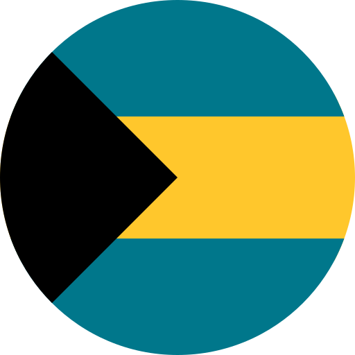 | 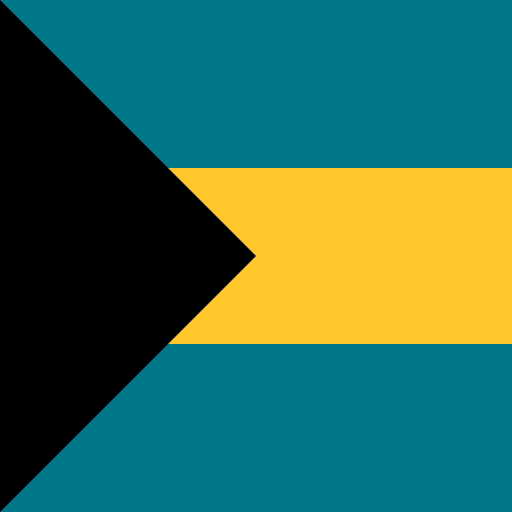 | 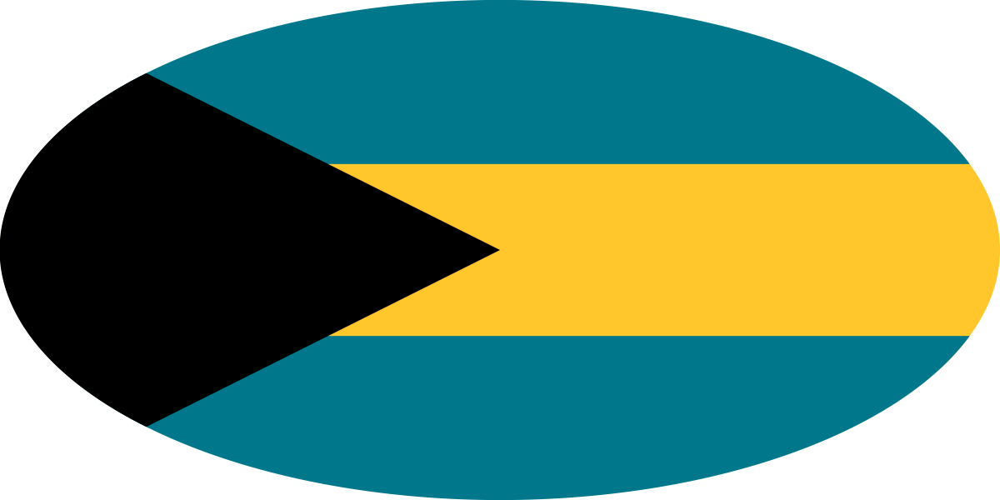 | [✓](full-size/countries/bs.svg) | [`#000000`](https://commons.wikimedia.org/wiki/File:Flag_of_the_Bahamas.svg)<br>[`#00778B`](https://commons.wikimedia.org/wiki/File:Flag_of_the_Bahamas.svg)<br>[`#FFC72C`](https://commons.wikimedia.org/wiki/File:Flag_of_the_Bahamas.svg) |
| `bh` | [Bahrain](https://en.wikipedia.org/wiki/Bahrain) |  | 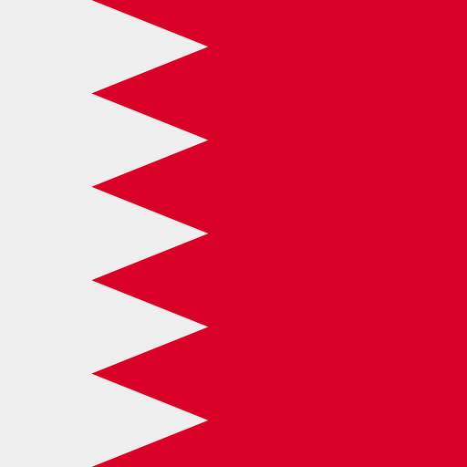 |  | [✓](full-size/countries/bh.svg) | [`#FFFFFF`](https://commons.wikimedia.org/wiki/File:Flag_of_Bahrain.svg)<br>[`#DA291C`](https://commons.wikimedia.org/wiki/File:Flag_of_Bahrain.svg) |
| `bd` | [Bangladesh](https://en.wikipedia.org/wiki/Bangladesh) |  |  | 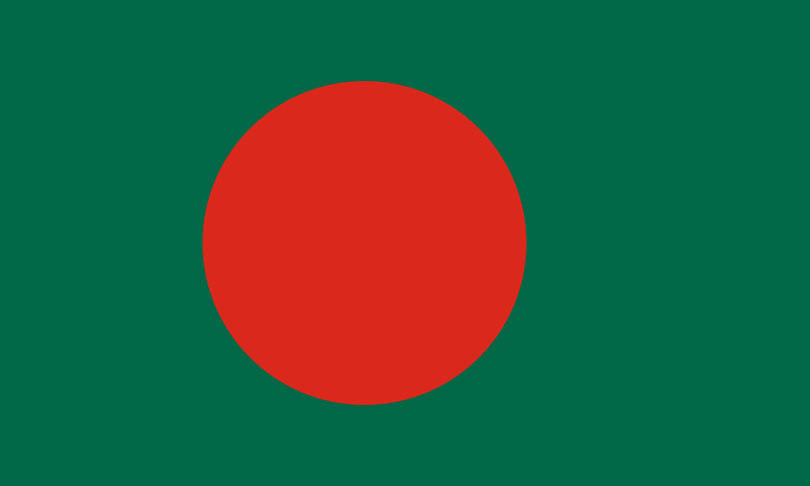 | [✓](full-size/countries/bd.svg) | [`#006747`](https://commons.wikimedia.org/wiki/File:Flag_of_Bangladesh.svg)<br>[`#DA291C`](https://commons.wikimedia.org/wiki/File:Flag_of_Bangladesh.svg) |
| `bb` | [Barbados](https://en.wikipedia.org/wiki/Barbados) | 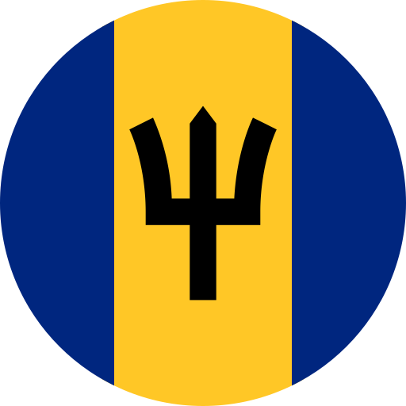 | 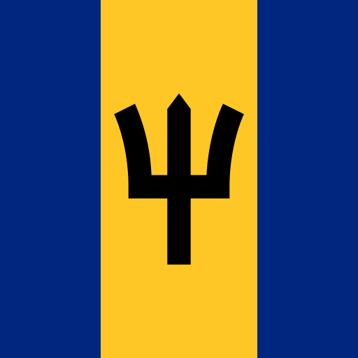 | 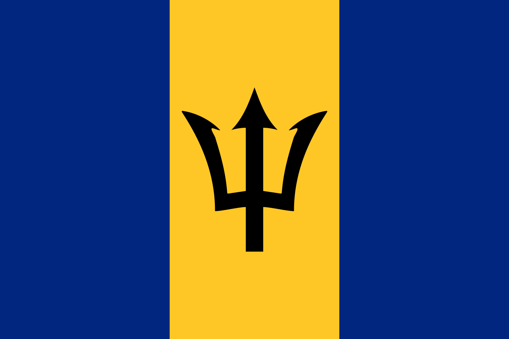 | [✓](full-size/countries/bb.svg) | [`#000000`](https://commons.wikimedia.org/wiki/File:Flag_of_Barbados.svg)<br>[`#00267F`](https://commons.wikimedia.org/wiki/File:Flag_of_Barbados.svg)<br>[`#FFC726`](https://commons.wikimedia.org/wiki/File:Flag_of_Barbados.svg) |
| `by` | [Belarus](https://en.wikipedia.org/wiki/Belarus) |  |  |  | [✓](full-size/countries/by.svg) | [`#007C30`](https://commons.wikimedia.org/wiki/File:Flag_of_Belarus.svg)<br>[`#CE1720`](https://commons.wikimedia.org/wiki/File:Flag_of_Belarus.svg)<br>[`#FFFFFF`](https://commons.wikimedia.org/wiki/File:Flag_of_Belarus.svg) |
| `be` | [Belgium](https://en.wikipedia.org/wiki/Belgium) |  | 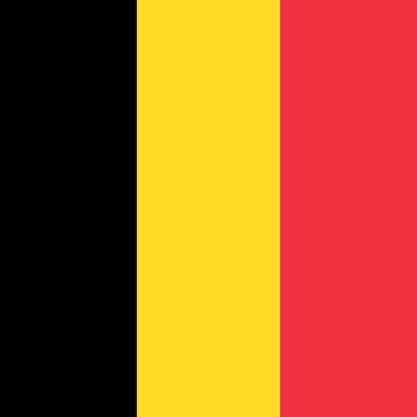 | 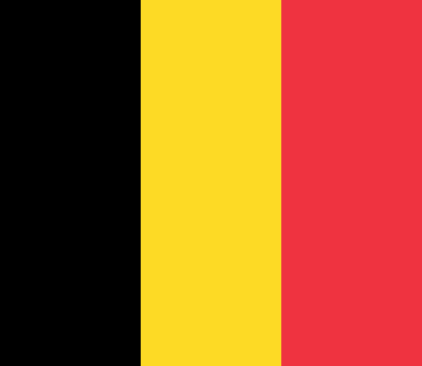 | [✓](full-size/countries/be.svg) | [`#000000`](https://commons.wikimedia.org/wiki/File:Flag_of_Belgium.svg)<br>[`#EF3340`](https://commons.wikimedia.org/wiki/File:Flag_of_Belgium.svg)<br>[`#FDDA25`](https://commons.wikimedia.org/wiki/File:Flag_of_Belgium.svg) |
| `bz` | [Belize](https://en.wikipedia.org/wiki/Belize) | 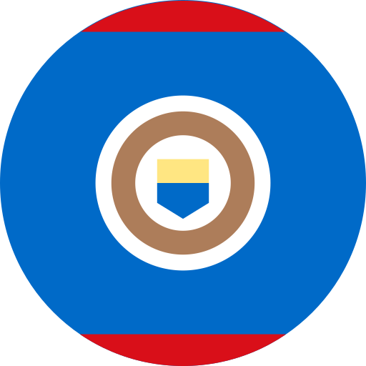 | 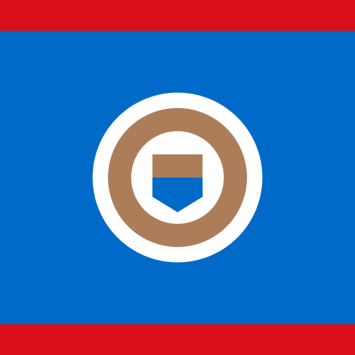 |  | [✓](full-size/countries/bz.svg) | [`#006AC8`](https://commons.wikimedia.org/wiki/File:Flag_of_Belize.svg)<br>[`#AD7D5A`](https://commons.wikimedia.org/wiki/File:Flag_of_Belize.svg)<br>[`#D90F19`](https://commons.wikimedia.org/wiki/File:Flag_of_Belize.svg)<br>[`#FFE682`](https://commons.wikimedia.org/wiki/File:Flag_of_Belize.svg)<br>[`#FFFFFF`](https://commons.wikimedia.org/wiki/File:Flag_of_Belize.svg) |
| `bj` | [Benin](https://en.wikipedia.org/wiki/Benin) | 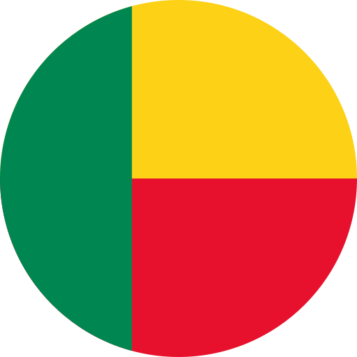 | 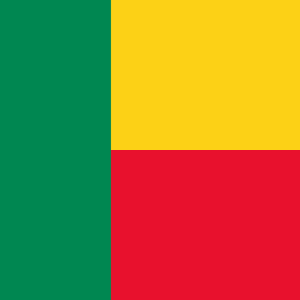 | 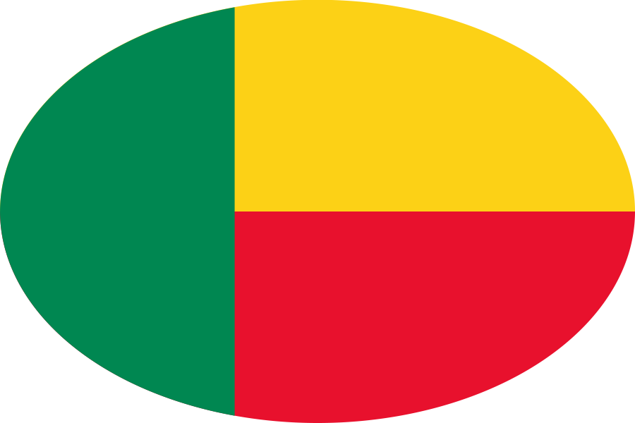 | [✓](full-size/countries/bj.svg) | [`#008751`](https://commons.wikimedia.org/wiki/File:Flag_of_Benin.svg)<br>[`#E8112D`](https://commons.wikimedia.org/wiki/File:Flag_of_Benin.svg)<br>[`#FCD116`](https://commons.wikimedia.org/wiki/File:Flag_of_Benin.svg) |
| `bt` | [Bhutan](https://en.wikipedia.org/wiki/Bhutan) |  |  |  | [✓](full-size/countries/bt.svg) | [`#FFCD00`](https://commons.wikimedia.org/wiki/File:Flag_of_Bhutan.svg)<br>[`#FF671F`](https://commons.wikimedia.org/wiki/File:Flag_of_Bhutan.svg)<br>[`#FFFFFF`](https://commons.wikimedia.org/wiki/File:Flag_of_Bhutan.svg) |
| `bo` | [Bolivia](https://en.wikipedia.org/wiki/Bolivia) | 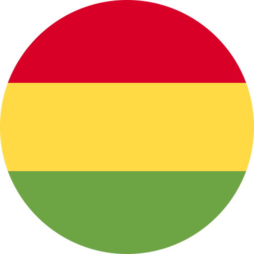 | 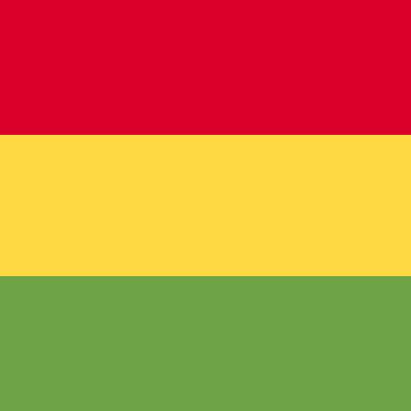 | 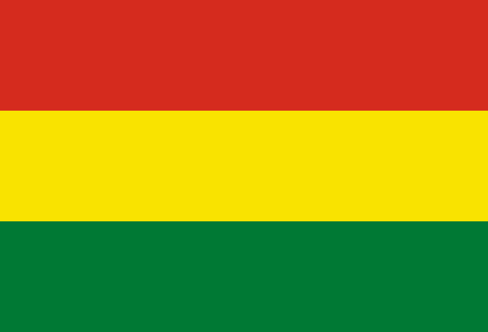 | [✓](full-size/countries/bo.svg) | [`#007934`](https://commons.wikimedia.org/wiki/File:Flag_of_Bolivia.svg)<br>[`#F9E300`](https://commons.wikimedia.org/wiki/File:Flag_of_Bolivia.svg)<br>[`#D52B1E`](https://commons.wikimedia.org/wiki/File:Flag_of_Bolivia.svg) |
| `ba` | [Bosnia and Herzegovina](https://en.wikipedia.org/wiki/Bosnia_and_Herzegovina) | 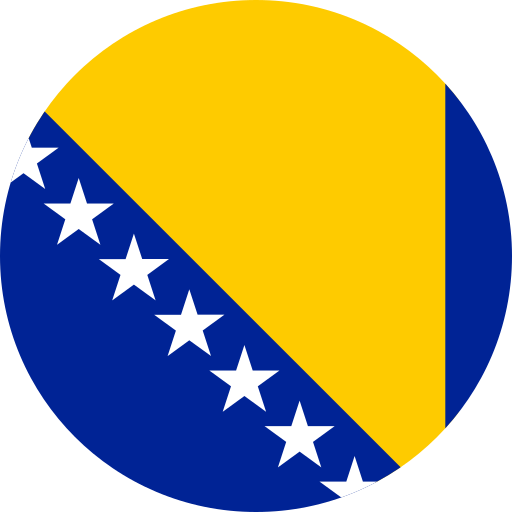 | 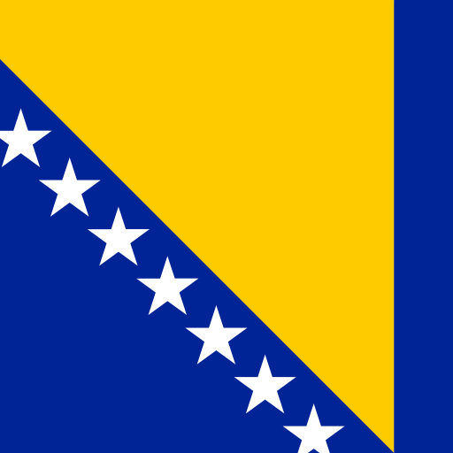 | 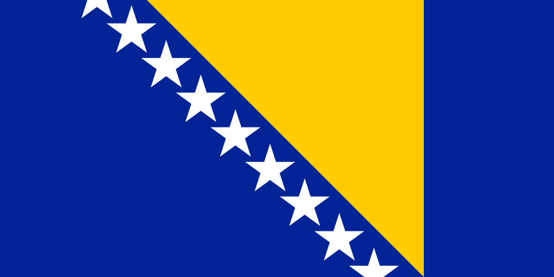 | [✓](full-size/countries/ba.svg) | [`#002395`](https://en.wikipedia.org/wiki/File:Flag_of_Bosnia_and_Herzegovina.svg)<br>[`#FECB00`](https://en.wikipedia.org/wiki/File:Flag_of_Bosnia_and_Herzegovina.svg)<br>[`#FFFFFF`](https://en.wikipedia.org/wiki/File:Flag_of_Bosnia_and_Herzegovina.svg) |
| `bw` | [Botswana](https://en.wikipedia.org/wiki/Botswana) |  |  |  | [✓](full-size/countries/bw.svg) | [`#000000`](https://commons.wikimedia.org/wiki/File:Flag_of_Botswana.svg)<br>[`#6DA9D2`](https://commons.wikimedia.org/wiki/File:Flag_of_Botswana.svg)<br>[`#FFFFFF`](https://commons.wikimedia.org/wiki/File:Flag_of_Botswana.svg) |
| `br` | [Brazil](https://en.wikipedia.org/wiki/Brazil) |  |  |  | [✓](full-size/countries/br.svg) | [`#009440`](https://commons.wikimedia.org/wiki/File:Flag_of_Brazil.svg)<br>[`#FFCB00`](https://commons.wikimedia.org/wiki/File:Flag_of_Brazil.svg)<br>[`#302681`](https://commons.wikimedia.org/wiki/File:Flag_of_Brazil.svg)<br>[`#FFFFFF`](https://commons.wikimedia.org/wiki/File:Flag_of_Brazil.svg) |
| `bn` | [Brunei](https://en.wikipedia.org/wiki/Brunei) |  |  |  | [✓](full-size/countries/bn.svg) | [`#FFFFFF`](https://commons.wikimedia.org/wiki/File:Flag_of_Brunei.svg) |
| `bg` | [Bulgaria](https://en.wikipedia.org/wiki/Bulgaria) |  |  |  | [✓](full-size/countries/bg.svg) | [`#FFFFFF`](https://commons.wikimedia.org/wiki/File:Flag_of_Bulgaria.svg)<br>[`#00966E`](https://commons.wikimedia.org/wiki/File:Flag_of_Bulgaria.svg)<br>[`#D62612`](https://commons.wikimedia.org/wiki/File:Flag_of_Bulgaria.svg) |
| `bf` | [Burkina Faso](https://en.wikipedia.org/wiki/Burkina_Faso) |  |  |  | [✓](full-size/countries/bf.svg) | [`#009E49`](https://commons.wikimedia.org/wiki/File:Flag_of_Burkina_Faso.svg)<br>[`#EF2B2D`](https://commons.wikimedia.org/wiki/File:Flag_of_Burkina_Faso.svg)<br>[`#FCD116`](https://commons.wikimedia.org/wiki/File:Flag_of_Burkina_Faso.svg) |
| `bi` | [Burundi](https://en.wikipedia.org/wiki/Burundi) |  |  |  | [✓](full-size/countries/bi.svg) | [`#43B02A`](https://commons.wikimedia.org/wiki/File:Flag_of_Burundi.svg)<br>[`#C8102E`](https://commons.wikimedia.org/wiki/File:Flag_of_Burundi.svg)<br>[`#FFFFFF`](https://commons.wikimedia.org/wiki/File:Flag_of_Burundi.svg) |
| `cv` | [Cabo Verde](https://en.wikipedia.org/wiki/Cabo_Verde) |  |  |  | [✓](full-size/countries/cv.svg) | [`#003893`](https://commons.wikimedia.org/wiki/File:Flag_of_Cape_Verde.svg)<br>[`#FFFFFF`](https://commons.wikimedia.org/wiki/File:Flag_of_Cape_Verde.svg)<br>[`#CF2027`](https://commons.wikimedia.org/wiki/File:Flag_of_Cape_Verde.svg)<br>[`#F7D116`](https://commons.wikimedia.org/wiki/File:Flag_of_Cape_Verde.svg) |
| `kh` | [Cambodia](https://en.wikipedia.org/wiki/Cambodia) |  |  |  | [✓](full-size/countries/kh.svg) | [`#032EA1`](https://commons.wikimedia.org/wiki/File:Flag_of_Cambodia.svg)<br>[`#E00025`](https://commons.wikimedia.org/wiki/File:Flag_of_Cambodia.svg)<br>[`#FFFFFF`](https://commons.wikimedia.org/wiki/File:Flag_of_Cambodia.svg)<br>[`#000000`](https://commons.wikimedia.org/wiki/File:Flag_of_Cambodia.svg) |
| `cm` | [Cameroon](https://en.wikipedia.org/wiki/Cameroon) |  |  |  | [✓](full-size/countries/cm.svg) | [`#007A5E`](https://commons.wikimedia.org/wiki/File:Flag_of_Cameroon.svg)<br>[`#CE1126`](https://commons.wikimedia.org/wiki/File:Flag_of_Cameroon.svg)<br>[`#FCD116`](https://commons.wikimedia.org/wiki/File:Flag_of_Cameroon.svg) |
| `ca` | [Canada](https://en.wikipedia.org/wiki/Canada) |  |  |  | [✓](full-size/countries/ca.svg) | [`#D52B1E`](https://commons.wikimedia.org/wiki/File:Flag_of_Canada_(Pantone).svg)<br>[`#FFFFFF`](https://commons.wikimedia.org/wiki/File:Flag_of_Canada_(Pantone).svg) |
| `cf` | [Central African Republic](https://en.wikipedia.org/wiki/Central_African_Republic) |  |  |  | [✓](full-size/countries/cf.svg) | [`#003082`](https://commons.wikimedia.org/wiki/File:Flag_of_the_Central_African_Republic.svg)<br>[`#289728`](https://commons.wikimedia.org/wiki/File:Flag_of_the_Central_African_Republic.svg)<br>[`#D21034`](https://commons.wikimedia.org/wiki/File:Flag_of_the_Central_African_Republic.svg)<br>[`#FFCE00`](https://commons.wikimedia.org/wiki/File:Flag_of_the_Central_African_Republic.svg)<br>[`#FFFFFF`](https://commons.wikimedia.org/wiki/File:Flag_of_the_Central_African_Republic.svg) |
| `td` | [Chad](https://en.wikipedia.org/wiki/Chad) |  |  |  | [✓](full-size/countries/td.svg) | [`#002664`](https://commons.wikimedia.org/wiki/File:Flag_of_Chad.svg)<br>[`#C60C30`](https://commons.wikimedia.org/wiki/File:Flag_of_Chad.svg)<br>[`#FECB00`](https://commons.wikimedia.org/wiki/File:Flag_of_Chad.svg) |
| `cl` | [Chile](https://en.wikipedia.org/wiki/Chile) |  |  |  | [✓](full-size/countries/cl.svg) | [`#0032A0`](https://commons.wikimedia.org/wiki/File:Flag_of_Chile.svg)<br>[`#DA291C`](https://commons.wikimedia.org/wiki/File:Flag_of_Chile.svg)<br>[`#FFFFFF`](https://commons.wikimedia.org/wiki/File:Flag_of_Chile.svg) |
| `cn` | [China](https://en.wikipedia.org/wiki/China) |  |  |  | [✓](full-size/countries/cn.svg) | [`#EE1C25`](https://commons.wikimedia.org/wiki/File:Flag_of_the_People%27s_Republic_of_China.svg)<br>[`#FFFF00`](https://commons.wikimedia.org/wiki/File:Flag_of_the_People%27s_Republic_of_China.svg) |
| `co` | [Colombia](https://en.wikipedia.org/wiki/Colombia) |  |  |  | [✓](full-size/countries/co.svg) | [`#003087`](https://commons.wikimedia.org/wiki/File:Flag_of_Colombia.svg)<br>[`#C8102E`](https://commons.wikimedia.org/wiki/File:Flag_of_Colombia.svg)<br>[`#FFCD00`](https://commons.wikimedia.org/wiki/File:Flag_of_Colombia.svg) |
| `km` | [Comoros](https://en.wikipedia.org/wiki/Comoros) |  |  |  | [✓](full-size/countries/km.svg) | [`#003DA5`](https://commons.wikimedia.org/wiki/File:Flag_of_the_Comoros.svg)<br>[`#009639`](https://commons.wikimedia.org/wiki/File:Flag_of_the_Comoros.svg)<br>[`#EF3340`](https://commons.wikimedia.org/wiki/File:Flag_of_the_Comoros.svg)<br>[`#FFD100`](https://commons.wikimedia.org/wiki/File:Flag_of_the_Comoros.svg)<br>[`#FFFFFF`](https://commons.wikimedia.org/wiki/File:Flag_of_the_Comoros.svg) |
| `cg` | [Congo](https://en.wikipedia.org/wiki/Republic_of_the_Congo) |  |  |  | [✓](full-size/countries/cg.svg) | [`#009739`](https://commons.wikimedia.org/wiki/File:Flag_of_the_Republic_of_the_Congo.svg)<br>[`#DC241F`](https://commons.wikimedia.org/wiki/File:Flag_of_the_Republic_of_the_Congo.svg)<br>[`#FFD100`](https://commons.wikimedia.org/wiki/File:Flag_of_the_Republic_of_the_Congo.svg)<br>[`#FFFFFF`](https://commons.wikimedia.org/wiki/File:Flag_of_the_Republic_of_the_Congo.svg) |
| `cd` | [Congo (DRC)](https://en.wikipedia.org/wiki/Democratic_Republic_of_the_Congo) |  |  |  | [✓](full-size/countries/cd.svg) | [`#007FFF`](https://commons.wikimedia.org/wiki/File:Flag_of_the_Democratic_Republic_of_the_Congo.svg)<br>[`#CE1021`](https://commons.wikimedia.org/wiki/File:Flag_of_the_Democratic_Republic_of_the_Congo.svg)<br>[`#F7D618`](https://commons.wikimedia.org/wiki/File:Flag_of_the_Democratic_Republic_of_the_Congo.svg)<br>[`#FFFFFF`](https://commons.wikimedia.org/wiki/File:Flag_of_the_Democratic_Republic_of_the_Congo.svg) |
| `cr` | [Costa Rica](https://en.wikipedia.org/wiki/Costa_Rica) |  |  |  | [✓](full-size/countries/cr.svg) | [`#001489`](https://commons.wikimedia.org/wiki/File:Flag_of_Costa_Rica.svg)<br>[`#FFFFFF`](https://commons.wikimedia.org/wiki/File:Flag_of_Costa_Rica.svg)<br>[`#DA291C`](https://commons.wikimedia.org/wiki/File:Flag_of_Costa_Rica.svg) |
| `hr` | [Croatia](https://en.wikipedia.org/wiki/Croatia) |  |  |  | [✓](full-size/countries/hr.svg) | [`#FF0000`](https://commons.wikimedia.org/wiki/File:Flag_of_Croatia.svg)<br>[`#FFFFFF`](https://commons.wikimedia.org/wiki/File:Flag_of_Croatia.svg)<br>[`#171796`](https://commons.wikimedia.org/wiki/File:Flag_of_Croatia.svg)<br>[`#0093DD`](https://commons.wikimedia.org/wiki/File:Flag_of_Croatia.svg)<br>[`#F7DB17`](https://commons.wikimedia.org/wiki/File:Flag_of_Croatia.svg)<br>[`#000000`](https://commons.wikimedia.org/wiki/File:Flag_of_Croatia.svg) |
| `cu` | [Cuba](https://en.wikipedia.org/wiki/Cuba) |  |  |  | [✓](full-size/countries/cu.svg) | [`#FFFFFF`](https://commons.wikimedia.org/wiki/File:Flag_of_Cuba.svg)<br>[`#002A8F`](https://commons.wikimedia.org/wiki/File:Flag_of_Cuba.svg)<br>[`#CB1515`](https://commons.wikimedia.org/wiki/File:Flag_of_Cuba.svg) |
| `cy` | [Cyprus](https://en.wikipedia.org/wiki/Cyprus) |  |  |  | [✓](full-size/countries/cy.svg) | [`#FFFFFF`](https://commons.wikimedia.org/wiki/File:Flag_of_Cyprus.svg)<br>[`#D67900`](https://commons.wikimedia.org/wiki/File:Flag_of_Cyprus.svg)<br>[`#4D5B2D`](https://commons.wikimedia.org/wiki/File:Flag_of_Cyprus.svg) |
| `cz` | [Czechia](https://en.wikipedia.org/wiki/Czech_Republic) |  |  |  | [✓](full-size/countries/cz.svg) | [`#11457E`](https://commons.wikimedia.org/wiki/File:Flag_of_the_Czech_Republic.svg)<br>[`#D7141A`](https://commons.wikimedia.org/wiki/File:Flag_of_the_Czech_Republic.svg)<br>[`#FFFFFF`](https://commons.wikimedia.org/wiki/File:Flag_of_the_Czech_Republic.svg) |
| `ci` | [Côte d'Ivoire](https://en.wikipedia.org/wiki/Ivory_Coast) |  |  |  | [✓](full-size/countries/ci.svg) | [`#009A44`](https://commons.wikimedia.org/wiki/File:Flag_of_Côte_d'Ivoire.svg)<br>[`#FF8200`](https://commons.wikimedia.org/wiki/File:Flag_of_Côte_d'Ivoire.svg)<br>[`#FFFFFF`](https://commons.wikimedia.org/wiki/File:Flag_of_Côte_d'Ivoire.svg) |
| `dk` | [Denmark](https://en.wikipedia.org/wiki/Denmark) |  |  |  | [✓](full-size/countries/dk.svg) | [`#C8102E`](https://en.wikipedia.org/wiki/File:Flag_of_Denmark.svg)<br>[`#FFFFFF`](https://en.wikipedia.org/wiki/File:Flag_of_Denmark.svg) |
| `dj` | [Djibouti](https://en.wikipedia.org/wiki/Djibouti) |  |  |  | [✓](full-size/countries/dj.svg) | [`#12AD2B`](https://commons.wikimedia.org/wiki/File:Flag_of_Djibouti.svg)<br>[`#6AB2E7`](https://commons.wikimedia.org/wiki/File:Flag_of_Djibouti.svg)<br>[`#D7141A`](https://commons.wikimedia.org/wiki/File:Flag_of_Djibouti.svg)<br>[`#FFFFFF`](https://commons.wikimedia.org/wiki/File:Flag_of_Djibouti.svg) |
| `dm` | [Dominica](https://en.wikipedia.org/wiki/Dominica) |  |  |  | [✓](full-size/countries/dm.svg) | [`#000000`](https://commons.wikimedia.org/wiki/File:Flag_of_Dominica.svg)<br>[`#046A38`](https://commons.wikimedia.org/wiki/File:Flag_of_Dominica.svg)<br>[`#D50032`](https://commons.wikimedia.org/wiki/File:Flag_of_Dominica.svg)<br>[`#FFCD00`](https://commons.wikimedia.org/wiki/File:Flag_of_Dominica.svg)<br>[`#FFFFFF`](https://commons.wikimedia.org/wiki/File:Flag_of_Dominica.svg) |
| `do` | [Dominican Republic](https://en.wikipedia.org/wiki/Dominican_Republic) |  |  |  | [✓](full-size/countries/do.svg) | [`#FFFFFF`](https://commons.wikimedia.org/wiki/File:Flag_of_the_Dominican_Republic.svg)<br>[`#002D62`](https://commons.wikimedia.org/wiki/File:Flag_of_the_Dominican_Republic.svg)<br>[`#CE1126`](https://commons.wikimedia.org/wiki/File:Flag_of_the_Dominican_Republic.svg)<br>[`#201B18`](https://commons.wikimedia.org/wiki/File:Flag_of_the_Dominican_Republic.svg)<br>[`#EAC102`](https://commons.wikimedia.org/wiki/File:Flag_of_the_Dominican_Republic.svg)<br>[`#006300`](https://commons.wikimedia.org/wiki/File:Flag_of_the_Dominican_Republic.svg)<br>[`#FFFF00`](https://commons.wikimedia.org/wiki/File:Flag_of_the_Dominican_Republic.svg)<br>[`#008F4C`](https://commons.wikimedia.org/wiki/File:Flag_of_the_Dominican_Republic.svg)<br>[`#00873F`](https://commons.wikimedia.org/wiki/File:Flag_of_the_Dominican_Republic.svg)<br>[`#00863D`](https://commons.wikimedia.org/wiki/File:Flag_of_the_Dominican_Republic.svg)<br>[`#AA241E`](https://commons.wikimedia.org/wiki/File:Flag_of_the_Dominican_Republic.svg)<br>[`#000000`](https://commons.wikimedia.org/wiki/File:Flag_of_the_Dominican_Republic.svg) |
| `ec` | [Ecuador](https://en.wikipedia.org/wiki/Ecuador) |  |  |  | [✓](full-size/countries/ec.svg) | [`#ED1C24`](https://commons.wikimedia.org/wiki/File:Flag_of_Ecuador.svg)<br>[`#034EA2`](https://commons.wikimedia.org/wiki/File:Flag_of_Ecuador.svg)<br>[`#FFDD00`](https://commons.wikimedia.org/wiki/File:Flag_of_Ecuador.svg)<br>[`#B1BABF`](https://commons.wikimedia.org/wiki/File:Flag_of_Ecuador.svg)<br>[`#E8B909`](https://commons.wikimedia.org/wiki/File:Flag_of_Ecuador.svg)<br>[`#39B54A`](https://commons.wikimedia.org/wiki/File:Flag_of_Ecuador.svg)<br>[`#FFDF4F`](https://commons.wikimedia.org/wiki/File:Flag_of_Ecuador.svg)<br>[`#DE2126`](https://commons.wikimedia.org/wiki/File:Flag_of_Ecuador.svg)<br>[`#009C4F`](https://commons.wikimedia.org/wiki/File:Flag_of_Ecuador.svg)<br>[`#C0CAD0`](https://commons.wikimedia.org/wiki/File:Flag_of_Ecuador.svg)<br>[`#EBC900`](https://commons.wikimedia.org/wiki/File:Flag_of_Ecuador.svg)<br>[`#023F88`](https://commons.wikimedia.org/wiki/File:Flag_of_Ecuador.svg)<br>[`#452C25`](https://commons.wikimedia.org/wiki/File:Flag_of_Ecuador.svg)<br>[`#C69024`](https://commons.wikimedia.org/wiki/File:Flag_of_Ecuador.svg)<br>[`#B87510`](https://commons.wikimedia.org/wiki/File:Flag_of_Ecuador.svg)<br>[`#B76E11`](https://commons.wikimedia.org/wiki/File:Flag_of_Ecuador.svg)<br>[`#AC620E`](https://commons.wikimedia.org/wiki/File:Flag_of_Ecuador.svg)<br>[`#A2550B`](https://commons.wikimedia.org/wiki/File:Flag_of_Ecuador.svg)<br>[`#D3DCE0`](https://commons.wikimedia.org/wiki/File:Flag_of_Ecuador.svg)<br>[`#395054`](https://commons.wikimedia.org/wiki/File:Flag_of_Ecuador.svg)<br>[`#006C3C`](https://commons.wikimedia.org/wiki/File:Flag_of_Ecuador.svg)<br>[`#6DBE45`](https://commons.wikimedia.org/wiki/File:Flag_of_Ecuador.svg)<br>[`#000000`](https://commons.wikimedia.org/wiki/File:Flag_of_Ecuador.svg)<br>[`#557176`](https://commons.wikimedia.org/wiki/File:Flag_of_Ecuador.svg)<br>[`#99AFCA`](https://commons.wikimedia.org/wiki/File:Flag_of_Ecuador.svg)<br>[`#4F91C5`](https://commons.wikimedia.org/wiki/File:Flag_of_Ecuador.svg)<br>[`#FFFFFF`](https://commons.wikimedia.org/wiki/File:Flag_of_Ecuador.svg)<br>[`#007638`](https://commons.wikimedia.org/wiki/File:Flag_of_Ecuador.svg)<br>[`#999B9E`](https://commons.wikimedia.org/wiki/File:Flag_of_Ecuador.svg)<br>[`#949699`](https://commons.wikimedia.org/wiki/File:Flag_of_Ecuador.svg)<br>[`#5C5342`](https://commons.wikimedia.org/wiki/File:Flag_of_Ecuador.svg)<br>[`#858D8D`](https://commons.wikimedia.org/wiki/File:Flag_of_Ecuador.svg)<br>[`#755338`](https://commons.wikimedia.org/wiki/File:Flag_of_Ecuador.svg)<br>[`#A37853`](https://commons.wikimedia.org/wiki/File:Flag_of_Ecuador.svg)<br>[`#616264`](https://commons.wikimedia.org/wiki/File:Flag_of_Ecuador.svg)<br>[`#A3A5A8`](https://commons.wikimedia.org/wiki/File:Flag_of_Ecuador.svg)<br>[`#797A7D`](https://commons.wikimedia.org/wiki/File:Flag_of_Ecuador.svg)<br>[`#939598`](https://commons.wikimedia.org/wiki/File:Flag_of_Ecuador.svg)<br>[`#442C13`](https://commons.wikimedia.org/wiki/File:Flag_of_Ecuador.svg)<br>[`#A48B58`](https://commons.wikimedia.org/wiki/File:Flag_of_Ecuador.svg)<br>[`#696161`](https://commons.wikimedia.org/wiki/File:Flag_of_Ecuador.svg)<br>[`#84848A`](https://commons.wikimedia.org/wiki/File:Flag_of_Ecuador.svg)<br>[`#453717`](https://commons.wikimedia.org/wiki/File:Flag_of_Ecuador.svg)<br>[`#6A5E46`](https://commons.wikimedia.org/wiki/File:Flag_of_Ecuador.svg)<br>[`#2F2311`](https://commons.wikimedia.org/wiki/File:Flag_of_Ecuador.svg)<br>[`#866D46`](https://commons.wikimedia.org/wiki/File:Flag_of_Ecuador.svg)<br>[`#ACACAD`](https://commons.wikimedia.org/wiki/File:Flag_of_Ecuador.svg)<br>[`#895F33`](https://commons.wikimedia.org/wiki/File:Flag_of_Ecuador.svg)<br>[`#FFE600`](https://commons.wikimedia.org/wiki/File:Flag_of_Ecuador.svg)<br>[`#565759`](https://commons.wikimedia.org/wiki/File:Flag_of_Ecuador.svg)<br>[`#9B7E39`](https://commons.wikimedia.org/wiki/File:Flag_of_Ecuador.svg)<br>[`#2F3B30`](https://commons.wikimedia.org/wiki/File:Flag_of_Ecuador.svg)<br>[`#64472D`](https://commons.wikimedia.org/wiki/File:Flag_of_Ecuador.svg)<br>[`#D9C0B9`](https://commons.wikimedia.org/wiki/File:Flag_of_Ecuador.svg)<br>[`#BD8759`](https://commons.wikimedia.org/wiki/File:Flag_of_Ecuador.svg)<br>[`#DCDDDE`](https://commons.wikimedia.org/wiki/File:Flag_of_Ecuador.svg)<br>[`#5E3F17`](https://commons.wikimedia.org/wiki/File:Flag_of_Ecuador.svg)<br>[`#DBA05F`](https://commons.wikimedia.org/wiki/File:Flag_of_Ecuador.svg)<br>[`#C6262C`](https://commons.wikimedia.org/wiki/File:Flag_of_Ecuador.svg)<br>[`#842116`](https://commons.wikimedia.org/wiki/File:Flag_of_Ecuador.svg)<br>[`#7A2E26`](https://commons.wikimedia.org/wiki/File:Flag_of_Ecuador.svg)<br>[`#574F4C`](https://commons.wikimedia.org/wiki/File:Flag_of_Ecuador.svg) |
| `eg` | [Egypt](https://en.wikipedia.org/wiki/Egypt) |  |  |  | [✓](full-size/countries/eg.svg) | [`#C8102E`](https://commons.wikimedia.org/wiki/File:Flag_of_Egypt.svg)<br>[`#FFFFFF`](https://commons.wikimedia.org/wiki/File:Flag_of_Egypt.svg)<br>[`#000000`](https://commons.wikimedia.org/wiki/File:Flag_of_Egypt.svg)<br>[`#FFCD00`](https://commons.wikimedia.org/wiki/File:Flag_of_Egypt.svg) |
| `sv` | [El Salvador](https://en.wikipedia.org/wiki/El_Salvador) |  |  |  | [✓](full-size/countries/sv.svg) | [`#FFFFFF`](https://commons.wikimedia.org/wiki/File:Flag_of_El_Salvador.svg)<br>[`#0047AB`](https://commons.wikimedia.org/wiki/File:Flag_of_El_Salvador.svg)<br>[`#FFCC00`](https://commons.wikimedia.org/wiki/File:Flag_of_El_Salvador.svg)<br>[`#009900`](https://commons.wikimedia.org/wiki/File:Flag_of_El_Salvador.svg)<br>[`#E60000`](https://commons.wikimedia.org/wiki/File:Flag_of_El_Salvador.svg)<br>[`#004BB3`](https://commons.wikimedia.org/wiki/File:Flag_of_El_Salvador.svg)<br>[`#000033`](https://commons.wikimedia.org/wiki/File:Flag_of_El_Salvador.svg)<br>[`#00004B`](https://commons.wikimedia.org/wiki/File:Flag_of_El_Salvador.svg)<br>[`#0088E8`](https://commons.wikimedia.org/wiki/File:Flag_of_El_Salvador.svg) |
| `gq` | [Equatorial Guinea](https://en.wikipedia.org/wiki/Equatorial_Guinea) |  |  |  | [✓](full-size/countries/gq.svg) | [`#0073CE`](https://commons.wikimedia.org/wiki/File:Flag_of_Equatorial_Guinea.svg)<br>[`#3E9A00`](https://commons.wikimedia.org/wiki/File:Flag_of_Equatorial_Guinea.svg)<br>[`#A36629`](https://commons.wikimedia.org/wiki/File:Flag_of_Equatorial_Guinea.svg)<br>[`#DDDDDD`](https://commons.wikimedia.org/wiki/File:Flag_of_Equatorial_Guinea.svg)<br>[`#E32118`](https://commons.wikimedia.org/wiki/File:Flag_of_Equatorial_Guinea.svg)<br>[`#FFFFFF`](https://commons.wikimedia.org/wiki/File:Flag_of_Equatorial_Guinea.svg) |
| `er` | [Eritrea](https://en.wikipedia.org/wiki/Eritrea) |  |  |  | [✓](full-size/countries/er.svg) | [`#E4002B`](https://commons.wikimedia.org/wiki/File:Flag_of_Eritrea.svg)<br>[`#43B02A`](https://commons.wikimedia.org/wiki/File:Flag_of_Eritrea.svg)<br>[`#418FDE`](https://commons.wikimedia.org/wiki/File:Flag_of_Eritrea.svg)<br>[`#FFC72C`](https://commons.wikimedia.org/wiki/File:Flag_of_Eritrea.svg) |
| `ee` | [Estonia](https://en.wikipedia.org/wiki/Estonia) |  |  |  | [✓](full-size/countries/ee.svg) | [`#0072CE`](https://commons.wikimedia.org/wiki/File:Flag_of_Estonia.svg)<br>[`#000000`](https://commons.wikimedia.org/wiki/File:Flag_of_Estonia.svg)<br>[`#FFFFFF`](https://commons.wikimedia.org/wiki/File:Flag_of_Estonia.svg) |
| `sz` | [Eswatini](https://en.wikipedia.org/wiki/Eswatini) |  |  |  | [✓](full-size/countries/sz.svg) | [`#3E5EB9`](https://commons.wikimedia.org/wiki/File:Flag_of_Eswatini.svg)<br>[`#FFD900`](https://commons.wikimedia.org/wiki/File:Flag_of_Eswatini.svg)<br>[`#B10C0C`](https://commons.wikimedia.org/wiki/File:Flag_of_Eswatini.svg)<br>[`#FFFFFF`](https://commons.wikimedia.org/wiki/File:Flag_of_Eswatini.svg)<br>[`#A70000`](https://commons.wikimedia.org/wiki/File:Flag_of_Eswatini.svg)<br>[`#3D5DA7`](https://commons.wikimedia.org/wiki/File:Flag_of_Eswatini.svg) |
| `et` | [Ethiopia](https://en.wikipedia.org/wiki/Ethiopia) |  |  |  | [✓](full-size/countries/et.svg) | [`#078930`](https://commons.wikimedia.org/wiki/File:Flag_of_Ethiopia.svg)<br>[`#0F47AF`](https://commons.wikimedia.org/wiki/File:Flag_of_Ethiopia.svg)<br>[`#DA121A`](https://commons.wikimedia.org/wiki/File:Flag_of_Ethiopia.svg)<br>[`#FCDD09`](https://commons.wikimedia.org/wiki/File:Flag_of_Ethiopia.svg) |
| `fj` | [Fiji](https://en.wikipedia.org/wiki/Fiji) |  |  |  | [✓](full-size/countries/fj.svg) | [`#012169`](https://commons.wikimedia.org/wiki/File:Flag_of_Fiji.svg)<br>[`#62B5E5`](https://commons.wikimedia.org/wiki/File:Flag_of_Fiji.svg)<br>[`#C8102E`](https://commons.wikimedia.org/wiki/File:Flag_of_Fiji.svg)<br>[`#FFFFFF`](https://commons.wikimedia.org/wiki/File:Flag_of_Fiji.svg) |
| `fi` | [Finland](https://en.wikipedia.org/wiki/Finland) |  |  |  | [✓](full-size/countries/fi.svg) | [`#FFFFFF`](https://en.wikipedia.org/wiki/File:Flag_of_Finland.svg)<br>[`#002F6C`](https://en.wikipedia.org/wiki/File:Flag_of_Finland.svg) |
| `ga` | [Gabon](https://en.wikipedia.org/wiki/Gabon) |  |  |  | [✓](full-size/countries/ga.svg) | [`#009E60`](https://commons.wikimedia.org/wiki/File:Flag_of_Gabon.svg)<br>[`#3A75C4`](https://commons.wikimedia.org/wiki/File:Flag_of_Gabon.svg)<br>[`#FCD116`](https://commons.wikimedia.org/wiki/File:Flag_of_Gabon.svg) |
| `gm` | [Gambia](https://en.wikipedia.org/wiki/The_Gambia) |  |  |  | [✓](full-size/countries/gm.svg) | [`#0C1C8C`](https://commons.wikimedia.org/wiki/File:Flag_of_The_Gambia.svg)<br>[`#3A7728`](https://commons.wikimedia.org/wiki/File:Flag_of_The_Gambia.svg)<br>[`#CE1126`](https://commons.wikimedia.org/wiki/File:Flag_of_The_Gambia.svg)<br>[`#FFFFFF`](https://commons.wikimedia.org/wiki/File:Flag_of_The_Gambia.svg) |
| `ge` | [Georgia](https://en.wikipedia.org/wiki/Georgia_(country)) |  |  |  | [✓](full-size/countries/ge.svg) | [`#FF0000`](https://commons.wikimedia.org/wiki/File:Flag_of_Georgia.svg)<br>[`#FFFFFF`](https://commons.wikimedia.org/wiki/File:Flag_of_Georgia.svg) |
| `gh` | [Ghana](https://en.wikipedia.org/wiki/Ghana) |  |  |  | [✓](full-size/countries/gh.svg) | [`#000000`](https://commons.wikimedia.org/wiki/File:Flag_of_Ghana.svg)<br>[`#006B3F`](https://commons.wikimedia.org/wiki/File:Flag_of_Ghana.svg)<br>[`#CE1126`](https://commons.wikimedia.org/wiki/File:Flag_of_Ghana.svg)<br>[`#FCD116`](https://commons.wikimedia.org/wiki/File:Flag_of_Ghana.svg) |
| `gd` | [Grenada](https://en.wikipedia.org/wiki/Grenada) |  |  |  | [✓](full-size/countries/gd.svg) | [`#007A5E`](https://commons.wikimedia.org/wiki/File:Flag_of_Grenada.svg)<br>[`#CE1126`](https://commons.wikimedia.org/wiki/File:Flag_of_Grenada.svg)<br>[`#FCD116`](https://commons.wikimedia.org/wiki/File:Flag_of_Grenada.svg) |
| `gt` | [Guatemala](https://en.wikipedia.org/wiki/Guatemala) |  |  |  | [✓](full-size/countries/gt.svg) | [`#4997D0`](https://commons.wikimedia.org/wiki/File:Flag_of_Guatemala.svg)<br>[`#FFFFFF`](https://commons.wikimedia.org/wiki/File:Flag_of_Guatemala.svg)<br>[`#BA1F3E`](https://commons.wikimedia.org/wiki/File:Flag_of_Guatemala.svg)<br>[`#8C959D`](https://commons.wikimedia.org/wiki/File:Flag_of_Guatemala.svg)<br>[`#6C301E`](https://commons.wikimedia.org/wiki/File:Flag_of_Guatemala.svg)<br>[`#B2B6BA`](https://commons.wikimedia.org/wiki/File:Flag_of_Guatemala.svg)<br>[`#FAB81C`](https://commons.wikimedia.org/wiki/File:Flag_of_Guatemala.svg)<br>[`#F9F0AA`](https://commons.wikimedia.org/wiki/File:Flag_of_Guatemala.svg)<br>[`#B07E09`](https://commons.wikimedia.org/wiki/File:Flag_of_Guatemala.svg)<br>[`#448127`](https://commons.wikimedia.org/wiki/File:Flag_of_Guatemala.svg)<br>[`#EAC102`](https://commons.wikimedia.org/wiki/File:Flag_of_Guatemala.svg)<br>[`#A08307`](https://commons.wikimedia.org/wiki/File:Flag_of_Guatemala.svg) |
| `gn` | [Guinea](https://en.wikipedia.org/wiki/Guinea) |  |  |  | [✓](full-size/countries/gn.svg) | [`#009460`](https://commons.wikimedia.org/wiki/File:Flag_of_Guinea.svg)<br>[`#CE1126`](https://commons.wikimedia.org/wiki/File:Flag_of_Guinea.svg)<br>[`#FCD116`](https://commons.wikimedia.org/wiki/File:Flag_of_Guinea.svg) |
| `gw` | [Guinea-Bissau](https://en.wikipedia.org/wiki/Guinea-Bissau) |  |  |  | [✓](full-size/countries/gw.svg) | [`#FCD116`](https://commons.wikimedia.org/wiki/File:Flag_of_Guinea-Bissau.svg)<br>[`#009E49`](https://commons.wikimedia.org/wiki/File:Flag_of_Guinea-Bissau.svg)<br>[`#CE1126`](https://commons.wikimedia.org/wiki/File:Flag_of_Guinea-Bissau.svg)<br>[`#000000`](https://commons.wikimedia.org/wiki/File:Flag_of_Guinea-Bissau.svg) |
| `gy` | [Guyana](https://en.wikipedia.org/wiki/Guyana) |  |  |  | [✓](full-size/countries/gy.svg) | [`#000000`](https://commons.wikimedia.org/wiki/File:Flag_of_Guyana.svg)<br>[`#2A936A`](https://commons.wikimedia.org/wiki/File:Flag_of_Guyana.svg)<br>[`#BE1E2D`](https://commons.wikimedia.org/wiki/File:Flag_of_Guyana.svg)<br>[`#FFC20E`](https://commons.wikimedia.org/wiki/File:Flag_of_Guyana.svg)<br>[`#FFFFFF`](https://commons.wikimedia.org/wiki/File:Flag_of_Guyana.svg) |
| `ht` | [Haiti](https://en.wikipedia.org/wiki/Haiti) |  |  |  | [✓](full-size/countries/ht.svg) | [`#00209F`](https://commons.wikimedia.org/wiki/File:Flag_of_Haiti.svg)<br>[`#016A16`](https://commons.wikimedia.org/wiki/File:Flag_of_Haiti.svg)<br>[`#D21034`](https://commons.wikimedia.org/wiki/File:Flag_of_Haiti.svg)<br>[`#F1B617`](https://commons.wikimedia.org/wiki/File:Flag_of_Haiti.svg)<br>[`#FFFFFF`](https://commons.wikimedia.org/wiki/File:Flag_of_Haiti.svg) |
| `hn` | [Honduras](https://en.wikipedia.org/wiki/Honduras) |  |  |  | [✓](full-size/countries/hn.svg) | [`#0D3B99`](https://commons.wikimedia.org/wiki/File:Flag_of_Honduras.svg)<br>[`#FFFFFF`](https://commons.wikimedia.org/wiki/File:Flag_of_Honduras.svg) |
| `hu` | [Hungary](https://en.wikipedia.org/wiki/Hungary) |  |  |  | [✓](full-size/countries/hu.svg) | [`#CE2939`](https://en.wikipedia.org/wiki/File:Flag_of_Hungary.svg)<br>[`#FFFFFF`](https://en.wikipedia.org/wiki/File:Flag_of_Hungary.svg)<br>[`#477050`](https://en.wikipedia.org/wiki/File:Flag_of_Hungary.svg) |
| `is` | [Iceland](https://en.wikipedia.org/wiki/Iceland) |  |  |  | [✓](full-size/countries/is.svg) | [`#02529C`](https://commons.wikimedia.org/wiki/File:Flag_of_Iceland.svg)<br>[`#DC1E35`](https://commons.wikimedia.org/wiki/File:Flag_of_Iceland.svg)<br>[`#FFFFFF`](https://commons.wikimedia.org/wiki/File:Flag_of_Iceland.svg) |
| `in` | [India](https://en.wikipedia.org/wiki/India) |  |  |  | [✓](full-size/countries/in.svg) | [`#046A38`](https://commons.wikimedia.org/wiki/File:Flag_of_India.svg)<br>[`#07038D`](https://commons.wikimedia.org/wiki/File:Flag_of_India.svg)<br>[`#FF6820`](https://commons.wikimedia.org/wiki/File:Flag_of_India.svg)<br>[`#FFFFFF`](https://commons.wikimedia.org/wiki/File:Flag_of_India.svg) |
| `id` | [Indonesia](https://en.wikipedia.org/wiki/Indonesia) |  |  |  | [✓](full-size/countries/id.svg) | [`#FF0000`](https://commons.wikimedia.org/wiki/File:Flag_of_Indonesia.svg)<br>[`#FFFFFF`](https://commons.wikimedia.org/wiki/File:Flag_of_Indonesia.svg) |
| `ir` | [Iran](https://en.wikipedia.org/wiki/Iran) |  |  |  | [✓](full-size/countries/ir.svg) | [`#239F40`](https://en.wikipedia.org/wiki/File:Flag_of_Iran.svg)<br>[`#FFFFFF`](https://en.wikipedia.org/wiki/File:Flag_of_Iran.svg)<br>[`#DA0000`](https://en.wikipedia.org/wiki/File:Flag_of_Iran.svg) |
| `iq` | [Iraq](https://en.wikipedia.org/wiki/Iraq) |  |  |  | [✓](full-size/countries/iq.svg) | [`#CD1125`](https://commons.wikimedia.org/wiki/File:Flag_of_Iraq.svg)<br>[`#FFFFFF`](https://commons.wikimedia.org/wiki/File:Flag_of_Iraq.svg)<br>[`#000000`](https://commons.wikimedia.org/wiki/File:Flag_of_Iraq.svg)<br>[`#017B3D`](https://commons.wikimedia.org/wiki/File:Flag_of_Iraq.svg) |
| `ie` | [Ireland](https://en.wikipedia.org/wiki/Republic_of_Ireland) |  |  |  | [✓](full-size/countries/ie.svg) | [`#169B62`](https://commons.wikimedia.org/wiki/File:Flag_of_Ireland.svg)<br>[`#FF883E`](https://commons.wikimedia.org/wiki/File:Flag_of_Ireland.svg)<br>[`#FFFFFF`](https://commons.wikimedia.org/wiki/File:Flag_of_Ireland.svg) |
| `il` | [Israel](https://en.wikipedia.org/wiki/Israel) |  |  |  | [✓](full-size/countries/il.svg) | [`#0038B8`](https://en.wikipedia.org/wiki/File:Flag_of_Israel.svg)<br>[`#FFFFFF`](https://en.wikipedia.org/wiki/File:Flag_of_Israel.svg) |
| `it` | [Italy](https://en.wikipedia.org/wiki/Italy) |  |  |  | [✓](full-size/countries/it.svg) | [`#009246`](https://en.wikipedia.org/wiki/File:Flag_of_Italy.svg)<br>[`#FFFFFF`](https://en.wikipedia.org/wiki/File:Flag_of_Italy.svg)<br>[`#CE2B37`](https://en.wikipedia.org/wiki/File:Flag_of_Italy.svg) |
| `jm` | [Jamaica](https://en.wikipedia.org/wiki/Jamaica) |  |  |  | [✓](full-size/countries/jm.svg) | [`#000000`](https://commons.wikimedia.org/wiki/File:Flag_of_Jamaica.svg)<br>[`#007749`](https://commons.wikimedia.org/wiki/File:Flag_of_Jamaica.svg)<br>[`#FFB81C`](https://commons.wikimedia.org/wiki/File:Flag_of_Jamaica.svg) |
| `jo` | [Jordan](https://en.wikipedia.org/wiki/Jordan) |  |  |  | [✓](full-size/countries/jo.svg) | [`#FFFFFF`](https://commons.wikimedia.org/wiki/File:Flag_of_Jordan.svg)<br>[`#007A3D`](https://commons.wikimedia.org/wiki/File:Flag_of_Jordan.svg)<br>[`#CE1126`](https://commons.wikimedia.org/wiki/File:Flag_of_Jordan.svg) |
| `kz` | [Kazakhstan](https://en.wikipedia.org/wiki/Kazakhstan) |  |  |  | [✓](full-size/countries/kz.svg) | [`#00AFCA`](https://en.wikipedia.org/wiki/File:Flag_of_Kazakhstan.svg)<br>[`#FFD700`](https://en.wikipedia.org/wiki/File:Flag_of_Kazakhstan.svg) |
| `ki` | [Kiribati](https://en.wikipedia.org/wiki/Kiribati) |  |  |  | [✓](full-size/countries/ki.svg) | [`#183070`](https://commons.wikimedia.org/wiki/File:Flag_of_Kiribati.svg)<br>[`#C81010`](https://commons.wikimedia.org/wiki/File:Flag_of_Kiribati.svg)<br>[`#F8D000`](https://commons.wikimedia.org/wiki/File:Flag_of_Kiribati.svg)<br>[`#FFFFFF`](https://commons.wikimedia.org/wiki/File:Flag_of_Kiribati.svg) |
| `kw` | [Kuwait](https://en.wikipedia.org/wiki/Kuwait) |  |  |  | [✓](full-size/countries/kw.svg) | [`#007A3D`](https://commons.wikimedia.org/wiki/File:Flag_of_Kuwait.svg)<br>[`#FFFFFF`](https://commons.wikimedia.org/wiki/File:Flag_of_Kuwait.svg)<br>[`#CE1126`](https://commons.wikimedia.org/wiki/File:Flag_of_Kuwait.svg) |
| `kg` | [Kyrgyzstan](https://en.wikipedia.org/wiki/Kyrgyzstan) |  |  |  | [✓](full-size/countries/kg.svg) | [`#E8112D`](https://en.wikipedia.org/wiki/File:Flag_of_Kyrgyzstan.svg)<br>[`#FFEF00`](https://en.wikipedia.org/wiki/File:Flag_of_Kyrgyzstan.svg) |
| `la` | [Laos](https://en.wikipedia.org/wiki/Laos) |  |  |  | [✓](full-size/countries/la.svg) | [`#002868`](https://commons.wikimedia.org/wiki/File:Flag_of_Laos.svg)<br>[`#CE1126`](https://commons.wikimedia.org/wiki/File:Flag_of_Laos.svg)<br>[`#FFFFFF`](https://commons.wikimedia.org/wiki/File:Flag_of_Laos.svg) |
| `lv` | [Latvia](https://en.wikipedia.org/wiki/Latvia) |  |  |  | [✓](full-size/countries/lv.svg) | [`#9D2235`](https://commons.wikimedia.org/wiki/File:Flag_of_Latvia.svg)<br>[`#FFFFFF`](https://commons.wikimedia.org/wiki/File:Flag_of_Latvia.svg) |
| `lb` | [Lebanon](https://en.wikipedia.org/wiki/Lebanon) |  |  |  | [✓](full-size/countries/lb.svg) | [`#D31624`](https://commons.wikimedia.org/wiki/File:Flag_of_Lebanon.svg)<br>[`#FFFFFF`](https://commons.wikimedia.org/wiki/File:Flag_of_Lebanon.svg)<br>[`#008C3E`](https://commons.wikimedia.org/wiki/File:Flag_of_Lebanon.svg) |
| `ls` | [Lesotho](https://en.wikipedia.org/wiki/Lesotho) |  |  |  | [✓](full-size/countries/ls.svg) | [`#000000`](https://commons.wikimedia.org/wiki/File:Flag_of_Lesotho.svg)<br>[`#001489`](https://commons.wikimedia.org/wiki/File:Flag_of_Lesotho.svg)<br>[`#009A44`](https://commons.wikimedia.org/wiki/File:Flag_of_Lesotho.svg)<br>[`#FFFFFF`](https://commons.wikimedia.org/wiki/File:Flag_of_Lesotho.svg) |
| `lr` | [Liberia](https://en.wikipedia.org/wiki/Liberia) |  |  |  | [✓](full-size/countries/lr.svg) | [`#003377`](https://commons.wikimedia.org/wiki/File:Flag_of_Liberia.svg)<br>[`#CC1133`](https://commons.wikimedia.org/wiki/File:Flag_of_Liberia.svg)<br>[`#FFFFFF`](https://commons.wikimedia.org/wiki/File:Flag_of_Liberia.svg) |
| `ly` | [Libya](https://en.wikipedia.org/wiki/Libya) |  |  |  | [✓](full-size/countries/ly.svg) | [`#239E46`](https://commons.wikimedia.org/wiki/File:Flag_of_Libya.svg)<br>[`#000000`](https://commons.wikimedia.org/wiki/File:Flag_of_Libya.svg)<br>[`#E70013`](https://commons.wikimedia.org/wiki/File:Flag_of_Libya.svg)<br>[`#FFFFFF`](https://commons.wikimedia.org/wiki/File:Flag_of_Libya.svg) |
| `li` | [Liechtenstein](https://en.wikipedia.org/wiki/Liechtenstein) |  |  |  | [✓](full-size/countries/li.svg) | [`#002B7F`](https://commons.wikimedia.org/wiki/File:Flag_of_Liechtenstein.svg)<br>[`#CE1126`](https://commons.wikimedia.org/wiki/File:Flag_of_Liechtenstein.svg)<br>[`#FFD83D`](https://commons.wikimedia.org/wiki/File:Flag_of_Liechtenstein.svg)<br>[`#000000`](https://commons.wikimedia.org/wiki/File:Flag_of_Liechtenstein.svg) |
| `lt` | [Lithuania](https://en.wikipedia.org/wiki/Lithuania) |  |  |  | [✓](full-size/countries/lt.svg) | [`#FDB913`](https://en.wikipedia.org/wiki/File:Flag_of_Lithuania.svg)<br>[`#006A44`](https://en.wikipedia.org/wiki/File:Flag_of_Lithuania.svg)<br>[`#C1272D`](https://en.wikipedia.org/wiki/File:Flag_of_Lithuania.svg) |
| `lu` | [Luxembourg](https://en.wikipedia.org/wiki/Luxembourg) |  |  |  | [✓](full-size/countries/lu.svg) | [`#00A3E0`](https://commons.wikimedia.org/wiki/File:Flag_of_Luxembourg.svg)<br>[`#EF3340`](https://commons.wikimedia.org/wiki/File:Flag_of_Luxembourg.svg)<br>[`#FFFFFF`](https://commons.wikimedia.org/wiki/File:Flag_of_Luxembourg.svg) |
| `mg` | [Madagascar](https://en.wikipedia.org/wiki/Madagascar) |  |  |  | [✓](full-size/countries/mg.svg) | [`#00843D`](https://commons.wikimedia.org/wiki/File:Flag_of_Madagascar.svg)<br>[`#F9423A`](https://commons.wikimedia.org/wiki/File:Flag_of_Madagascar.svg)<br>[`#FFFFFF`](https://commons.wikimedia.org/wiki/File:Flag_of_Madagascar.svg) |
| `mw` | [Malawi](https://en.wikipedia.org/wiki/Malawi) |  |  |  | [✓](full-size/countries/mw.svg) | [`#000000`](https://commons.wikimedia.org/wiki/File:Flag_of_Malawi.svg)<br>[`#339E35`](https://commons.wikimedia.org/wiki/File:Flag_of_Malawi.svg)<br>[`#CE1126`](https://commons.wikimedia.org/wiki/File:Flag_of_Malawi.svg) |
| `my` | [Malaysia](https://en.wikipedia.org/wiki/Malaysia) |  |  |  | [✓](full-size/countries/my.svg) | [`#010066`](https://commons.wikimedia.org/wiki/File:Flag_of_Malaysia.svg)<br>[`#CC0001`](https://commons.wikimedia.org/wiki/File:Flag_of_Malaysia.svg)<br>[`#FCC200`](https://commons.wikimedia.org/wiki/File:Flag_of_Malaysia.svg)<br>[`#FFFFFF`](https://commons.wikimedia.org/wiki/File:Flag_of_Malaysia.svg) |
| `mv` | [Maldives](https://en.wikipedia.org/wiki/Maldives) |  |  |  | [✓](full-size/countries/mv.svg) | [`#007E3A`](https://commons.wikimedia.org/wiki/File:Flag_of_Maldives.svg)<br>[`#FFFFFF`](https://commons.wikimedia.org/wiki/File:Flag_of_Maldives.svg) |
| `ml` | [Mali](https://en.wikipedia.org/wiki/Mali) |  |  |  | [✓](full-size/countries/ml.svg) | [`#14B53A`](https://commons.wikimedia.org/wiki/File:Flag_of_Mali.svg)<br>[`#CE1126`](https://commons.wikimedia.org/wiki/File:Flag_of_Mali.svg)<br>[`#FCD116`](https://commons.wikimedia.org/wiki/File:Flag_of_Mali.svg) |
| `mt` | [Malta](https://en.wikipedia.org/wiki/Malta) |  |  |  | [✓](full-size/countries/mt.svg) | [`#CF142B`](https://commons.wikimedia.org/wiki/File:Flag_of_Malta.svg)<br>[`#FFFFFF`](https://commons.wikimedia.org/wiki/File:Flag_of_Malta.svg) |
| `mh` | [Marshall Islands](https://en.wikipedia.org/wiki/Marshall_Islands) |  |  |  | [✓](full-size/countries/mh.svg) | [`#003893`](https://commons.wikimedia.org/wiki/File:Flag_of_the_Marshall_Islands.svg)<br>[`#DD7500`](https://commons.wikimedia.org/wiki/File:Flag_of_the_Marshall_Islands.svg)<br>[`#FFFFFF`](https://commons.wikimedia.org/wiki/File:Flag_of_the_Marshall_Islands.svg) |
| `mr` | [Mauritania](https://en.wikipedia.org/wiki/Mauritania) |  |  |  | [✓](full-size/countries/mr.svg) | [`#D01C1F`](https://commons.wikimedia.org/wiki/File:Flag_of_Mauritania.svg)<br>[`#00A95C`](https://commons.wikimedia.org/wiki/File:Flag_of_Mauritania.svg)<br>[`#FFD700`](https://commons.wikimedia.org/wiki/File:Flag_of_Mauritania.svg) |
| `mu` | [Mauritius](https://en.wikipedia.org/wiki/Mauritius) |  |  |  | [✓](full-size/countries/mu.svg) | [`#008658`](https://commons.wikimedia.org/wiki/File:Flag_of_Mauritius.svg)<br>[`#2D3359`](https://commons.wikimedia.org/wiki/File:Flag_of_Mauritius.svg)<br>[`#D01C1F`](https://commons.wikimedia.org/wiki/File:Flag_of_Mauritius.svg)<br>[`#F7B718`](https://commons.wikimedia.org/wiki/File:Flag_of_Mauritius.svg) |
| `mx` | [Mexico](https://en.wikipedia.org/wiki/Mexico) |  |  |  | [✓](full-size/countries/mx.svg) | [`#006847`](https://commons.wikimedia.org/wiki/File:Flag_of_Mexico.svg)<br>[`#CE1126`](https://commons.wikimedia.org/wiki/File:Flag_of_Mexico.svg)<br>[`#FFFFFF`](https://commons.wikimedia.org/wiki/File:Flag_of_Mexico.svg) |
| `fm` | [Micronesia](https://en.wikipedia.org/wiki/Federated_States_of_Micronesia) |  |  |  | [✓](full-size/countries/fm.svg) | [`#75B2DD`](https://commons.wikimedia.org/wiki/File:Flag_of_the_Federated_States_of_Micronesia.svg)<br>[`#FFFFFF`](https://commons.wikimedia.org/wiki/File:Flag_of_the_Federated_States_of_Micronesia.svg) |
| `md` | [Moldova](https://en.wikipedia.org/wiki/Moldova) |  |  |  | [✓](full-size/countries/md.svg) | [`#CC092F`](https://commons.wikimedia.org/wiki/File:Flag_of_Moldova.svg)<br>[`#FFD200`](https://commons.wikimedia.org/wiki/File:Flag_of_Moldova.svg)<br>[`#0046AE`](https://commons.wikimedia.org/wiki/File:Flag_of_Moldova.svg)<br>[`#B07E5B`](https://commons.wikimedia.org/wiki/File:Flag_of_Moldova.svg)<br>[`#007A50`](https://commons.wikimedia.org/wiki/File:Flag_of_Moldova.svg) |
| `mc` | [Monaco](https://en.wikipedia.org/wiki/Monaco) |  |  |  | [✓](full-size/countries/mc.svg) | [`#CE1126`](https://commons.wikimedia.org/wiki/File:Flag_of_Monaco.svg)<br>[`#FFFFFF`](https://commons.wikimedia.org/wiki/File:Flag_of_Monaco.svg) |
| `mn` | [Mongolia](https://en.wikipedia.org/wiki/Mongolia) |  |  |  | [✓](full-size/countries/mn.svg) | [`#DA2031`](https://en.wikipedia.org/wiki/File:Flag_of_Mongolia.svg)<br>[`#0066B2`](https://en.wikipedia.org/wiki/File:Flag_of_Mongolia.svg)<br>[`#FFD300`](https://en.wikipedia.org/wiki/File:Flag_of_Mongolia.svg) |
| `me` | [Montenegro](https://en.wikipedia.org/wiki/Montenegro) |  |  |  | [✓](full-size/countries/me.svg) | [`#E30000`](https://commons.wikimedia.org/wiki/File:Flag_of_Montenegro.svg)<br>[`#D17624`](https://commons.wikimedia.org/wiki/File:Flag_of_Montenegro.svg)<br>[`#FFC000`](https://commons.wikimedia.org/wiki/File:Flag_of_Montenegro.svg)<br>[`#0071BC`](https://commons.wikimedia.org/wiki/File:Flag_of_Montenegro.svg)<br>[`#39B54A`](https://commons.wikimedia.org/wiki/File:Flag_of_Montenegro.svg) |
| `ma` | [Morocco](https://en.wikipedia.org/wiki/Morocco) |  |  |  | [✓](full-size/countries/ma.svg) | [`#C1272D`](https://commons.wikimedia.org/wiki/File:Flag_of_Morocco.svg) |
| `mz` | [Mozambique](https://en.wikipedia.org/wiki/Mozambique) |  |  |  | [✓](full-size/countries/mz.svg) | [`#FFFFFF`](https://commons.wikimedia.org/wiki/File:Flag_of_Mozambique.svg)<br>[`#007168`](https://commons.wikimedia.org/wiki/File:Flag_of_Mozambique.svg)<br>[`#FCE100`](https://commons.wikimedia.org/wiki/File:Flag_of_Mozambique.svg)<br>[`#D21034`](https://commons.wikimedia.org/wiki/File:Flag_of_Mozambique.svg) |
| `mm` | [Myanmar](https://en.wikipedia.org/wiki/Myanmar) |  |  |  | [✓](full-size/countries/mm.svg) | [`#FECB00`](https://en.wikipedia.org/wiki/File:Flag_of_Myanmar.svg)<br>[`#34B233`](https://en.wikipedia.org/wiki/File:Flag_of_Myanmar.svg)<br>[`#EA2839`](https://en.wikipedia.org/wiki/File:Flag_of_Myanmar.svg)<br>[`#FFFFFF`](https://en.wikipedia.org/wiki/File:Flag_of_Myanmar.svg) |
| `na` | [Namibia](https://en.wikipedia.org/wiki/Namibia) |  |  |  | [✓](full-size/countries/na.svg) | [`#002F6C`](https://commons.wikimedia.org/wiki/File:Flag_of_Namibia.svg)<br>[`#009A44`](https://commons.wikimedia.org/wiki/File:Flag_of_Namibia.svg)<br>[`#C8102E`](https://commons.wikimedia.org/wiki/File:Flag_of_Namibia.svg)<br>[`#FFCD00`](https://commons.wikimedia.org/wiki/File:Flag_of_Namibia.svg)<br>[`#FFFFFF`](https://commons.wikimedia.org/wiki/File:Flag_of_Namibia.svg) |
| `nr` | [Nauru](https://en.wikipedia.org/wiki/Nauru) |  |  |  | [✓](full-size/countries/nr.svg) | [`#012169`](https://commons.wikimedia.org/wiki/File:Flag_of_Nauru.svg)<br>[`#FFC72C`](https://commons.wikimedia.org/wiki/File:Flag_of_Nauru.svg)<br>[`#FFFFFF`](https://commons.wikimedia.org/wiki/File:Flag_of_Nauru.svg) |
| `np` | [Nepal](https://en.wikipedia.org/wiki/Nepal) |  |  |  | [✓](full-size/countries/np.svg) | [`#DC143C`](https://commons.wikimedia.org/wiki/File:Flag_of_Nepal.svg)<br>[`#003893`](https://commons.wikimedia.org/wiki/File:Flag_of_Nepal.svg)<br>[`#FFFFFF`](https://commons.wikimedia.org/wiki/File:Flag_of_Nepal.svg) |
| `nl` | [Netherlands](https://en.wikipedia.org/wiki/Netherlands) |  |  |  | [✓](full-size/countries/nl.svg) | [`#AE1C28`](https://commons.wikimedia.org/wiki/File:Flag_of_the_Netherlands.svg)<br>[`#21468B`](https://commons.wikimedia.org/wiki/File:Flag_of_the_Netherlands.svg)<br>[`#FFFFFF`](https://commons.wikimedia.org/wiki/File:Flag_of_the_Netherlands.svg) |
| `nz` | [New Zealand](https://en.wikipedia.org/wiki/New_Zealand) |  |  |  | [✓](full-size/countries/nz.svg) | [`#012169`](https://commons.wikimedia.org/wiki/File:Flag_of_New_Zealand.svg)<br>[`#C8102E`](https://commons.wikimedia.org/wiki/File:Flag_of_New_Zealand.svg)<br>[`#FFFFFF`](https://commons.wikimedia.org/wiki/File:Flag_of_New_Zealand.svg) |
| `ni` | [Nicaragua](https://en.wikipedia.org/wiki/Nicaragua) |  |  |  | [✓](full-size/countries/ni.svg) | [`#0067C6`](https://commons.wikimedia.org/wiki/File:Flag_of_Nicaragua.svg)<br>[`#FFFFFF`](https://commons.wikimedia.org/wiki/File:Flag_of_Nicaragua.svg)<br>[`#C8A400`](https://commons.wikimedia.org/wiki/File:Flag_of_Nicaragua.svg)<br>[`#17C0EB`](https://commons.wikimedia.org/wiki/File:Flag_of_Nicaragua.svg)<br>[`#FF6600`](https://commons.wikimedia.org/wiki/File:Flag_of_Nicaragua.svg)<br>[`#FFFF00`](https://commons.wikimedia.org/wiki/File:Flag_of_Nicaragua.svg)<br>[`#00FF00`](https://commons.wikimedia.org/wiki/File:Flag_of_Nicaragua.svg)<br>[`#00CCFF`](https://commons.wikimedia.org/wiki/File:Flag_of_Nicaragua.svg)<br>[`#0000FF`](https://commons.wikimedia.org/wiki/File:Flag_of_Nicaragua.svg)<br>[`#510000`](https://commons.wikimedia.org/wiki/File:Flag_of_Nicaragua.svg)<br>[`#FF2A2A`](https://commons.wikimedia.org/wiki/File:Flag_of_Nicaragua.svg)<br>[`#910000`](https://commons.wikimedia.org/wiki/File:Flag_of_Nicaragua.svg)<br>[`#FF3A3A`](https://commons.wikimedia.org/wiki/File:Flag_of_Nicaragua.svg)<br>[`#CCD11E`](https://commons.wikimedia.org/wiki/File:Flag_of_Nicaragua.svg)<br>[`#97C924`](https://commons.wikimedia.org/wiki/File:Flag_of_Nicaragua.svg)<br>[`#EDE71F`](https://commons.wikimedia.org/wiki/File:Flag_of_Nicaragua.svg)<br>[`#C6CB24`](https://commons.wikimedia.org/wiki/File:Flag_of_Nicaragua.svg)<br>[`#9ECB34`](https://commons.wikimedia.org/wiki/File:Flag_of_Nicaragua.svg)<br>[`#93BC30`](https://commons.wikimedia.org/wiki/File:Flag_of_Nicaragua.svg) |
| `ne` | [Niger](https://en.wikipedia.org/wiki/Niger) |  |  |  | [✓](full-size/countries/ne.svg) | [`#0DB02B`](https://commons.wikimedia.org/wiki/File:Flag_of_Niger.svg)<br>[`#E05206`](https://commons.wikimedia.org/wiki/File:Flag_of_Niger.svg)<br>[`#FFFFFF`](https://commons.wikimedia.org/wiki/File:Flag_of_Niger.svg) |
| `ng` | [Nigeria](https://en.wikipedia.org/wiki/Nigeria) |  |  |  | [✓](full-size/countries/ng.svg) | [`#008751`](https://commons.wikimedia.org/wiki/File:Flag_of_Nigeria.svg)<br>[`#FFFFFF`](https://commons.wikimedia.org/wiki/File:Flag_of_Nigeria.svg) |
| `kp` | [North Korea](https://en.wikipedia.org/wiki/North_Korea) |  |  |  | [✓](full-size/countries/kp.svg) | [`#034DA2`](https://commons.wikimedia.org/wiki/File:Flag_of_North_Korea.svg)<br>[`#FFFFFF`](https://commons.wikimedia.org/wiki/File:Flag_of_North_Korea.svg)<br>[`#EC1D25`](https://commons.wikimedia.org/wiki/File:Flag_of_North_Korea.svg) |
| `mk` | [North Macedonia](https://en.wikipedia.org/wiki/North_Macedonia) |  |  |  | [✓](full-size/countries/mk.svg) | [`#D82126`](https://commons.wikimedia.org/wiki/File:Flag_of_North_Macedonia.svg)<br>[`#F8E92E`](https://commons.wikimedia.org/wiki/File:Flag_of_North_Macedonia.svg) |
| `no` | [Norway](https://en.wikipedia.org/wiki/Norway) |  |  |  | [✓](full-size/countries/no.svg) | [`#BA0C2F`](https://commons.wikimedia.org/wiki/File:Flag_of_Norway.svg)<br>[`#FFFFFF`](https://commons.wikimedia.org/wiki/File:Flag_of_Norway.svg)<br>[`#00205B`](https://commons.wikimedia.org/wiki/File:Flag_of_Norway.svg) |
| `om` | [Oman](https://en.wikipedia.org/wiki/Oman) |  |  |  | [✓](full-size/countries/om.svg) | [`#028002`](https://commons.wikimedia.org/wiki/File:Flag_of_Oman.svg)<br>[`#DB171B`](https://commons.wikimedia.org/wiki/File:Flag_of_Oman.svg)<br>[`#FFFFFF`](https://commons.wikimedia.org/wiki/File:Flag_of_Oman.svg) |
| `pk` | [Pakistan](https://en.wikipedia.org/wiki/Pakistan) |  |  |  | [✓](full-size/countries/pk.svg) | [`#01411C`](https://commons.wikimedia.org/wiki/File:Flag_of_Pakistan.svg)<br>[`#FFFFFF`](https://commons.wikimedia.org/wiki/File:Flag_of_Pakistan.svg) |
| `pw` | [Palau](https://en.wikipedia.org/wiki/Palau) |  |  |  | [✓](full-size/countries/pw.svg) | [`#0099FF`](https://commons.wikimedia.org/wiki/File:Flag_of_Palau.svg)<br>[`#FFFF00`](https://commons.wikimedia.org/wiki/File:Flag_of_Palau.svg) |
| `pa` | [Panama](https://en.wikipedia.org/wiki/Panama) |  |  |  | [✓](full-size/countries/pa.svg) | [`#FFFFFF`](https://commons.wikimedia.org/wiki/File:Flag_of_Panama.svg)<br>[`#DA121A`](https://commons.wikimedia.org/wiki/File:Flag_of_Panama.svg)<br>[`#072357`](https://commons.wikimedia.org/wiki/File:Flag_of_Panama.svg) |
| `pg` | [Papua New Guinea](https://en.wikipedia.org/wiki/Papua_New_Guinea) |  |  |  | [✓](full-size/countries/pg.svg) | [`#000000`](https://commons.wikimedia.org/wiki/File:Flag_of_Papua_New_Guinea.svg)<br>[`#C8102E`](https://commons.wikimedia.org/wiki/File:Flag_of_Papua_New_Guinea.svg)<br>[`#FFCD00`](https://commons.wikimedia.org/wiki/File:Flag_of_Papua_New_Guinea.svg)<br>[`#FFFFFF`](https://commons.wikimedia.org/wiki/File:Flag_of_Papua_New_Guinea.svg) |
| `py` | [Paraguay](https://en.wikipedia.org/wiki/Paraguay) |  |  |  | [✓](full-size/countries/py.svg) | [`#0038A8`](https://commons.wikimedia.org/wiki/File:Flag_of_Paraguay.svg)<br>[`#FFFFFF`](https://commons.wikimedia.org/wiki/File:Flag_of_Paraguay.svg)<br>[`#D52B1E`](https://commons.wikimedia.org/wiki/File:Flag_of_Paraguay.svg)<br>[`#009B3A`](https://commons.wikimedia.org/wiki/File:Flag_of_Paraguay.svg)<br>[`#FEDF00`](https://commons.wikimedia.org/wiki/File:Flag_of_Paraguay.svg) |
| `pe` | [Peru](https://en.wikipedia.org/wiki/Peru) |  |  |  | [✓](full-size/countries/pe.svg) | [`#D91023`](https://commons.wikimedia.org/wiki/File:Flag_of_Peru.svg) |
| `ph` | [Philippines](https://en.wikipedia.org/wiki/Philippines) |  |  |  | [✓](full-size/countries/ph.svg) | [`#0038A8`](https://commons.wikimedia.org/wiki/File:Flag_of_the_Philippines.svg)<br>[`#CE1126`](https://commons.wikimedia.org/wiki/File:Flag_of_the_Philippines.svg)<br>[`#FCD116`](https://commons.wikimedia.org/wiki/File:Flag_of_the_Philippines.svg)<br>[`#FFFFFF`](https://commons.wikimedia.org/wiki/File:Flag_of_the_Philippines.svg) |
| `pl` | [Poland](https://en.wikipedia.org/wiki/Poland) |  |  |  | [✓](full-size/countries/pl.svg) | [`#FFFFFF`](https://en.wikipedia.org/wiki/File:Flag_of_Poland.svg)<br>[`#DC143C`](https://en.wikipedia.org/wiki/File:Flag_of_Poland.svg) |
| `pt` | [Portugal](https://en.wikipedia.org/wiki/Portugal) |  |  |  | [✓](full-size/countries/pt.svg) | [`#000000`](https://commons.wikimedia.org/wiki/File:Flag_of_Portugal.svg)<br>[`#003399`](https://commons.wikimedia.org/wiki/File:Flag_of_Portugal.svg)<br>[`#006600`](https://commons.wikimedia.org/wiki/File:Flag_of_Portugal.svg)<br>[`#FF0000`](https://commons.wikimedia.org/wiki/File:Flag_of_Portugal.svg)<br>[`#FFFF00`](https://commons.wikimedia.org/wiki/File:Flag_of_Portugal.svg)<br>[`#FFFFFF`](https://commons.wikimedia.org/wiki/File:Flag_of_Portugal.svg) |
| `qa` | [Qatar](https://en.wikipedia.org/wiki/Qatar) |  |  |  | [✓](full-size/countries/qa.svg) | [`#8A1538`](https://commons.wikimedia.org/wiki/File:Flag_of_Qatar.svg)<br>[`#FFFFFF`](https://commons.wikimedia.org/wiki/File:Flag_of_Qatar.svg) |
| `ro` | [Romania](https://en.wikipedia.org/wiki/Romania) |  |  |  | [✓](full-size/countries/ro.svg) | [`#002B7F`](https://commons.wikimedia.org/wiki/File:Flag_of_Romania.svg)<br>[`#FCD116`](https://commons.wikimedia.org/wiki/File:Flag_of_Romania.svg)<br>[`#CE1126`](https://commons.wikimedia.org/wiki/File:Flag_of_Romania.svg) |
| `ru` | [Russia](https://en.wikipedia.org/wiki/Russia) |  |  |  | [✓](full-size/countries/ru.svg) | [`#0039A6`](https://commons.wikimedia.org/wiki/File:Flag_of_Russia.svg)<br>[`#D52B1E`](https://commons.wikimedia.org/wiki/File:Flag_of_Russia.svg)<br>[`#FFFFFF`](https://commons.wikimedia.org/wiki/File:Flag_of_Russia.svg) |
| `rw` | [Rwanda](https://en.wikipedia.org/wiki/Rwanda) |  |  |  | [✓](full-size/countries/rw.svg) | [`#00A3E0`](https://commons.wikimedia.org/wiki/File:Flag_of_Rwanda.svg)<br>[`#20603D`](https://commons.wikimedia.org/wiki/File:Flag_of_Rwanda.svg)<br>[`#FAD201`](https://commons.wikimedia.org/wiki/File:Flag_of_Rwanda.svg) |
| `kn` | [Saint Kitts and Nevis](https://en.wikipedia.org/wiki/Saint_Kitts_and_Nevis) |  |  |  | [✓](full-size/countries/kn.svg) | [`#000000`](https://commons.wikimedia.org/wiki/File:Flag_of_Saint_Kitts_and_Nevis.svg)<br>[`#009739`](https://commons.wikimedia.org/wiki/File:Flag_of_Saint_Kitts_and_Nevis.svg)<br>[`#C8102E`](https://commons.wikimedia.org/wiki/File:Flag_of_Saint_Kitts_and_Nevis.svg)<br>[`#FFCD00`](https://commons.wikimedia.org/wiki/File:Flag_of_Saint_Kitts_and_Nevis.svg)<br>[`#FFFFFF`](https://commons.wikimedia.org/wiki/File:Flag_of_Saint_Kitts_and_Nevis.svg) |
| `lc` | [Saint Lucia](https://en.wikipedia.org/wiki/Saint_Lucia) |  |  |  | [✓](full-size/countries/lc.svg) | [`#000000`](https://commons.wikimedia.org/wiki/File:Flag_of_Saint_Lucia.svg)<br>[`#66CCFF`](https://commons.wikimedia.org/wiki/File:Flag_of_Saint_Lucia.svg)<br>[`#FCD116`](https://commons.wikimedia.org/wiki/File:Flag_of_Saint_Lucia.svg)<br>[`#FFFFFF`](https://commons.wikimedia.org/wiki/File:Flag_of_Saint_Lucia.svg) |
| `vc` | [Saint Vincent and the Grenadines](https://en.wikipedia.org/wiki/Saint_Vincent_and_the_Grenadines) |  |  |  | [✓](full-size/countries/vc.svg) | [`#002674`](https://commons.wikimedia.org/wiki/File:Flag_of_Saint_Vincent_and_the_Grenadines.svg)<br>[`#007C2E`](https://commons.wikimedia.org/wiki/File:Flag_of_Saint_Vincent_and_the_Grenadines.svg)<br>[`#FCD022`](https://commons.wikimedia.org/wiki/File:Flag_of_Saint_Vincent_and_the_Grenadines.svg) |
| `ws` | [Samoa](https://en.wikipedia.org/wiki/Samoa) |  |  |  | [✓](full-size/countries/ws.svg) | [`#002B7F`](https://commons.wikimedia.org/wiki/File:Flag_of_Samoa.svg)<br>[`#CE1126`](https://commons.wikimedia.org/wiki/File:Flag_of_Samoa.svg)<br>[`#FFFFFF`](https://commons.wikimedia.org/wiki/File:Flag_of_Samoa.svg) |
| `sm` | [San Marino](https://en.wikipedia.org/wiki/San_Marino) |  |  |  | [✓](full-size/countries/sm.svg) | [`#5EB6E4`](https://commons.wikimedia.org/wiki/File:Flag_of_San_Marino.svg)<br>[`#FFFFFF`](https://commons.wikimedia.org/wiki/File:Flag_of_San_Marino.svg)<br>[`#000000`](https://commons.wikimedia.org/wiki/File:Flag_of_San_Marino.svg)<br>[`#F1BF31`](https://commons.wikimedia.org/wiki/File:Flag_of_San_Marino.svg)<br>[`#D99F31`](https://commons.wikimedia.org/wiki/File:Flag_of_San_Marino.svg)<br>[`#F1F1F2`](https://commons.wikimedia.org/wiki/File:Flag_of_San_Marino.svg)<br>[`#A0CFEB`](https://commons.wikimedia.org/wiki/File:Flag_of_San_Marino.svg)<br>[`#94BB79`](https://commons.wikimedia.org/wiki/File:Flag_of_San_Marino.svg)<br>[`#658D5C`](https://commons.wikimedia.org/wiki/File:Flag_of_San_Marino.svg)<br>[`#BDBFC1`](https://commons.wikimedia.org/wiki/File:Flag_of_San_Marino.svg)<br>[`#466343`](https://commons.wikimedia.org/wiki/File:Flag_of_San_Marino.svg)<br>[`#A48253`](https://commons.wikimedia.org/wiki/File:Flag_of_San_Marino.svg) |
| `sa` | [Saudi Arabia](https://en.wikipedia.org/wiki/Saudi_Arabia) |  |  |  | [✓](full-size/countries/sa.svg) | [`#005430`](https://en.wikipedia.org/wiki/File:Flag_of_Saudi_Arabia.svg)<br>[`#FFFFFF`](https://en.wikipedia.org/wiki/File:Flag_of_Saudi_Arabia.svg) |
| `sn` | [Senegal](https://en.wikipedia.org/wiki/Senegal) |  |  |  | [✓](full-size/countries/sn.svg) | [`#00853F`](https://commons.wikimedia.org/wiki/File:Flag_of_Senegal.svg)<br>[`#E31B23`](https://commons.wikimedia.org/wiki/File:Flag_of_Senegal.svg)<br>[`#FDEF42`](https://commons.wikimedia.org/wiki/File:Flag_of_Senegal.svg) |
| `rs` | [Serbia](https://en.wikipedia.org/wiki/Serbia) |  |  |  | [✓](full-size/countries/rs.svg) | [`#0C4076`](https://commons.wikimedia.org/wiki/File:Flag_of_Serbia.svg)<br>[`#21231E`](https://commons.wikimedia.org/wiki/File:Flag_of_Serbia.svg)<br>[`#C6363C`](https://commons.wikimedia.org/wiki/File:Flag_of_Serbia.svg)<br>[`#EDB92E`](https://commons.wikimedia.org/wiki/File:Flag_of_Serbia.svg)<br>[`#FFFFFF`](https://commons.wikimedia.org/wiki/File:Flag_of_Serbia.svg) |
| `sc` | [Seychelles](https://en.wikipedia.org/wiki/Seychelles) |  |  |  | [✓](full-size/countries/sc.svg) | [`#002F6C`](https://commons.wikimedia.org/wiki/File:Flag_of_Seychelles.svg)<br>[`#007A33`](https://commons.wikimedia.org/wiki/File:Flag_of_Seychelles.svg)<br>[`#D22730`](https://commons.wikimedia.org/wiki/File:Flag_of_Seychelles.svg)<br>[`#FED141`](https://commons.wikimedia.org/wiki/File:Flag_of_Seychelles.svg)<br>[`#FFFFFF`](https://commons.wikimedia.org/wiki/File:Flag_of_Seychelles.svg) |
| `sl` | [Sierra Leone](https://en.wikipedia.org/wiki/Sierra_Leone) |  |  |  | [✓](full-size/countries/sl.svg) | [`#0072C6`](https://commons.wikimedia.org/wiki/File:Flag_of_Sierra_Leone.svg)<br>[`#1EB53A`](https://commons.wikimedia.org/wiki/File:Flag_of_Sierra_Leone.svg)<br>[`#FFFFFF`](https://commons.wikimedia.org/wiki/File:Flag_of_Sierra_Leone.svg) |
| `sg` | [Singapore](https://en.wikipedia.org/wiki/Singapore) |  |  |  | [✓](full-size/countries/sg.svg) | [`#ED2939`](https://commons.wikimedia.org/wiki/File:Flag_of_Singapore.svg)<br>[`#FFFFFF`](https://commons.wikimedia.org/wiki/File:Flag_of_Singapore.svg) |
| `sk` | [Slovakia](https://en.wikipedia.org/wiki/Slovakia) |  |  |  | [✓](full-size/countries/sk.svg) | [`#FFFFFF`](https://commons.wikimedia.org/wiki/File:Flag_of_Slovakia.svg)<br>[`#254AA5`](https://commons.wikimedia.org/wiki/File:Flag_of_Slovakia.svg)<br>[`#ED1C24`](https://commons.wikimedia.org/wiki/File:Flag_of_Slovakia.svg) |
| `si` | [Slovenia](https://en.wikipedia.org/wiki/Slovenia) |  |  |  | [✓](full-size/countries/si.svg) | [`#003DA5`](https://commons.wikimedia.org/wiki/File:Flag_of_Slovenia.svg)<br>[`#ED1C24`](https://commons.wikimedia.org/wiki/File:Flag_of_Slovenia.svg)<br>[`#FFFFFF`](https://commons.wikimedia.org/wiki/File:Flag_of_Slovenia.svg)<br>[`#FFD700`](https://commons.wikimedia.org/wiki/File:Flag_of_Slovenia.svg) |
| `sb` | [Solomon Islands](https://en.wikipedia.org/wiki/Solomon_Islands) |  |  |  | [✓](full-size/countries/sb.svg) | [`#0051BA`](https://commons.wikimedia.org/wiki/File:Flag_of_the_Solomon_Islands.svg)<br>[`#215B33`](https://commons.wikimedia.org/wiki/File:Flag_of_the_Solomon_Islands.svg)<br>[`#FCD116`](https://commons.wikimedia.org/wiki/File:Flag_of_the_Solomon_Islands.svg)<br>[`#FFFFFF`](https://commons.wikimedia.org/wiki/File:Flag_of_the_Solomon_Islands.svg) |
| `so` | [Somalia](https://en.wikipedia.org/wiki/Somalia) |  |  |  | [✓](full-size/countries/so.svg) | [`#4189DD`](https://commons.wikimedia.org/wiki/File:Flag_of_Somalia.svg)<br>[`#FFFFFF`](https://commons.wikimedia.org/wiki/File:Flag_of_Somalia.svg) |
| `za` | [South Africa](https://en.wikipedia.org/wiki/South_Africa) |  |  |  | [✓](full-size/countries/za.svg) | [`#000000`](https://commons.wikimedia.org/wiki/File:Flag_of_South_Africa.svg)<br>[`#001489`](https://commons.wikimedia.org/wiki/File:Flag_of_South_Africa.svg)<br>[`#007749`](https://commons.wikimedia.org/wiki/File:Flag_of_South_Africa.svg)<br>[`#E03C31`](https://commons.wikimedia.org/wiki/File:Flag_of_South_Africa.svg)<br>[`#FFB81C`](https://commons.wikimedia.org/wiki/File:Flag_of_South_Africa.svg)<br>[`#FFFFFF`](https://commons.wikimedia.org/wiki/File:Flag_of_South_Africa.svg) |
| `kr` | [South Korea](https://en.wikipedia.org/wiki/South_Korea) |  |  |  | [✓](full-size/countries/kr.svg) | [`#000000`](https://commons.wikimedia.org/wiki/File:Flag_of_South_Korea.svg)<br>[`#0047A0`](https://commons.wikimedia.org/wiki/File:Flag_of_South_Korea.svg)<br>[`#CD2E3A`](https://commons.wikimedia.org/wiki/File:Flag_of_South_Korea.svg)<br>[`#FFFFFF`](https://commons.wikimedia.org/wiki/File:Flag_of_South_Korea.svg) |
| `ss` | [South Sudan](https://en.wikipedia.org/wiki/South_Sudan) |  |  |  | [✓](full-size/countries/ss.svg) | [`#000000`](https://commons.wikimedia.org/wiki/File:Flag_of_South_Sudan.svg)<br>[`#00914C`](https://commons.wikimedia.org/wiki/File:Flag_of_South_Sudan.svg)<br>[`#00B6F2`](https://commons.wikimedia.org/wiki/File:Flag_of_South_Sudan.svg)<br>[`#E22028`](https://commons.wikimedia.org/wiki/File:Flag_of_South_Sudan.svg)<br>[`#FFE51A`](https://commons.wikimedia.org/wiki/File:Flag_of_South_Sudan.svg)<br>[`#FFFFFF`](https://commons.wikimedia.org/wiki/File:Flag_of_South_Sudan.svg) |
| `es` | [Spain](https://en.wikipedia.org/wiki/Spain) |  |  |  | [✓](full-size/countries/es.svg) | [`#AD1519`](https://commons.wikimedia.org/wiki/File:Flag_of_Spain.svg)<br>[`#FABD00`](https://commons.wikimedia.org/wiki/File:Flag_of_Spain.svg)<br>[`#C8B100`](https://commons.wikimedia.org/wiki/File:Flag_of_Spain.svg)<br>[`#005BBF`](https://commons.wikimedia.org/wiki/File:Flag_of_Spain.svg)<br>[`#FFFFFF`](https://commons.wikimedia.org/wiki/File:Flag_of_Spain.svg) |
| `lk` | [Sri Lanka](https://en.wikipedia.org/wiki/Sri_Lanka) |  |  |  | [✓](full-size/countries/lk.svg) | [`#FFBE29`](https://commons.wikimedia.org/wiki/File:Flag_of_Sri_Lanka.svg)<br>[`#EB7400`](https://commons.wikimedia.org/wiki/File:Flag_of_Sri_Lanka.svg)<br>[`#00534E`](https://commons.wikimedia.org/wiki/File:Flag_of_Sri_Lanka.svg)<br>[`#8D153A`](https://commons.wikimedia.org/wiki/File:Flag_of_Sri_Lanka.svg)<br>[`#000000`](https://commons.wikimedia.org/wiki/File:Flag_of_Sri_Lanka.svg) |
| `sd` | [Sudan](https://en.wikipedia.org/wiki/Sudan) |  |  |  | [✓](full-size/countries/sd.svg) | [`#000000`](https://commons.wikimedia.org/wiki/File:Flag_of_Sudan.svg)<br>[`#007229`](https://commons.wikimedia.org/wiki/File:Flag_of_Sudan.svg)<br>[`#D21034`](https://commons.wikimedia.org/wiki/File:Flag_of_Sudan.svg)<br>[`#FFFFFF`](https://commons.wikimedia.org/wiki/File:Flag_of_Sudan.svg) |
| `sr` | [Suriname](https://en.wikipedia.org/wiki/Suriname) |  |  |  | [✓](full-size/countries/sr.svg) | [`#377E3F`](https://commons.wikimedia.org/wiki/File:Flag_of_Suriname.svg)<br>[`#FFFFFF`](https://commons.wikimedia.org/wiki/File:Flag_of_Suriname.svg)<br>[`#B40A2D`](https://commons.wikimedia.org/wiki/File:Flag_of_Suriname.svg)<br>[`#ECC81D`](https://commons.wikimedia.org/wiki/File:Flag_of_Suriname.svg) |
| `se` | [Sweden](https://en.wikipedia.org/wiki/Sweden) |  |  |  | [✓](full-size/countries/se.svg) | [`#005293`](https://commons.wikimedia.org/wiki/File:Flag_of_Sweden.svg)<br>[`#FECB00`](https://commons.wikimedia.org/wiki/File:Flag_of_Sweden.svg) |
| `ch` | [Switzerland](https://en.wikipedia.org/wiki/Switzerland) |  |  |  | [✓](full-size/countries/ch.svg) | [`#FF0000`](https://commons.wikimedia.org/wiki/File:Flag_of_Switzerland.svg)<br>[`#FFFFFF`](https://commons.wikimedia.org/wiki/File:Flag_of_Switzerland.svg) |
| `sy` | [Syria](https://en.wikipedia.org/wiki/Syria) |  |  |  | [✓](full-size/countries/sy.svg) | [`#FFFFFF`](https://commons.wikimedia.org/wiki/File:Flag_of_Syria.svg)<br>[`#007A3D`](https://commons.wikimedia.org/wiki/File:Flag_of_Syria.svg)<br>[`#CE1126`](https://commons.wikimedia.org/wiki/File:Flag_of_Syria.svg) |
| `st` | [São Tomé and Príncipe](https://en.wikipedia.org/wiki/São_Tomé_and_Príncipe) |  |  |  | [✓](full-size/countries/st.svg) | [`#009739`](https://commons.wikimedia.org/wiki/File:Flag_of_Sao_Tome_and_Principe.svg)<br>[`#FFD100`](https://commons.wikimedia.org/wiki/File:Flag_of_Sao_Tome_and_Principe.svg)<br>[`#EF3340`](https://commons.wikimedia.org/wiki/File:Flag_of_Sao_Tome_and_Principe.svg) |
| `tj` | [Tajikistan](https://en.wikipedia.org/wiki/Tajikistan) |  |  |  | [✓](full-size/countries/tj.svg) | [`#DC161D`](https://en.wikipedia.org/wiki/File:Flag_of_Tajikistan.svg)<br>[`#FFFFFF`](https://en.wikipedia.org/wiki/File:Flag_of_Tajikistan.svg)<br>[`#197B30`](https://en.wikipedia.org/wiki/File:Flag_of_Tajikistan.svg)<br>[`#F7BF00`](https://en.wikipedia.org/wiki/File:Flag_of_Tajikistan.svg) |
| `tz` | [Tanzania](https://en.wikipedia.org/wiki/Tanzania) |  |  |  | [✓](full-size/countries/tz.svg) | [`#000000`](https://commons.wikimedia.org/wiki/File:Flag_of_Tanzania.svg)<br>[`#00A3DD`](https://commons.wikimedia.org/wiki/File:Flag_of_Tanzania.svg)<br>[`#1EB53A`](https://commons.wikimedia.org/wiki/File:Flag_of_Tanzania.svg)<br>[`#FCD116`](https://commons.wikimedia.org/wiki/File:Flag_of_Tanzania.svg)<br>[`#FFFFFF`](https://commons.wikimedia.org/wiki/File:Flag_of_Tanzania.svg) |
| `th` | [Thailand](https://en.wikipedia.org/wiki/Thailand) |  |  |  | [✓](full-size/countries/th.svg) | [`#A51931`](https://en.wikipedia.org/wiki/File:Flag_of_Thailand.svg)<br>[`#F4F5F8`](https://en.wikipedia.org/wiki/File:Flag_of_Thailand.svg)<br>[`#2D2A4A`](https://en.wikipedia.org/wiki/File:Flag_of_Thailand.svg) |
| `tl` | [Timor-Leste](https://en.wikipedia.org/wiki/Timor-Leste) |  |  |  | [✓](full-size/countries/tl.svg) | [`#DA291C`](https://commons.wikimedia.org/wiki/File:Flag_of_East_Timor.svg)<br>[`#FFC72C`](https://commons.wikimedia.org/wiki/File:Flag_of_East_Timor.svg)<br>[`#FFFFFF`](https://commons.wikimedia.org/wiki/File:Flag_of_East_Timor.svg) |
| `tg` | [Togo](https://en.wikipedia.org/wiki/Togo) |  |  |  | [✓](full-size/countries/tg.svg) | [`#006A4E`](https://commons.wikimedia.org/wiki/File:Flag_of_Togo.svg)<br>[`#D21034`](https://commons.wikimedia.org/wiki/File:Flag_of_Togo.svg)<br>[`#FFCE00`](https://commons.wikimedia.org/wiki/File:Flag_of_Togo.svg)<br>[`#FFFFFF`](https://commons.wikimedia.org/wiki/File:Flag_of_Togo.svg) |
| `to` | [Tonga](https://en.wikipedia.org/wiki/Tonga) |  |  |  | [✓](full-size/countries/to.svg) | [`#C10000`](https://commons.wikimedia.org/wiki/File:Flag_of_Tonga.svg)<br>[`#FFFFFF`](https://commons.wikimedia.org/wiki/File:Flag_of_Tonga.svg) |
| `tt` | [Trinidad and Tobago](https://en.wikipedia.org/wiki/Trinidad_and_Tobago) |  |  |  | [✓](full-size/countries/tt.svg) | [`#000000`](https://commons.wikimedia.org/wiki/File:Flag_of_Trinidad_and_Tobago.svg)<br>[`#DA1A35`](https://commons.wikimedia.org/wiki/File:Flag_of_Trinidad_and_Tobago.svg)<br>[`#FFFFFF`](https://commons.wikimedia.org/wiki/File:Flag_of_Trinidad_and_Tobago.svg) |
| `tn` | [Tunisia](https://en.wikipedia.org/wiki/Tunisia) |  |  |  | [✓](full-size/countries/tn.svg) | [`#E70013`](https://commons.wikimedia.org/wiki/File:Flag_of_Tunisia.svg)<br>[`#FFFFFF`](https://commons.wikimedia.org/wiki/File:Flag_of_Tunisia.svg) |
| `tr` | [Turkey](https://en.wikipedia.org/wiki/Turkey) |  |  |  | [✓](full-size/countries/tr.svg) | [`#E30A17`](https://en.wikipedia.org/wiki/File:Flag_of_Turkey.svg)<br>[`#FFFFFF`](https://en.wikipedia.org/wiki/File:Flag_of_Turkey.svg) |
| `tm` | [Turkmenistan](https://en.wikipedia.org/wiki/Turkmenistan) |  |  |  | [✓](full-size/countries/tm.svg) | [`#00843D`](https://en.wikipedia.org/wiki/File:Flag_of_Turkmenistan.svg)<br>[`#FFFFFF`](https://en.wikipedia.org/wiki/File:Flag_of_Turkmenistan.svg)<br>[`#D22630`](https://en.wikipedia.org/wiki/File:Flag_of_Turkmenistan.svg)<br>[`#FFC72C`](https://en.wikipedia.org/wiki/File:Flag_of_Turkmenistan.svg)<br>[`#383739`](https://en.wikipedia.org/wiki/File:Flag_of_Turkmenistan.svg) |
| `tv` | [Tuvalu](https://en.wikipedia.org/wiki/Tuvalu) |  |  |  | [✓](full-size/countries/tv.svg) | [`#009CDE`](https://commons.wikimedia.org/wiki/File:Flag_of_Tuvalu.svg)<br>[`#012169`](https://commons.wikimedia.org/wiki/File:Flag_of_Tuvalu.svg)<br>[`#C8102E`](https://commons.wikimedia.org/wiki/File:Flag_of_Tuvalu.svg)<br>[`#FEDD00`](https://commons.wikimedia.org/wiki/File:Flag_of_Tuvalu.svg)<br>[`#FFFFFF`](https://commons.wikimedia.org/wiki/File:Flag_of_Tuvalu.svg) |
| `ug` | [Uganda](https://en.wikipedia.org/wiki/Uganda) |  |  |  | [✓](full-size/countries/ug.svg) | [`#000000`](https://commons.wikimedia.org/wiki/File:Flag_of_Uganda.svg)<br>[`#D90000`](https://commons.wikimedia.org/wiki/File:Flag_of_Uganda.svg)<br>[`#FCDC04`](https://commons.wikimedia.org/wiki/File:Flag_of_Uganda.svg)<br>[`#FFFFFF`](https://commons.wikimedia.org/wiki/File:Flag_of_Uganda.svg) |
| `ua` | [Ukraine](https://en.wikipedia.org/wiki/Ukraine) |  |  |  | [✓](full-size/countries/ua.svg) | [`#0057B7`](https://en.wikipedia.org/wiki/File:Flag_of_Ukraine.svg)<br>[`#FFD700`](https://en.wikipedia.org/wiki/File:Flag_of_Ukraine.svg) |
| `ae` | [United Arab Emirates](https://en.wikipedia.org/wiki/United_Arab_Emirates) |  |  |  | [✓](full-size/countries/ae.svg) | [`#00843D`](https://commons.wikimedia.org/wiki/File:Flag_of_the_United_Arab_Emirates.svg)<br>[`#FFFFFF`](https://commons.wikimedia.org/wiki/File:Flag_of_the_United_Arab_Emirates.svg)<br>[`#C8102E`](https://commons.wikimedia.org/wiki/File:Flag_of_the_United_Arab_Emirates.svg) |
| `uy` | [Uruguay](https://en.wikipedia.org/wiki/Uruguay) |  |  |  | [✓](full-size/countries/uy.svg) | [`#FFFFFF`](https://commons.wikimedia.org/wiki/File:Flag_of_Uruguay.svg)<br>[`#0038A8`](https://commons.wikimedia.org/wiki/File:Flag_of_Uruguay.svg) |
| `uz` | [Uzbekistan](https://en.wikipedia.org/wiki/Uzbekistan) |  |  |  | [✓](full-size/countries/uz.svg) | [`#3081F7`](https://en.wikipedia.org/wiki/File:Flag_of_Uzbekistan.svg)<br>[`#308738`](https://en.wikipedia.org/wiki/File:Flag_of_Uzbekistan.svg)<br>[`#EE162E`](https://en.wikipedia.org/wiki/File:Flag_of_Uzbekistan.svg)<br>[`#FFFFFF`](https://en.wikipedia.org/wiki/File:Flag_of_Uzbekistan.svg) |
| `vu` | [Vanuatu](https://en.wikipedia.org/wiki/Vanuatu) |  |  |  | [✓](full-size/countries/vu.svg) | [`#000000`](https://commons.wikimedia.org/wiki/File:Flag_of_Vanuatu.svg)<br>[`#009543`](https://commons.wikimedia.org/wiki/File:Flag_of_Vanuatu.svg)<br>[`#D21034`](https://commons.wikimedia.org/wiki/File:Flag_of_Vanuatu.svg)<br>[`#FDCE12`](https://commons.wikimedia.org/wiki/File:Flag_of_Vanuatu.svg) |
| `ve` | [Venezuela](https://en.wikipedia.org/wiki/Venezuela) |  |  |  | [✓](full-size/countries/ve.svg) | [`#FFFFFF`](https://commons.wikimedia.org/wiki/File:Flag_of_Venezuela.svg)<br>[`#CF142B`](https://commons.wikimedia.org/wiki/File:Flag_of_Venezuela.svg)<br>[`#00247D`](https://commons.wikimedia.org/wiki/File:Flag_of_Venezuela.svg)<br>[`#FFCC00`](https://commons.wikimedia.org/wiki/File:Flag_of_Venezuela.svg) |
| `vn` | [Vietnam](https://en.wikipedia.org/wiki/Vietnam) |  |  |  | [✓](full-size/countries/vn.svg) | [`#DA251D`](https://en.wikipedia.org/wiki/File:Flag_of_Vietnam.svg)<br>[`#FFFF00`](https://en.wikipedia.org/wiki/File:Flag_of_Vietnam.svg) |
| `ye` | [Yemen](https://en.wikipedia.org/wiki/Yemen) |  |  |  | [✓](full-size/countries/ye.svg) | [`#FFFFFF`](https://commons.wikimedia.org/wiki/File:Flag_of_Yemen.svg)<br>[`#CE1126`](https://commons.wikimedia.org/wiki/File:Flag_of_Yemen.svg) |
| `zm` | [Zambia](https://en.wikipedia.org/wiki/Zambia) |  |  |  | [✓](full-size/countries/zm.svg) | [`#000000`](https://commons.wikimedia.org/wiki/File:Flag_of_Zambia.svg)<br>[`#147F55`](https://commons.wikimedia.org/wiki/File:Flag_of_Zambia.svg)<br>[`#D40829`](https://commons.wikimedia.org/wiki/File:Flag_of_Zambia.svg)<br>[`#F99815`](https://commons.wikimedia.org/wiki/File:Flag_of_Zambia.svg) |
| `zw` | [Zimbabwe](https://en.wikipedia.org/wiki/Zimbabwe) |  |  |  | [✓](full-size/countries/zw.svg) | [`#000000`](https://commons.wikimedia.org/wiki/File:Flag_of_Zimbabwe.svg)<br>[`#006400`](https://commons.wikimedia.org/wiki/File:Flag_of_Zimbabwe.svg)<br>[`#D40000`](https://commons.wikimedia.org/wiki/File:Flag_of_Zimbabwe.svg)<br>[`#FFD200`](https://commons.wikimedia.org/wiki/File:Flag_of_Zimbabwe.svg)<br>[`#FFFFFF`](https://commons.wikimedia.org/wiki/File:Flag_of_Zimbabwe.svg) |

### Languages

A base language flag (e.g. `en`) is a copy of its primary country flag (English → GB). Locale variants (e.g. `en-us`) use a diagonal split: top-left triangle shows the locale country flag, bottom-right shows the base language flag.

#### Base languages

| Code | Name | Circle | Square |
|------|------|:------:|:------:|
| `af` | Afrikaans |  |  |
| `am` | Amharic |  |  |
| `ar` | Arabic |  |  |
| `az` | Azerbaijani |  |  |
| `be` | Belarusian |  |  |
| `bn` | Bengali |  |  |
| `bs` | Bosnian |  |  |
| `cs` | Czech |  |  |
| `da` | Danish |  |  |
| `de` | German |  |  |
| `el` | Greek |  |  |
| `en` | English |  |  |
| `es` | Spanish |  |  |
| `et` | Estonian |  |  |
| `fa` | Persian |  |  |
| `fi` | Finnish |  |  |
| `fr` | French |  |  |
| `ga` | Irish |  |  |
| `he` | Hebrew |  |  |
| `hi` | Hindi |  |  |
| `hr` | Croatian |  |  |
| `hu` | Hungarian |  |  |
| `id` | Indonesian |  |  |
| `is` | Icelandic |  |  |
| `it` | Italian |  |  |
| `ja` | Japanese |  |  |
| `ka` | Georgian |  |  |
| `kk` | Kazakh |  |  |
| `km` | Khmer |  |  |
| `ko` | Korean |  |  |
| `ky` | Kyrgyz |  |  |
| `lo` | Lao |  |  |
| `lt` | Lithuanian |  |  |
| `lv` | Latvian |  |  |
| `mg` | Malagasy |  |  |
| `mk` | Macedonian |  |  |
| `mn` | Mongolian |  |  |
| `ms` | Malay |  |  |
| `mt` | Maltese |  |  |
| `my` | Burmese |  |  |
| `ne` | Nepali |  |  |
| `nl` | Dutch |  |  |
| `no` | Norwegian |  |  |
| `pl` | Polish |  |  |
| `ps` | Pashto |  |  |
| `pt` | Portuguese |  |  |
| `ro` | Romanian |  |  |
| `ru` | Russian |  |  |
| `sk` | Slovak |  |  |
| `sl` | Slovenian |  |  |
| `so` | Somali |  |  |
| `sq` | Albanian |  |  |
| `sr` | Serbian |  |  |
| `sv` | Swedish |  |  |
| `sw` | Swahili |  |  |
| `tg` | Tajik |  |  |
| `th` | Thai |  |  |
| `tk` | Turkmen |  |  |
| `tl` | Tagalog |  |  |
| `tr` | Turkish |  |  |
| `uk` | Ukrainian |  |  |
| `ur` | Urdu |  |  |
| `uz` | Uzbek |  |  |
| `vi` | Vietnamese |  |  |
| `zh` | Chinese |  |  |

#### Locale variants

| Code | Name | Circle | Square |
|------|------|:------:|:------:|
| `en-us` | English (US) |  |  |
| `es-mx` | Spanish (Mexico) |  |  |
| `fr-ca` | French (Canada) |  |  |
| `fr-ca-qc` | French (Quebec) |  |  |

### Other locales (non-UN entities)

| Code | Name | Circle | Square | Simplified | Full-size | Colors |
|------|------|:------:|:----:|:----------:|:---------:|--------|
| `northern-cyprus` | [Northern Cyprus](https://en.wikipedia.org/wiki/Northern_Cyprus) |  |  |  | [✓](full-size/other/locales/northern-cyprus.svg) | [`#E30A17`](https://commons.wikimedia.org/wiki/File:Flag_of_the_Turkish_Republic_of_Northern_Cyprus.svg)<br>[`#FFFFFF`](https://commons.wikimedia.org/wiki/File:Flag_of_the_Turkish_Republic_of_Northern_Cyprus.svg) |
| `tw` | [Taiwan](https://en.wikipedia.org/wiki/Taiwan) |  |  |  | [✓](full-size/other/locales/tw.svg) | [`#000094`](https://commons.wikimedia.org/wiki/File:Flag_of_the_Republic_of_China.svg)<br>[`#FE0000`](https://commons.wikimedia.org/wiki/File:Flag_of_the_Republic_of_China.svg)<br>[`#FFFFFF`](https://commons.wikimedia.org/wiki/File:Flag_of_the_Republic_of_China.svg) |
| `xk` | [Kosovo](https://en.wikipedia.org/wiki/Kosovo) |  |  |  | [✓](full-size/other/locales/xk.svg) | [`#244AA5`](https://commons.wikimedia.org/wiki/File:Flag_of_Kosovo.svg)<br>[`#D0A650`](https://commons.wikimedia.org/wiki/File:Flag_of_Kosovo.svg)<br>[`#FFFFFF`](https://commons.wikimedia.org/wiki/File:Flag_of_Kosovo.svg) |

### Organizations & symbols

| Code | Name | Circle | Square | Simplified | Full-size | Colors |
|------|------|:------:|:----:|:----------:|:---------:|--------|
| `checkered` | [F1 chequered flag](https://en.wikipedia.org/wiki/Racing_flags#Chequered_flag) |  |  |  | [✓](full-size/other/orgs/checkered.svg) | [`#322C24`](https://commons.wikimedia.org/wiki/File:F1_chequered_flag.svg)<br>[`#FFFFFF`](https://commons.wikimedia.org/wiki/File:F1_chequered_flag.svg) |
| `nato` | [NATO](https://en.wikipedia.org/wiki/NATO) |  |  |  | [✓](full-size/other/orgs/nato.svg) | [`#004990`](https://en.wikipedia.org/wiki/File:Flag_of_NATO.svg)<br>[`#FFFFFF`](https://en.wikipedia.org/wiki/File:Flag_of_NATO.svg) |
| `olympics` | [Olympics](https://en.wikipedia.org/wiki/Olympic_symbols) |  |  |  | [✓](full-size/other/orgs/olympics.svg) | [`#0081C8`](https://en.wikipedia.org/wiki/File:Olympic_flag.svg)<br>[`#000000`](https://en.wikipedia.org/wiki/File:Olympic_flag.svg)<br>[`#EE334E`](https://en.wikipedia.org/wiki/File:Olympic_flag.svg)<br>[`#FCB131`](https://en.wikipedia.org/wiki/File:Olympic_flag.svg)<br>[`#00A651`](https://en.wikipedia.org/wiki/File:Olympic_flag.svg)<br>[`#FFFFFF`](https://en.wikipedia.org/wiki/File:Olympic_flag.svg) |
| `un` | [United Nations](https://en.wikipedia.org/wiki/United_Nations) |  |  |  | [✓](full-size/other/orgs/un.svg) | [`#009EDB`](https://en.wikipedia.org/wiki/File:Flag_of_the_United_Nations.svg)<br>[`#FFFFFF`](https://en.wikipedia.org/wiki/File:Flag_of_the_United_Nations.svg) |

### Subdivisions (ISO 3166-2)

#### Australia

| Code | Name | Circle | Square | Simplified | Full-size | Colors |
|------|------|:------:|:----:|:----------:|:---------:|--------|
| `au-act` | [Australian Capital Territory](https://en.wikipedia.org/wiki/Australian_Capital_Territory) |  |  |  | [✓](full-size/states/au-act.svg) | `#0052B4`<br>`#FFDA44`<br>`#EEEEEE` |
| `au-nsw` | [New South Wales](https://en.wikipedia.org/wiki/New_South_Wales) |  |  |  | [✓](full-size/states/au-nsw.svg) | `#0052B4`<br>`#EEEEEE`<br>`#D80027`<br>`#FFDA44` |
| `au-nt` | [Northern Territory](https://en.wikipedia.org/wiki/Northern_Territory) |  |  |  | [✓](full-size/states/au-nt.svg) | `#333333`<br>`#FF9811`<br>`#EEEEEE` |
| `au-qld` | [Queensland](https://en.wikipedia.org/wiki/Queensland) |  |  |  | [✓](full-size/states/au-qld.svg) | `#0052B4`<br>`#EEEEEE`<br>`#D80027`<br>`#338AF3`<br>`#FFDA44` |
| `au-sa` | [South Australia](https://en.wikipedia.org/wiki/South_Australia) |  |  |  | [✓](full-size/states/au-sa.svg) | `#0052B4`<br>`#EEEEEE`<br>`#D80027`<br>`#FF9811`<br>`#333333` |
| `au-tas` | [Tasmania](https://en.wikipedia.org/wiki/Tasmania) |  |  |  | [✓](full-size/states/au-tas.svg) | `#0052B4`<br>`#EEEEEE`<br>`#D80027` |
| `au-vic` | [Victoria (state)](https://en.wikipedia.org/wiki/Victoria_(state)) |  |  |  | [✓](full-size/states/au-vic.svg) | `#0052B4`<br>`#EEEEEE`<br>`#D80027`<br>`#FFDA44` |
| `au-wa` | [Western Australia](https://en.wikipedia.org/wiki/Western_Australia) |  |  |  | [✓](full-size/states/au-wa.svg) | `#0052B4`<br>`#EEEEEE`<br>`#D80027`<br>`#FFDA44`<br>`#333333` |

#### Bonaire, Sint Eustatius and Saba

| Code | Name | Circle | Square | Simplified | Full-size | Colors |
|------|------|:------:|:----:|:----------:|:---------:|--------|
| `bq-bo` | [Bonaire](https://en.wikipedia.org/wiki/Bonaire) |  |  |  | [✓](full-size/states/bq-bo.svg) | `#EEEEEE`<br>`#FFDA44`<br>`#0052B4`<br>`#333333`<br>`#D80027` |
| `bq-sa` | [Saba](https://en.wikipedia.org/wiki/Saba_(island)) |  |  |  | [✓](full-size/states/bq-sa.svg) | `#D80027`<br>`#0052B4`<br>`#EEEEEE`<br>`#FFDA44` |
| `bq-se` | [Sint Eustatius](https://en.wikipedia.org/wiki/Sint_Eustatius) |  |  |  | [✓](full-size/states/bq-se.svg) | `#0052B4`<br>`#EEEEEE`<br>`#6DA544`<br>`#FFDA44`<br>`#D80027` |

#### Canada

| Code | Name | Circle | Square | Simplified | Full-size | Colors |
|------|------|:------:|:----:|:----------:|:---------:|--------|
| `ca-bc` | [British Columbia](https://en.wikipedia.org/wiki/British_Columbia) |  |  |  | [✓](full-size/states/ca-bc.svg) | [`#0047BB`](https://commons.wikimedia.org/wiki/File:Flag_of_British_Columbia.svg)<br>[`#D22630`](https://commons.wikimedia.org/wiki/File:Flag_of_British_Columbia.svg)<br>[`#FFD200`](https://commons.wikimedia.org/wiki/File:Flag_of_British_Columbia.svg)<br>[`#FFFFFF`](https://commons.wikimedia.org/wiki/File:Flag_of_British_Columbia.svg) |
| `ca-qc` | [Quebec](https://en.wikipedia.org/wiki/Quebec) |  |  |  | [✓](full-size/states/ca-qc.svg) | [`#003DA5`](https://commons.wikimedia.org/wiki/File:Flag_of_Quebec.svg)<br>[`#FFFFFF`](https://commons.wikimedia.org/wiki/File:Flag_of_Quebec.svg) |

#### China

| Code | Name | Circle | Square | Simplified | Full-size | Colors |
|------|------|:------:|:----:|:----------:|:---------:|--------|
| `cn-xj` | [Xinjiang](https://en.wikipedia.org/wiki/Xinjiang) |  |  |  | [✓](full-size/states/cn-xj.svg) | `#338AF3`<br>`#EEEEEE` |
| `cn-xz` | [Tibet](https://en.wikipedia.org/wiki/Tibet) |  |  |  | [✓](full-size/states/cn-xz.svg) | `#EEEEEE`<br>`#D80027`<br>`#0052B4`<br>`#FFDA44` |

#### Ethiopia

| Code | Name | Circle | Square | Simplified | Full-size | Colors |
|------|------|:------:|:----:|:----------:|:---------:|--------|
| `et-af` | [Afar Region](https://en.wikipedia.org/wiki/Afar_Region) |  |  |  | [✓](full-size/states/et-af.svg) | `#EEEEEE`<br>`#0052B4`<br>`#496E2D`<br>`#D80027`<br>`#FF9811` |
| `et-am` | [Amhara Region](https://en.wikipedia.org/wiki/Amhara_Region) |  |  |  | [✓](full-size/states/et-am.svg) | `#FFDA44`<br>`#D80027` |
| `et-be` | [Benishangul-Gumuz](https://en.wikipedia.org/wiki/Benishangul-Gumuz_Region) |  |  |  | [✓](full-size/states/et-be.svg) | `#FFDA44`<br>`#333333`<br>`#496E2D`<br>`#D80027` |
| `et-ga` | [Gambela](https://en.wikipedia.org/wiki/Gambela_Region) |  |  |  | [✓](full-size/states/et-ga.svg) | `#D80027`<br>`#EEEEEE`<br>`#496E2D`<br>`#333333` |
| `et-ha` | [Harari](https://en.wikipedia.org/wiki/Harari_Region) |  |  |  | [✓](full-size/states/et-ha.svg) | `#EEEEEE`<br>`#D80027`<br>`#6DA544`<br>`#338AF3` |
| `et-or` | [Oromia](https://en.wikipedia.org/wiki/Oromia_Region) |  |  |  | [✓](full-size/states/et-or.svg) | `#EEEEEE`<br>`#D80027`<br>`#333333`<br>`#6DA544`<br>`#496E2D` |
| `et-si` | [Sidama](https://en.wikipedia.org/wiki/Sidama_Region) |  |  |  | [✓](full-size/states/et-si.svg) | `#496E2D`<br>`#EEEEEE`<br>`#D80027`<br>`#0052B4` |
| `et-sn` | [Southern Nations, Nationalities, and Peoples' Region](https://en.wikipedia.org/wiki/Southern_Nations,_Nationalities,_and_Peoples%27_Region) |  |  |  | [✓](full-size/states/et-sn.svg) | `#EEEEEE`<br>`#0052B4`<br>`#D80027`<br>`#FF9811` |
| `et-so` | [Somali Region](https://en.wikipedia.org/wiki/Somali_Region) |  |  |  | [✓](full-size/states/et-so.svg) | `#EEEEEE`<br>`#496E2D`<br>`#D80027`<br>`#338AF3` |
| `et-sw` | [South West Region](https://en.wikipedia.org/wiki/South_West_Ethiopia_Peoples%27_Region) |  |  |  | [✓](full-size/states/et-sw.svg) | `#6DA544`<br>`#0052B4`<br>`#EEEEEE`<br>`#FFDA44`<br>`#D80027` |
| `et-ti` | [Tigray](https://en.wikipedia.org/wiki/Tigray_Region) |  |  |  | [✓](full-size/states/et-ti.svg) | `#D80027`<br>`#FFDA44` |

#### France

| Code | Name | Circle | Square | Simplified | Full-size | Colors |
|------|------|:------:|:----:|:----------:|:---------:|--------|
| `fr-20r` | [Corsica](https://en.wikipedia.org/wiki/Corsica) |  |  |  | [✓](full-size/states/fr-20r.svg) | `#EEEEEE`<br>`#333333`<br>`#ACABB1` |
| `fr-bre` | [Brittany](https://en.wikipedia.org/wiki/Brittany) |  |  |  | [✓](full-size/states/fr-bre.svg) | `#EEEEEE`<br>`#333333` |
| `fr-cp` | [Clipperton Island](https://en.wikipedia.org/wiki/Clipperton_Island) |  |  |  | [✓](full-size/states/fr-cp.svg) | `#0052B4`<br>`#FFFFFF`<br>`#FF9811`<br>`#6DA544` |

#### Georgia

| Code | Name | Circle | Square | Simplified | Full-size | Colors |
|------|------|:------:|:----:|:----------:|:---------:|--------|
| `ge-ab` | [Abkhazia](https://en.wikipedia.org/wiki/Abkhazia) |  |  |  | [✓](full-size/states/ge-ab.svg) | `#EEEEEE`<br>`#6DA544`<br>`#D80027` |

#### Indonesia

| Code | Name | Circle | Square | Simplified | Full-size | Colors |
|------|------|:------:|:----:|:----------:|:---------:|--------|
| `id-jb` | [West Java](https://en.wikipedia.org/wiki/West_Java) |  |  |  | [✓](full-size/states/id-jb.svg) | `#496E2D`<br>`#FFDA44`<br>`#EEEEEE`<br>`#0052B4`<br>`#333333`<br>`#D80027` |
| `id-jt` | [Central Java](https://en.wikipedia.org/wiki/Central_Java) |  |  |  | [✓](full-size/states/id-jt.svg) | `#FFDA44`<br>`#D80027`<br>`#EEEEEE`<br>`#6DA544`<br>`#333333`<br>`#338AF3`<br>`#FF9811` |

#### India

| Code | Name | Circle | Square | Simplified | Full-size | Colors |
|------|------|:------:|:----:|:----------:|:---------:|--------|
| `in-as` | [Assam](https://en.wikipedia.org/wiki/Assam) |  |  |  | [✓](full-size/states/in-as.svg) | `#EEEEEE`<br>`#333333`<br>`#ACABB1` |
| `in-gj` | [Gujarat](https://en.wikipedia.org/wiki/Gujarat) |  |  |  | [✓](full-size/states/in-gj.svg) | `#EEEEEE`<br>`#D80027` |
| `in-ka` | [Karnataka](https://en.wikipedia.org/wiki/Karnataka) |  |  |  | [✓](full-size/states/in-ka.svg) | `#D80027`<br>`#FFDA44` |
| `in-mn` | [Manipur](https://en.wikipedia.org/wiki/Manipur) |  |  |  | [✓](full-size/states/in-mn.svg) | `#D80027`<br>`#EEEEEE`<br>`#333333`<br>`#FFDA44`<br>`#4A1F63`<br>`#338AF3`<br>`#6DA544` |
| `in-mz` | [Mizoram](https://en.wikipedia.org/wiki/Mizoram) |  |  |  | [✓](full-size/states/in-mz.svg) | `#EEEEEE`<br>`#338AF3`<br>`#D80027` |
| `in-or` | [Odisha](https://en.wikipedia.org/wiki/Odisha) |  |  |  | [✓](full-size/states/in-or.svg) | `#FFDA44`<br>`#D80027`<br>`#EEEEEE` |
| `in-tg` | [Telangana](https://en.wikipedia.org/wiki/Telangana) |  |  |  | [✓](full-size/states/in-tg.svg) | `#EEEEEE`<br>`#338AF3`<br>`#FF9811`<br>`#496E2D` |
| `in-tn` | [Tamil Nadu](https://en.wikipedia.org/wiki/Tamil_Nadu) |  |  |  | [✓](full-size/states/in-tn.svg) | `#EEEEEE`<br>`#496E2D`<br>`#FFDA44`<br>`#FF9811`<br>`#6DA544`<br>`#0052B4`<br>`#D80027` |

#### Iraq

| Code | Name | Circle | Square | Simplified | Full-size | Colors |
|------|------|:------:|:----:|:----------:|:---------:|--------|
| `iq-kr` | [Kurdistan Region](https://en.wikipedia.org/wiki/Kurdistan_Region) |  |  |  | [✓](full-size/states/iq-kr.svg) | `#EEEEEE`<br>`#D80027`<br>`#6DA544`<br>`#FFDA44` |

#### Italy

| Code | Name | Circle | Square | Simplified | Full-size | Colors |
|------|------|:------:|:----:|:----------:|:---------:|--------|
| `it-21` | [Piedmont](https://en.wikipedia.org/wiki/Piedmont) |  |  |  | [✓](full-size/states/it-21.svg) | `#D80027`<br>`#EEEEEE`<br>`#0052B4` |
| `it-23` | [Aosta Valley](https://en.wikipedia.org/wiki/Aosta_Valley) |  |  |  | [✓](full-size/states/it-23.svg) | `#333333`<br>`#D80027` |
| `it-25` | [Lombardy](https://en.wikipedia.org/wiki/Lombardy) |  |  |  | [✓](full-size/states/it-25.svg) | `#6DA544`<br>`#EEEEEE` |
| `it-32` | [Trentino-Alto Adige](https://en.wikipedia.org/wiki/Trentino-Alto_Adige) |  |  |  | [✓](full-size/states/it-32.svg) | `#0052B4`<br>`#EEEEEE`<br>`#333333`<br>`#D80027` |
| `it-34` | [Veneto](https://en.wikipedia.org/wiki/Veneto) |  |  |  | [✓](full-size/states/it-34.svg) | `#0052B4`<br>`#FF9811`<br>`#FFDA44`<br>`#A2001D`<br>`#FFDA45`<br>`#EEEEEE` |
| `it-36` | [Friuli Venezia Giulia](https://en.wikipedia.org/wiki/Friuli-Venezia_Giulia) |  |  |  | [✓](full-size/states/it-36.svg) | `#338AF3`<br>`#EEEEEE`<br>`#333333`<br>`#FFDA44` |
| `it-42` | [Liguria](https://en.wikipedia.org/wiki/Liguria) |  |  |  | [✓](full-size/states/it-42.svg) | `#D80027`<br>`#338AF3`<br>`#6DA544`<br>`#EEEEEE`<br>`#ACABB1` |
| `it-45` | [Emilia-Romagna](https://en.wikipedia.org/wiki/Emilia-Romagna) |  |  |  | [✓](full-size/states/it-45.svg) | `#EEEEEE`<br>`#496E2D`<br>`#D80027` |
| `it-52` | [Tuscany](https://en.wikipedia.org/wiki/Tuscany) |  |  |  | [✓](full-size/states/it-52.svg) | `#EEEEEE`<br>`#D80027`<br>`#ACABB1` |
| `it-55` | [Umbria](https://en.wikipedia.org/wiki/Umbria) |  |  |  | [✓](full-size/states/it-55.svg) | `#6DA544`<br>`#EEEEEE`<br>`#D80027` |
| `it-57` | [Marche](https://en.wikipedia.org/wiki/Marche) |  |  |  | [✓](full-size/states/it-57.svg) | `#EEEEEE`<br>`#496E2D`<br>`#333333` |
| `it-62` | [Lazio](https://en.wikipedia.org/wiki/Lazio) |  |  |  | [✓](full-size/states/it-62.svg) | `#338AF3`<br>`#FFDA44`<br>`#D80027`<br>`#0052B4`<br>`#6DA544`<br>`#EEEEEE` |
| `it-65` | [Abruzzo](https://en.wikipedia.org/wiki/Abruzzo) |  |  |  | [✓](full-size/states/it-65.svg) | `#D80027`<br>`#0052B4`<br>`#EEEEEE`<br>`#6DA544` |
| `it-67` | [Molise](https://en.wikipedia.org/wiki/Molise) |  |  |  | [✓](full-size/states/it-67.svg) | `#338AF3`<br>`#D80027`<br>`#EEEEEE` |
| `it-72` | [Campania](https://en.wikipedia.org/wiki/Campania) |  |  |  | [✓](full-size/states/it-72.svg) | `#0052B4`<br>`#EEEEEE`<br>`#D80027` |
| `it-75` | [Apulia](https://en.wikipedia.org/wiki/Apulia) |  |  |  | [✓](full-size/states/it-75.svg) | `#EEEEEE`<br>`#338AF3`<br>`#FFDA44`<br>`#D80027`<br>`#6DA544`<br>`#496E2D`<br>`#FF9811` |
| `it-77` | [Basilicata](https://en.wikipedia.org/wiki/Basilicata) |  |  |  | [✓](full-size/states/it-77.svg) | `#0052B4`<br>`#EEEEEE` |
| `it-78` | [Calabria](https://en.wikipedia.org/wiki/Calabria) |  |  |  | [✓](full-size/states/it-78.svg) | `#0052B4`<br>`#EEEEEE`<br>`#FFDA44`<br>`#333333`<br>`#6DA544`<br>`#496E2D`<br>`#338AF3` |
| `it-82` | [Sicily](https://en.wikipedia.org/wiki/Sicily) |  |  |  | [✓](full-size/states/it-82.svg) | `#D80027`<br>`#FFDA44`<br>`#FF9811`<br>`#EEEEEE` |
| `it-88` | [Sardinia](https://en.wikipedia.org/wiki/Sardinia) |  |  |  | [✓](full-size/states/it-88.svg) | `#EEEEEE`<br>`#D80027`<br>`#333333`<br>`#ACABB1` |

#### Netherlands

| Code | Name | Circle | Square | Simplified | Full-size | Colors |
|------|------|:------:|:----:|:----------:|:---------:|--------|
| `nl-fr` | [Friesland](https://en.wikipedia.org/wiki/Friesland) |  |  |  | [✓](full-size/states/nl-fr.svg) | `#EEEEEE`<br>`#0052B4`<br>`#D80027` |

#### Pakistan

| Code | Name | Circle | Square | Simplified | Full-size | Colors |
|------|------|:------:|:----:|:----------:|:---------:|--------|
| `pk-jk` | [Azad Kashmir](https://en.wikipedia.org/wiki/Azad_Kashmir) |  |  |  | [✓](full-size/states/pk-jk.svg) | `#FF9811`<br>`#EEEEEE`<br>`#496E2D` |
| `pk-sd` | [Sindh](https://en.wikipedia.org/wiki/Sindh) |  |  |  | [✓](full-size/states/pk-sd.svg) | `#496E2D`<br>`#EEEEEE` |

#### Portugal

| Code | Name | Circle | Square | Simplified | Full-size | Colors |
|------|------|:------:|:----:|:----------:|:---------:|--------|
| `pt-20` | [Azores](https://en.wikipedia.org/wiki/Azores) |  |  |  | [✓](full-size/states/pt-20.svg) | `#0052B4`<br>`#EEEEEE`<br>`#D80027`<br>`#FFDA44` |
| `pt-30` | [Madeira](https://en.wikipedia.org/wiki/Madeira) |  |  |  | [✓](full-size/states/pt-30.svg) | `#0052B4`<br>`#FFDA44`<br>`#D80027`<br>`#EEEEEE` |

#### Russia

| Code | Name | Circle | Square | Simplified | Full-size | Colors |
|------|------|:------:|:----:|:----------:|:---------:|--------|
| `ru-ba` | [Bashkortostan](https://en.wikipedia.org/wiki/Bashkortostan) |  |  |  | [✓](full-size/states/ru-ba.svg) | `#EEEEEE`<br>`#338AF3`<br>`#496E2D`<br>`#FFDA44` |
| `ru-ce` | [Chechnya](https://en.wikipedia.org/wiki/Chechnya) |  |  |  | [✓](full-size/states/ru-ce.svg) | `#D80027`<br>`#496E2D`<br>`#EEEEEE` |
| `ru-cu` | [Chuvashia](https://en.wikipedia.org/wiki/Chuvashia) |  |  |  | [✓](full-size/states/ru-cu.svg) | `#FFDA44`<br>`#A2001D` |
| `ru-da` | [Dagestan](https://en.wikipedia.org/wiki/Dagestan) |  |  |  | [✓](full-size/states/ru-da.svg) | `#0052B4`<br>`#D80027`<br>`#6DA544` |
| `ru-dpr` | [Donetsk People's Republic](https://en.wikipedia.org/wiki/Donetsk_People%27s_Republic) |  |  |  | [✓](full-size/states/ru-dpr.svg) | `#0052B4`<br>`#333333`<br>`#D80027` |
| `ru-ko` | [Komi Republic](https://en.wikipedia.org/wiki/Komi_Republic) |  |  |  | [✓](full-size/states/ru-ko.svg) | `#6DA544`<br>`#EEEEEE`<br>`#0052B4` |
| `ru-lpr` | [Luhansk People's Republic](https://en.wikipedia.org/wiki/Luhansk_People%27s_Republic) |  |  |  | [✓](full-size/states/ru-lpr.svg) | `#0052B4`<br>`#338AF3`<br>`#D80027` |
| `ru-ta` | [Tatarstan](https://en.wikipedia.org/wiki/Tatarstan) |  |  |  | [✓](full-size/states/ru-ta.svg) | `#EEEEEE`<br>`#496E2D`<br>`#D80027` |
| `ru-ud` | [Udmurtia](https://en.wikipedia.org/wiki/Udmurtia) |  |  |  | [✓](full-size/states/ru-ud.svg) | `#EEEEEE`<br>`#333333`<br>`#D80027` |

#### Saint Helena, Ascension and Tristan da Cunha

| Code | Name | Circle | Square | Simplified | Full-size | Colors |
|------|------|:------:|:----:|:----------:|:---------:|--------|
| `sh-ac` | [Ascension Island](https://en.wikipedia.org/wiki/Ascension_Island) |  |  |  | [✓](full-size/states/sh-ac.svg) | `#0052B4`<br>`#EEEEEE`<br>`#D80027`<br>`#6DA544`<br>`#ACABB1`<br>`#338AF3`<br>`#FF9811` |
| `sh-hl` | [Saint Helena](https://en.wikipedia.org/wiki/Saint_Helena) |  |  |  | [✓](full-size/states/sh-hl.svg) | `#0052B4`<br>`#EEEEEE`<br>`#D80027`<br>`#333333`<br>`#338AF3` |
| `sh-ta` | [Tristan da Cunha](https://en.wikipedia.org/wiki/Tristan_da_Cunha) |  |  |  | [✓](full-size/states/sh-ta.svg) | `#0052B4`<br>`#EEEEEE`<br>`#D80027`<br>`#338AF3`<br>`#FF9811` |

#### Spain

| Code | Name | Circle | Square | Simplified | Full-size | Colors |
|------|------|:------:|:----:|:----------:|:---------:|--------|
| `es-ar` | [Aragon](https://en.wikipedia.org/wiki/Aragon) |  |  |  | [✓](full-size/states/es-ar.svg) | `#FFDA44`<br>`#D80027`<br>`#FF9811`<br>`#0052B4`<br>`#EEEEEE` |
| `es-ce` | [Ceuta](https://en.wikipedia.org/wiki/Ceuta) |  |  |  | [✓](full-size/states/es-ce.svg) | `#EEEEEE`<br>`#333333`<br>`#FFDA44`<br>`#D80027`<br>`#0052B4` |
| `es-cn` | [Canary Islands](https://en.wikipedia.org/wiki/Canary_Islands) |  |  |  | [✓](full-size/states/es-cn.svg) | `#338AF3`<br>`#EEEEEE`<br>`#FFDA44` |
| `es-ct` | [Catalonia](https://en.wikipedia.org/wiki/Catalonia) |  |  |  | [✓](full-size/states/es-ct.svg) | `#FFDA44`<br>`#D80027` |
| `es-ga` | [Galicia](https://en.wikipedia.org/wiki/Galicia_(Spain)) |  |  |  | [✓](full-size/states/es-ga.svg) | `#EEEEEE`<br>`#338AF3`<br>`#D80027`<br>`#0052B4` |
| `es-ib` | [Balearic Islands](https://en.wikipedia.org/wiki/Balearic_Islands) |  |  |  | [✓](full-size/states/es-ib.svg) | `#FFDA44`<br>`#D80027`<br>`#4A1F63`<br>`#EEEEEE` |
| `es-ml` | [Melilla](https://en.wikipedia.org/wiki/Melilla) |  |  |  | [✓](full-size/states/es-ml.svg) | `#338AF3`<br>`#ACABB1`<br>`#FFDA44`<br>`#EEEEEE`<br>`#0052B4`<br>`#D80027` |
| `es-pv` | [Basque Country](https://en.wikipedia.org/wiki/Basque_Country_(autonomous_community)) |  |  |  | [✓](full-size/states/es-pv.svg) | `#D80027`<br>`#496E2D`<br>`#EEEEEE` |
| `es-vc` | [Valencia](https://en.wikipedia.org/wiki/Valencian_Community) |  |  |  | [✓](full-size/states/es-vc.svg) | `#FFDA44`<br>`#D80027`<br>`#0052B4` |

#### Switzerland

| Code | Name | Circle | Square | Simplified | Full-size | Colors |
|------|------|:------:|:----:|:----------:|:---------:|--------|
| `ch-gr` | [Grisons](https://en.wikipedia.org/wiki/Grisons) |  |  |  | [✓](full-size/states/ch-gr.svg) | `#EEEEEE`<br>`#338AF3`<br>`#333333`<br>`#FFDA44` |

#### Ukraine

| Code | Name | Circle | Square | Simplified | Full-size | Colors |
|------|------|:------:|:----:|:----------:|:---------:|--------|
| `ua-bpr` | [Belgorod People's Republic](https://en.wikipedia.org/wiki/Belgorod_People%27s_Republic) |  |  |  | [✓](full-size/states/ua-bpr.svg) | `#FFDA44`<br>`#338AF3`<br>`#333333` |
| `ua-kpr` | [Kursk People's Republic](https://en.wikipedia.org/wiki/Kursk_People%27s_Republic) |  |  |  | [✓](full-size/states/ua-kpr.svg) | `#0052B4`<br>`#EEEEEE`<br>`#FFDA44` |

#### United Kingdom

| Code | Name | Circle | Square | Simplified | Full-size | Colors |
|------|------|:------:|:----:|:----------:|:---------:|--------|
| `gb-con` | [Cornwall](https://en.wikipedia.org/wiki/Cornwall) |  |  |  | [✓](full-size/states/gb-con.svg) | `#333333`<br>`#EEEEEE` |
| `gb-eng` | [England](https://en.wikipedia.org/wiki/England) |  |  |  | [✓](full-size/states/gb-eng.svg) | `#EEEEEE`<br>`#D80027` |
| `gb-nir` | [Northern Ireland](https://en.wikipedia.org/wiki/Northern_Ireland) |  |  |  | [✓](full-size/states/gb-nir.svg) | `#EEEEEE`<br>`#D80027`<br>`#ACABB1`<br>`#FFDA44` |
| `gb-ork` | [Orkney](https://en.wikipedia.org/wiki/Orkney) |  |  |  | [✓](full-size/states/gb-ork.svg) | `#D80027`<br>`#FFDA44`<br>`#0052B4` |
| `gb-sct` | [Scotland](https://en.wikipedia.org/wiki/Scotland) |  |  |  | [✓](full-size/states/gb-sct.svg) | `#0052B4`<br>`#EEEEEE` |
| `gb-wls` | [Wales](https://en.wikipedia.org/wiki/Wales) |  |  |  | [✓](full-size/states/gb-wls.svg) | `#6DA544`<br>`#EEEEEE`<br>`#D80027` |

#### United States

| Code | Name | Circle | Square | Simplified | Full-size | Colors |
|------|------|:------:|:----:|:----------:|:---------:|--------|
| `us-ak` | [Alaska](https://en.wikipedia.org/wiki/Alaska) |  |  |  | [✓](full-size/states/us-ak.svg) | `#0052B4`<br>`#FFDA44` |
| `us-al` | [Alabama](https://en.wikipedia.org/wiki/Alabama) |  |  |  | [✓](full-size/states/us-al.svg) | `#EEEEEE`<br>`#D80027` |
| `us-ar` | [Arkansas](https://en.wikipedia.org/wiki/Arkansas) |  |  |  | [✓](full-size/states/us-ar.svg) | `#D80027`<br>`#0052B4`<br>`#EEEEEE` |
| `us-az` | [Arizona](https://en.wikipedia.org/wiki/Arizona) |  |  |  | [✓](full-size/states/us-az.svg) | `#D80027`<br>`#0052B4`<br>`#FFDA44`<br>`#FF9811` |
| `us-ca` | [California](https://en.wikipedia.org/wiki/California) |  |  |  | [✓](full-size/states/us-ca.svg) | [`#BA0C2F`](https://commons.wikimedia.org/wiki/File:Flag_of_California.svg)<br>[`#FFFFFF`](https://commons.wikimedia.org/wiki/File:Flag_of_California.svg)<br>[`#5C462B`](https://commons.wikimedia.org/wiki/File:Flag_of_California.svg)<br>[`#00843D`](https://commons.wikimedia.org/wiki/File:Flag_of_California.svg)<br>[`#B58150`](https://commons.wikimedia.org/wiki/File:Flag_of_California.svg) |
| `us-co` | [Colorado](https://en.wikipedia.org/wiki/Colorado) |  |  |  | [✓](full-size/states/us-co.svg) | `#0052B4`<br>`#EEEEEE`<br>`#D80027`<br>`#FFDA44` |
| `us-dc` | [District of Columbia](https://en.wikipedia.org/wiki/Washington,_D.C.) |  |  |  | [✓](full-size/states/us-dc.svg) | `#EEEEEE`<br>`#D80027` |
| `us-fl` | [Florida](https://en.wikipedia.org/wiki/Florida) |  |  |  | [✓](full-size/states/us-fl.svg) | `#EEEEEE`<br>`#D80027`<br>`#FF9811`<br>`#6DA544` |
| `us-ga` | [Georgia](https://en.wikipedia.org/wiki/Georgia_(U.S._state)) |  |  |  | [✓](full-size/states/us-ga.svg) | `#D80027`<br>`#EEEEEE`<br>`#0052B4`<br>`#FFDA44` |
| `us-hi` | [Hawaii](https://en.wikipedia.org/wiki/Hawaii) |  |  |  | [✓](full-size/states/us-hi.svg) | `#EEEEEE`<br>`#0052B4`<br>`#D80027` |
| `us-in` | [Indiana](https://en.wikipedia.org/wiki/Indiana) |  |  |  | [✓](full-size/states/us-in.svg) | `#0052B4`<br>`#FFDA44` |
| `us-md` | [Maryland](https://en.wikipedia.org/wiki/Maryland) |  |  |  | [✓](full-size/states/us-md.svg) | `#333333`<br>`#FF9811`<br>`#EEEEEE`<br>`#A2001D` |
| `us-mn` | [Minnesota](https://en.wikipedia.org/wiki/Minnesota) |  |  |  | [✓](full-size/states/us-mn.svg) | `#002266`<br>`#338AF3`<br>`#EEEEEE` |
| `us-mo` | [Missouri](https://en.wikipedia.org/wiki/Missouri) |  |  |  | [✓](full-size/states/us-mo.svg) | `#EEEEEE`<br>`#D80027`<br>`#0052B4`<br>`#338AF3`<br>`#FF9811` |
| `us-ms` | [Mississippi](https://en.wikipedia.org/wiki/Mississippi) |  |  |  | [✓](full-size/states/us-ms.svg) | `#D80027`<br>`#FF9811`<br>`#0052B4`<br>`#EEEEEE` |
| `us-nc` | [North Carolina](https://en.wikipedia.org/wiki/North_Carolina) |  |  |  | [✓](full-size/states/us-nc.svg) | `#0052B4`<br>`#D80027`<br>`#EEEEEE`<br>`#FFDA44` |
| `us-nm` | [New Mexico](https://en.wikipedia.org/wiki/New_Mexico) |  |  |  | [✓](full-size/states/us-nm.svg) | `#FFDA44`<br>`#D80027` |
| `us-or` | [Oregon](https://en.wikipedia.org/wiki/Oregon) |  |  |  | [✓](full-size/states/us-or.svg) | `#0052B4`<br>`#FFDA44` |
| `us-ri` | [Rhode Island](https://en.wikipedia.org/wiki/Rhode_Island) |  |  |  | [✓](full-size/states/us-ri.svg) | `#EEEEEE`<br>`#0052B4`<br>`#FFDA44` |
| `us-sc` | [South Carolina](https://en.wikipedia.org/wiki/South_Carolina) |  |  |  | [✓](full-size/states/us-sc.svg) | `#0052B4`<br>`#EEEEEE` |
| `us-tn` | [Tennessee](https://en.wikipedia.org/wiki/Tennessee) |  |  |  | [✓](full-size/states/us-tn.svg) | `#0052B4`<br>`#EEEEEE`<br>`#D80027` |
| `us-tx` | [Texas](https://en.wikipedia.org/wiki/Texas) |  |  |  | [✓](full-size/states/us-tx.svg) | `#0052B4`<br>`#EEEEEE`<br>`#D80027` |
| `us-wa` | [Washington](https://en.wikipedia.org/wiki/Washington_(state)) |  |  |  | [✓](full-size/states/us-wa.svg) | `#6DA544`<br>`#333333`<br>`#FFDA44`<br>`#338AF3`<br>`#FFD6BB`<br>`#EEEEEE`<br>`#ACABB1`<br>`#FF9811` |
| `us-wi` | [Wisconsin](https://en.wikipedia.org/wiki/Wisconsin) |  |  |  | [✓](full-size/states/us-wi.svg) | `#0052B4`<br>`#FFDA44`<br>`#EEEEEE` |
| `us-wy` | [Wyoming](https://en.wikipedia.org/wiki/Wyoming) |  |  |  | [✓](full-size/states/us-wy.svg) | `#D80027`<br>`#EEEEEE`<br>`#0052B4` |

### Historical

| Code | Name | Circle | Square | Simplified | Full-size | Colors |
|------|------|:------:|:----:|:----------:|:---------:|--------|
| `confederacy` | [Confederate battle flag](https://commons.wikimedia.org/wiki/File:Battle_flag_of_the_Confederate_States_of_America_(3-5).svg) |  |  |  | [✓](full-size/historical/confederacy.svg) | [`#bf0a30`](https://commons.wikimedia.org/wiki/File:Battle_flag_of_the_Confederate_States_of_America_(3-5).svg)<br>[`#FFFFFF`](https://commons.wikimedia.org/wiki/File:Battle_flag_of_the_Confederate_States_of_America_(3-5).svg)<br>[`#002868`](https://commons.wikimedia.org/wiki/File:Battle_flag_of_the_Confederate_States_of_America_(3-5).svg) |

## SVG Design Rules

All SVGs in this project follow these rules for maximum compatibility:

- No `<mask>` elements (Xcode doesn't support them)
- No `<style>` tags or CSS
- No `class` attributes
- No `<use>` / `xlink:href` references (Xcode has inconsistent support)
- No symlinks — every file is standalone
- Circle variants use `<clipPath>` with `<circle>` for clipping
- All styling via inline `fill` attributes
- `viewBox`-based sizing for clean scaling
- Official flag colors sourced from [Wikipedia](https://en.wikipedia.org/wiki/Main_Page)/[Wikimedia Commons](https://commons.wikimedia.org/) SVGs (see Colors column in progress tables)

## Usage

### Xcode Asset Catalog

Drag any SVG directly into your asset catalog. Works out of the box — no conversion needed.

### SwiftUI

```swift
Image("us") // after adding to asset catalog
```

### HTML

```html

```

## License

MIT — see [LICENSE](LICENSE). Based on [circle-flags](https://github.com/HatScripts/circle-flags) by HatScripts.
