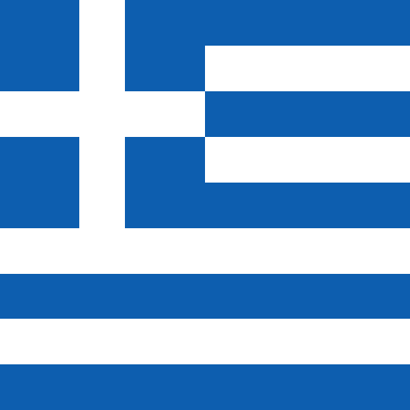
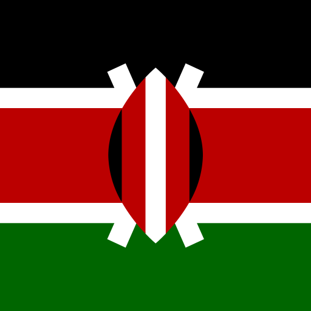
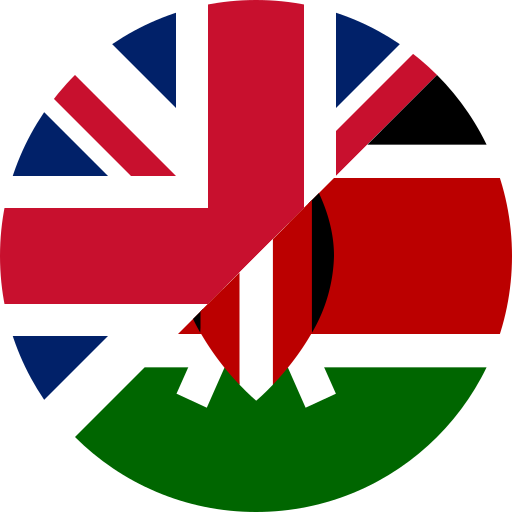

# svg-flags

Clean, Xcode-compatible SVG flags with official colors in multiple shapes.

**[Browse the gallery](https://motomatic-llc.github.io/svg-flags)**

## Why this exists

I use [HatScripts/circle-flags](https://github.com/HatScripts/circle-flags) in many different projects — it's a fantastic collection of 400+ minimal circular SVG flags. But I keep running into the same issues:

**Xcode can't render them.** The circle-flags SVGs use `<mask>` elements for circular clipping. Xcode's SVG renderer has limited support — it doesn't handle masks, CSS `<style>` blocks, or complex filters. Importing these into an Xcode asset catalog produces blank or broken images. This project uses `<clipPath>` instead, which Xcode handles correctly.

**Circle shape isn't always enough.** Circular flags work great for profile badges and map markers, but many UI contexts call for rectangular flags — table rows, settings screens, country pickers, informational displays. This project provides multiple shape variants from simplified icons to full-detail flags.

**Colors are simplified.** circle-flags maps every flag to an 11-color palette for visual consistency. That's a reasonable design choice, but it means the US flag uses `#d80027` instead of Old Glory Red `#B31942`, and `#0052b4` instead of Old Glory Blue `#0A3161`. This project uses the actual official flag colors, sourced from Wikipedia/Wikimedia Commons SVGs, and documents every color below.

| circle-flags | svg-flags |
|:---:|:---:|
|  |  |
| Simplified palette | Official colors |

**Symlinks cause problems.** The language flags in circle-flags are symlinks pointing to country flags. Symlinks break in Xcode asset catalogs, some npm packaging, and cross-platform workflows. This project duplicates files instead — every flag is a standalone SVG.

## Credits

This project is based on and inspired by [HatScripts/circle-flags](https://github.com/HatScripts/circle-flags), which is MIT licensed. The SVG geometry for circle and rect variants was adapted from that project, with modifications for Xcode compatibility and official color accuracy. Full-size variants are based on Wikimedia Commons SVGs.

## Variants

| Variant | Directory | Source | Description |
|---------|-----------|--------|-------------|
| Circle | `circle/` | circle-flags | 512×512 circular flags, `<mask>` → `<clipPath>`, real colors |
| Rect | `rect/` | circle-flags | 512×512 square, circle-flags geometry without circular clip |
| Full-size simplified | `full-size-simplified/` | circle-flags | True aspect ratio, simplified geometry for complicated flags, real colors |
| Full-size | `full-size/` | Wikipedia | True proportions & detail, based on Wikimedia Commons SVGs |

**circle** and **rect** use the same simplified geometry from circle-flags — just with official colors and Xcode-compatible SVG elements. **full-size-simplified** uses that geometry at the flag's true aspect ratio. **full-size** uses the actual detailed flag SVGs from Wikipedia with proper proportions and accurate geometry.

## Border

Circle and rect variants of mostly-white flags (like Japan) include a subtle grey border (`#cdcfd3`) to prevent them from disappearing into white backgrounds.

The border is inside the `<clipPath>` group so only the inner half of the stroke is visible — the flag stays full-size. It's marked with a `<!-- border -->` comment:

```xml
<!-- border --><circle cx="256" cy="256" r="256" fill="none" stroke="#cdcfd3" stroke-width="4"/>
```

To remove it, delete the line or strip all borders with:

```bash
sed -i '' '/<!-- border -->/d' circle/**/*.svg rect/**/*.svg
```

## Structure

```
svg-flags/
├── circle/
│   ├── countries/     # UN member states (ISO 3166-1 alpha-2)
│   ├── other/
│   │   ├── locales/   # Non-UN places (tw.svg, northern-cyprus.svg, ...)
│   │   └── orgs/      # Organizations & symbols (nato.svg, un.svg, ...)
│   ├── historical/    # Former states (confederacy.svg, ussr.svg, ...)
│   ├── states/        # Subdivisions (us-ca.svg, us-ny.svg, ...)
│   └── languages/     # Language codes (en.svg, es.svg, ...)
├── rect/
│   └── (same subcategories)
├── full-size-simplified/
│   └── (same subcategories)
├── full-size/
│   └── (same subcategories)
└── index.html         # Visual gallery (open in browser)
```

## Categories

- **countries/** — UN member states, using [ISO 3166-1 alpha-2](https://en.wikipedia.org/wiki/ISO_3166-1_alpha-2) codes
- **other/** — Two subcategories:
  - **other/locales/** — Places with widely recognized flags that are not UN member states (e.g. Taiwan, Northern Cyprus, Kosovo)
  - **other/orgs/** — Organizations, symbols, and novelty flags (e.g. NATO, UN, Olympics, F1 chequered flag)
- **historical/** — Flags of former states and defunct entities (e.g. Confederate battle flag, Soviet Union, Prussia)
- **states/** — Subnational divisions (e.g. US states, Canadian provinces), using [ISO 3166-2](https://en.wikipedia.org/wiki/ISO_3166-2) codes
- **languages/** — Language flags (duplicated files, not symlinks)

## Progress

### Countries (UN member states)

| Code | Name | Circle | Rect | Simplified | Full-size | Colors |
|------|------|:------:|:----:|:----------:|:---------:|--------|
| `fr` | [France](https://en.wikipedia.org/wiki/France) |  |  |  | [✓](full-size/countries/fr.svg) | [`#002654`](https://en.wikipedia.org/wiki/File:Flag_of_France.svg)<br>[`#FFFFFF`](https://en.wikipedia.org/wiki/File:Flag_of_France.svg)<br>[`#CE1126`](https://en.wikipedia.org/wiki/File:Flag_of_France.svg) |
| `gr` | [Greece](https://en.wikipedia.org/wiki/Greece) |  |  |  | [✓](full-size/countries/gr.svg) | [`#0D5EAF`](https://en.wikipedia.org/wiki/File:Flag_of_Greece.svg)<br>[`#FFFFFF`](https://en.wikipedia.org/wiki/File:Flag_of_Greece.svg) |
| `de` | [Germany](https://en.wikipedia.org/wiki/Germany) |  |  |  | [✓](full-size/countries/de.svg) | [`#000000`](https://en.wikipedia.org/wiki/File:Flag_of_Germany.svg)<br>[`#DD0000`](https://en.wikipedia.org/wiki/File:Flag_of_Germany.svg)<br>[`#FFCE00`](https://en.wikipedia.org/wiki/File:Flag_of_Germany.svg) |
| `jp` | [Japan](https://en.wikipedia.org/wiki/Japan) |  |  |  | [✓](full-size/countries/jp.svg) | [`#FFFFFF`](https://en.wikipedia.org/wiki/File:Flag_of_Japan.svg)<br>[`#BC002D`](https://en.wikipedia.org/wiki/File:Flag_of_Japan.svg) |
| `ke` | [Kenya](https://en.wikipedia.org/wiki/Kenya) |  |  |  | [✓](full-size/countries/ke.svg) | [`#000000`](https://en.wikipedia.org/wiki/File:Flag_of_Kenya.svg)<br>[`#BB0000`](https://en.wikipedia.org/wiki/File:Flag_of_Kenya.svg)<br>[`#FFFFFF`](https://en.wikipedia.org/wiki/File:Flag_of_Kenya.svg)<br>[`#006600`](https://en.wikipedia.org/wiki/File:Flag_of_Kenya.svg) |
| `gb` | [United Kingdom](https://en.wikipedia.org/wiki/United_Kingdom) |  |  |  | [✓](full-size/countries/gb.svg) | [`#C8102E`](https://en.wikipedia.org/wiki/File:Flag_of_the_United_Kingdom.svg)<br>[`#FFFFFF`](https://en.wikipedia.org/wiki/File:Flag_of_the_United_Kingdom.svg)<br>[`#012169`](https://en.wikipedia.org/wiki/File:Flag_of_the_United_Kingdom.svg) |
| `us` | [United States](https://en.wikipedia.org/wiki/United_States) |  |  |  | [✓](full-size/countries/us.svg) | [`#B31942`](https://commons.wikimedia.org/wiki/File:Flag_of_the_United_States.svg)<br>[`#FFFFFF`](https://commons.wikimedia.org/wiki/File:Flag_of_the_United_States.svg)<br>[`#0A3161`](https://commons.wikimedia.org/wiki/File:Flag_of_the_United_States.svg) |
| `af` | [Afghanistan](https://en.wikipedia.org/wiki/Afghanistan) | | | | | |
| `al` | [Albania](https://en.wikipedia.org/wiki/Albania) | | | | | |
| `dz` | [Algeria](https://en.wikipedia.org/wiki/Algeria) | | | | | |
| `ad` | [Andorra](https://en.wikipedia.org/wiki/Andorra) | | | | | |
| `ao` | [Angola](https://en.wikipedia.org/wiki/Angola) | | | | | |
| `ag` | [Antigua and Barbuda](https://en.wikipedia.org/wiki/Antigua_and_Barbuda) | | | | | |
| `ar` | [Argentina](https://en.wikipedia.org/wiki/Argentina) | | | | | |
| `am` | [Armenia](https://en.wikipedia.org/wiki/Armenia) | | | | | |
| `au` | [Australia](https://en.wikipedia.org/wiki/Australia) |  |  |  |  | [`#012169`](https://commons.wikimedia.org/wiki/File:Flag_of_Australia_(converted).svg)<br>[`#E4002B`](https://commons.wikimedia.org/wiki/File:Flag_of_Australia_(converted).svg)<br>[`#FFFFFF`](https://commons.wikimedia.org/wiki/File:Flag_of_Australia_(converted).svg) |
| `at` | [Austria](https://en.wikipedia.org/wiki/Austria) | | | | | |
| `az` | [Azerbaijan](https://en.wikipedia.org/wiki/Azerbaijan) | | | | | |
| `bs` | [Bahamas](https://en.wikipedia.org/wiki/The_Bahamas) |  |  |  |  | [`#000000`](https://commons.wikimedia.org/wiki/File:Flag_of_the_Bahamas.svg)<br>[`#00778B`](https://commons.wikimedia.org/wiki/File:Flag_of_the_Bahamas.svg)<br>[`#FFC72C`](https://commons.wikimedia.org/wiki/File:Flag_of_the_Bahamas.svg) |
| `bh` | [Bahrain](https://en.wikipedia.org/wiki/Bahrain) | | | | | |
| `bd` | [Bangladesh](https://en.wikipedia.org/wiki/Bangladesh) | | | | | |
| `bb` | [Barbados](https://en.wikipedia.org/wiki/Barbados) |  |  |  |  | [`#000000`](https://commons.wikimedia.org/wiki/File:Flag_of_Barbados.svg)<br>[`#00267F`](https://commons.wikimedia.org/wiki/File:Flag_of_Barbados.svg)<br>[`#FFC726`](https://commons.wikimedia.org/wiki/File:Flag_of_Barbados.svg) |
| `by` | [Belarus](https://en.wikipedia.org/wiki/Belarus) | | | | | |
| `be` | [Belgium](https://en.wikipedia.org/wiki/Belgium) |  |  |  |  | [`#000000`](https://commons.wikimedia.org/wiki/File:Flag_of_Belgium.svg)<br>[`#EF3340`](https://commons.wikimedia.org/wiki/File:Flag_of_Belgium.svg)<br>[`#FDDA25`](https://commons.wikimedia.org/wiki/File:Flag_of_Belgium.svg) |
| `bz` | [Belize](https://en.wikipedia.org/wiki/Belize) |  |  |  |  | [`#006AC8`](https://commons.wikimedia.org/wiki/File:Flag_of_Belize.svg)<br>[`#AD7D5A`](https://commons.wikimedia.org/wiki/File:Flag_of_Belize.svg)<br>[`#D90F19`](https://commons.wikimedia.org/wiki/File:Flag_of_Belize.svg)<br>[`#FFE682`](https://commons.wikimedia.org/wiki/File:Flag_of_Belize.svg)<br>[`#FFFFFF`](https://commons.wikimedia.org/wiki/File:Flag_of_Belize.svg) |
| `bj` | [Benin](https://en.wikipedia.org/wiki/Benin) |  |  |  |  | [`#008751`](https://commons.wikimedia.org/wiki/File:Flag_of_Benin.svg)<br>[`#E8112D`](https://commons.wikimedia.org/wiki/File:Flag_of_Benin.svg)<br>[`#FCD116`](https://commons.wikimedia.org/wiki/File:Flag_of_Benin.svg) |
| `bt` | [Bhutan](https://en.wikipedia.org/wiki/Bhutan) | | | | | |
| `bo` | [Bolivia](https://en.wikipedia.org/wiki/Bolivia) | | | | | |
| `ba` | [Bosnia and Herzegovina](https://en.wikipedia.org/wiki/Bosnia_and_Herzegovina) | | | | | |
| `bw` | [Botswana](https://en.wikipedia.org/wiki/Botswana) |  |  |  |  | [`#000000`](https://commons.wikimedia.org/wiki/File:Flag_of_Botswana.svg)<br>[`#6DA9D2`](https://commons.wikimedia.org/wiki/File:Flag_of_Botswana.svg)<br>[`#FFFFFF`](https://commons.wikimedia.org/wiki/File:Flag_of_Botswana.svg) |
| `br` | [Brazil](https://en.wikipedia.org/wiki/Brazil) | | | | | |
| `bn` | [Brunei](https://en.wikipedia.org/wiki/Brunei) | | | | | |
| `bg` | [Bulgaria](https://en.wikipedia.org/wiki/Bulgaria) | | | | | |
| `bf` | [Burkina Faso](https://en.wikipedia.org/wiki/Burkina_Faso) |  |  |  |  | [`#009E49`](https://commons.wikimedia.org/wiki/File:Flag_of_Burkina_Faso.svg)<br>[`#EF2B2D`](https://commons.wikimedia.org/wiki/File:Flag_of_Burkina_Faso.svg)<br>[`#FCD116`](https://commons.wikimedia.org/wiki/File:Flag_of_Burkina_Faso.svg) |
| `bi` | [Burundi](https://en.wikipedia.org/wiki/Burundi) |  |  |  |  | [`#43B02A`](https://commons.wikimedia.org/wiki/File:Flag_of_Burundi.svg)<br>[`#C8102E`](https://commons.wikimedia.org/wiki/File:Flag_of_Burundi.svg)<br>[`#FFFFFF`](https://commons.wikimedia.org/wiki/File:Flag_of_Burundi.svg) |
| `cv` | [Cabo Verde](https://en.wikipedia.org/wiki/Cape_Verde) | | | | | |
| `kh` | [Cambodia](https://en.wikipedia.org/wiki/Cambodia) | | | | | |
| `cm` | [Cameroon](https://en.wikipedia.org/wiki/Cameroon) |  |  |  |  | [`#007A5E`](https://commons.wikimedia.org/wiki/File:Flag_of_Cameroon.svg)<br>[`#CE1126`](https://commons.wikimedia.org/wiki/File:Flag_of_Cameroon.svg)<br>[`#FCD116`](https://commons.wikimedia.org/wiki/File:Flag_of_Cameroon.svg) |
| `ca` | [Canada](https://en.wikipedia.org/wiki/Canada) |  |  |  |  | [`#D52B1E`](https://commons.wikimedia.org/wiki/File:Flag_of_Canada_(Pantone).svg)<br>[`#FFFFFF`](https://commons.wikimedia.org/wiki/File:Flag_of_Canada_(Pantone).svg) |
| `cf` | [Central African Republic](https://en.wikipedia.org/wiki/Central_African_Republic) |  |  |  |  | [`#003082`](https://commons.wikimedia.org/wiki/File:Flag_of_the_Central_African_Republic.svg)<br>[`#289728`](https://commons.wikimedia.org/wiki/File:Flag_of_the_Central_African_Republic.svg)<br>[`#D21034`](https://commons.wikimedia.org/wiki/File:Flag_of_the_Central_African_Republic.svg)<br>[`#FFCE00`](https://commons.wikimedia.org/wiki/File:Flag_of_the_Central_African_Republic.svg)<br>[`#FFFFFF`](https://commons.wikimedia.org/wiki/File:Flag_of_the_Central_African_Republic.svg) |
| `td` | [Chad](https://en.wikipedia.org/wiki/Chad) |  |  |  |  | [`#002664`](https://commons.wikimedia.org/wiki/File:Flag_of_Chad.svg)<br>[`#C60C30`](https://commons.wikimedia.org/wiki/File:Flag_of_Chad.svg)<br>[`#FECB00`](https://commons.wikimedia.org/wiki/File:Flag_of_Chad.svg) |
| `cl` | [Chile](https://en.wikipedia.org/wiki/Chile) | | | | | |
| `cn` | [China](https://en.wikipedia.org/wiki/China) | | | | | |
| `co` | [Colombia](https://en.wikipedia.org/wiki/Colombia) | | | | | |
| `km` | [Comoros](https://en.wikipedia.org/wiki/Comoros) |  |  |  |  | [`#003DA5`](https://commons.wikimedia.org/wiki/File:Flag_of_the_Comoros.svg)<br>[`#009639`](https://commons.wikimedia.org/wiki/File:Flag_of_the_Comoros.svg)<br>[`#EF3340`](https://commons.wikimedia.org/wiki/File:Flag_of_the_Comoros.svg)<br>[`#FFD100`](https://commons.wikimedia.org/wiki/File:Flag_of_the_Comoros.svg)<br>[`#FFFFFF`](https://commons.wikimedia.org/wiki/File:Flag_of_the_Comoros.svg) |
| `cg` | [Congo](https://en.wikipedia.org/wiki/Republic_of_the_Congo) |  |  |  |  | [`#009739`](https://commons.wikimedia.org/wiki/File:Flag_of_the_Republic_of_the_Congo.svg)<br>[`#DC241F`](https://commons.wikimedia.org/wiki/File:Flag_of_the_Republic_of_the_Congo.svg)<br>[`#FFD100`](https://commons.wikimedia.org/wiki/File:Flag_of_the_Republic_of_the_Congo.svg)<br>[`#FFFFFF`](https://commons.wikimedia.org/wiki/File:Flag_of_the_Republic_of_the_Congo.svg) |
| `cd` | [Congo (DRC)](https://en.wikipedia.org/wiki/Democratic_Republic_of_the_Congo) |  |  |  |  | [`#007FFF`](https://commons.wikimedia.org/wiki/File:Flag_of_the_Democratic_Republic_of_the_Congo.svg)<br>[`#CE1021`](https://commons.wikimedia.org/wiki/File:Flag_of_the_Democratic_Republic_of_the_Congo.svg)<br>[`#F7D618`](https://commons.wikimedia.org/wiki/File:Flag_of_the_Democratic_Republic_of_the_Congo.svg)<br>[`#FFFFFF`](https://commons.wikimedia.org/wiki/File:Flag_of_the_Democratic_Republic_of_the_Congo.svg) |
| `cr` | [Costa Rica](https://en.wikipedia.org/wiki/Costa_Rica) | | | | | |
| `hr` | [Croatia](https://en.wikipedia.org/wiki/Croatia) | | | | | |
| `cu` | [Cuba](https://en.wikipedia.org/wiki/Cuba) | | | | | |
| `cy` | [Cyprus](https://en.wikipedia.org/wiki/Cyprus) | | | | | |
| `cz` | [Czechia](https://en.wikipedia.org/wiki/Czech_Republic) | | | | | |
| `ci` | [Côte d'Ivoire](https://en.wikipedia.org/wiki/Ivory_Coast) |  |  |  |  | [`#009A44`](https://commons.wikimedia.org/wiki/File:Flag_of_Côte_d'Ivoire.svg)<br>[`#FF8200`](https://commons.wikimedia.org/wiki/File:Flag_of_Côte_d'Ivoire.svg)<br>[`#FFFFFF`](https://commons.wikimedia.org/wiki/File:Flag_of_Côte_d'Ivoire.svg) |
| `dk` | [Denmark](https://en.wikipedia.org/wiki/Denmark) | | | | | |
| `dj` | [Djibouti](https://en.wikipedia.org/wiki/Djibouti) |  |  |  |  | [`#12AD2B`](https://commons.wikimedia.org/wiki/File:Flag_of_Djibouti.svg)<br>[`#6AB2E7`](https://commons.wikimedia.org/wiki/File:Flag_of_Djibouti.svg)<br>[`#D7141A`](https://commons.wikimedia.org/wiki/File:Flag_of_Djibouti.svg)<br>[`#FFFFFF`](https://commons.wikimedia.org/wiki/File:Flag_of_Djibouti.svg) |
| `dm` | [Dominica](https://en.wikipedia.org/wiki/Dominica) |  |  |  |  | [`#000000`](https://commons.wikimedia.org/wiki/File:Flag_of_Dominica.svg)<br>[`#046A38`](https://commons.wikimedia.org/wiki/File:Flag_of_Dominica.svg)<br>[`#D50032`](https://commons.wikimedia.org/wiki/File:Flag_of_Dominica.svg)<br>[`#FFCD00`](https://commons.wikimedia.org/wiki/File:Flag_of_Dominica.svg)<br>[`#FFFFFF`](https://commons.wikimedia.org/wiki/File:Flag_of_Dominica.svg) |
| `do` | [Dominican Republic](https://en.wikipedia.org/wiki/Dominican_Republic) | | | | | |
| `ec` | [Ecuador](https://en.wikipedia.org/wiki/Ecuador) | | | | | |
| `eg` | [Egypt](https://en.wikipedia.org/wiki/Egypt) | | | | | |
| `sv` | [El Salvador](https://en.wikipedia.org/wiki/El_Salvador) | | | | | |
| `gq` | [Equatorial Guinea](https://en.wikipedia.org/wiki/Equatorial_Guinea) |  |  |  |  | [`#0073CE`](https://commons.wikimedia.org/wiki/File:Flag_of_Equatorial_Guinea.svg)<br>[`#3E9A00`](https://commons.wikimedia.org/wiki/File:Flag_of_Equatorial_Guinea.svg)<br>[`#A36629`](https://commons.wikimedia.org/wiki/File:Flag_of_Equatorial_Guinea.svg)<br>[`#DDDDDD`](https://commons.wikimedia.org/wiki/File:Flag_of_Equatorial_Guinea.svg)<br>[`#E32118`](https://commons.wikimedia.org/wiki/File:Flag_of_Equatorial_Guinea.svg)<br>[`#FFFFFF`](https://commons.wikimedia.org/wiki/File:Flag_of_Equatorial_Guinea.svg) |
| `er` | [Eritrea](https://en.wikipedia.org/wiki/Eritrea) | | | | | |
| `ee` | [Estonia](https://en.wikipedia.org/wiki/Estonia) | | | | | |
| `sz` | [Eswatini](https://en.wikipedia.org/wiki/Eswatini) | | | | | |
| `et` | [Ethiopia](https://en.wikipedia.org/wiki/Ethiopia) | | | | | |
| `fj` | [Fiji](https://en.wikipedia.org/wiki/Fiji) |  |  |  |  | [`#012169`](https://commons.wikimedia.org/wiki/File:Flag_of_Fiji.svg)<br>[`#62B5E5`](https://commons.wikimedia.org/wiki/File:Flag_of_Fiji.svg)<br>[`#C8102E`](https://commons.wikimedia.org/wiki/File:Flag_of_Fiji.svg)<br>[`#FFFFFF`](https://commons.wikimedia.org/wiki/File:Flag_of_Fiji.svg) |
| `fi` | [Finland](https://en.wikipedia.org/wiki/Finland) | | | | | |
| `ga` | [Gabon](https://en.wikipedia.org/wiki/Gabon) |  |  |  |  | [`#009E60`](https://commons.wikimedia.org/wiki/File:Flag_of_Gabon.svg)<br>[`#3A75C4`](https://commons.wikimedia.org/wiki/File:Flag_of_Gabon.svg)<br>[`#FCD116`](https://commons.wikimedia.org/wiki/File:Flag_of_Gabon.svg) |
| `gm` | [Gambia](https://en.wikipedia.org/wiki/The_Gambia) |  |  |  |  | [`#0C1C8C`](https://commons.wikimedia.org/wiki/File:Flag_of_The_Gambia.svg)<br>[`#3A7728`](https://commons.wikimedia.org/wiki/File:Flag_of_The_Gambia.svg)<br>[`#CE1126`](https://commons.wikimedia.org/wiki/File:Flag_of_The_Gambia.svg)<br>[`#FFFFFF`](https://commons.wikimedia.org/wiki/File:Flag_of_The_Gambia.svg) |
| `ge` | [Georgia](https://en.wikipedia.org/wiki/Georgia_(country)) | | | | | |
| `gh` | [Ghana](https://en.wikipedia.org/wiki/Ghana) |  |  |  |  | [`#000000`](https://commons.wikimedia.org/wiki/File:Flag_of_Ghana.svg)<br>[`#006B3F`](https://commons.wikimedia.org/wiki/File:Flag_of_Ghana.svg)<br>[`#CE1126`](https://commons.wikimedia.org/wiki/File:Flag_of_Ghana.svg)<br>[`#FCD116`](https://commons.wikimedia.org/wiki/File:Flag_of_Ghana.svg) |
| `gd` | [Grenada](https://en.wikipedia.org/wiki/Grenada) |  |  |  |  | [`#007A5E`](https://commons.wikimedia.org/wiki/File:Flag_of_Grenada.svg)<br>[`#CE1126`](https://commons.wikimedia.org/wiki/File:Flag_of_Grenada.svg)<br>[`#FCD116`](https://commons.wikimedia.org/wiki/File:Flag_of_Grenada.svg) |
| `gt` | [Guatemala](https://en.wikipedia.org/wiki/Guatemala) | | | | | |
| `gn` | [Guinea](https://en.wikipedia.org/wiki/Guinea) |  |  |  |  | [`#009460`](https://commons.wikimedia.org/wiki/File:Flag_of_Guinea.svg)<br>[`#CE1126`](https://commons.wikimedia.org/wiki/File:Flag_of_Guinea.svg)<br>[`#FCD116`](https://commons.wikimedia.org/wiki/File:Flag_of_Guinea.svg) |
| `gw` | [Guinea-Bissau](https://en.wikipedia.org/wiki/Guinea-Bissau) | | | | | |
| `gy` | [Guyana](https://en.wikipedia.org/wiki/Guyana) |  |  |  |  | [`#000000`](https://commons.wikimedia.org/wiki/File:Flag_of_Guyana.svg)<br>[`#2A936A`](https://commons.wikimedia.org/wiki/File:Flag_of_Guyana.svg)<br>[`#BE1E2D`](https://commons.wikimedia.org/wiki/File:Flag_of_Guyana.svg)<br>[`#FFC20E`](https://commons.wikimedia.org/wiki/File:Flag_of_Guyana.svg)<br>[`#FFFFFF`](https://commons.wikimedia.org/wiki/File:Flag_of_Guyana.svg) |
| `ht` | [Haiti](https://en.wikipedia.org/wiki/Haiti) |  |  |  |  | [`#00209F`](https://commons.wikimedia.org/wiki/File:Flag_of_Haiti.svg)<br>[`#016A16`](https://commons.wikimedia.org/wiki/File:Flag_of_Haiti.svg)<br>[`#D21034`](https://commons.wikimedia.org/wiki/File:Flag_of_Haiti.svg)<br>[`#F1B617`](https://commons.wikimedia.org/wiki/File:Flag_of_Haiti.svg)<br>[`#FFFFFF`](https://commons.wikimedia.org/wiki/File:Flag_of_Haiti.svg) |
| `hn` | [Honduras](https://en.wikipedia.org/wiki/Honduras) | | | | | |
| `hu` | [Hungary](https://en.wikipedia.org/wiki/Hungary) | | | | | |
| `is` | [Iceland](https://en.wikipedia.org/wiki/Iceland) | | | | | |
| `in` | [India](https://en.wikipedia.org/wiki/India) |  |  |  |  | [`#046A38`](https://commons.wikimedia.org/wiki/File:Flag_of_India.svg)<br>[`#07038D`](https://commons.wikimedia.org/wiki/File:Flag_of_India.svg)<br>[`#FF6820`](https://commons.wikimedia.org/wiki/File:Flag_of_India.svg)<br>[`#FFFFFF`](https://commons.wikimedia.org/wiki/File:Flag_of_India.svg) |
| `id` | [Indonesia](https://en.wikipedia.org/wiki/Indonesia) | | | | | |
| `ir` | [Iran](https://en.wikipedia.org/wiki/Iran) | | | | | |
| `iq` | [Iraq](https://en.wikipedia.org/wiki/Iraq) | | | | | |
| `ie` | [Ireland](https://en.wikipedia.org/wiki/Republic_of_Ireland) |  |  |  |  | [`#169B62`](https://commons.wikimedia.org/wiki/File:Flag_of_Ireland.svg)<br>[`#FF883E`](https://commons.wikimedia.org/wiki/File:Flag_of_Ireland.svg)<br>[`#FFFFFF`](https://commons.wikimedia.org/wiki/File:Flag_of_Ireland.svg) |
| `il` | [Israel](https://en.wikipedia.org/wiki/Israel) | | | | | |
| `it` | [Italy](https://en.wikipedia.org/wiki/Italy) | | | | | |
| `jm` | [Jamaica](https://en.wikipedia.org/wiki/Jamaica) |  |  |  |  | [`#000000`](https://commons.wikimedia.org/wiki/File:Flag_of_Jamaica.svg)<br>[`#007749`](https://commons.wikimedia.org/wiki/File:Flag_of_Jamaica.svg)<br>[`#FFB81C`](https://commons.wikimedia.org/wiki/File:Flag_of_Jamaica.svg) |
| `jo` | [Jordan](https://en.wikipedia.org/wiki/Jordan) | | | | | |
| `kz` | [Kazakhstan](https://en.wikipedia.org/wiki/Kazakhstan) | | | | | |
| `ki` | [Kiribati](https://en.wikipedia.org/wiki/Kiribati) |  |  |  |  | [`#183070`](https://commons.wikimedia.org/wiki/File:Flag_of_Kiribati.svg)<br>[`#C81010`](https://commons.wikimedia.org/wiki/File:Flag_of_Kiribati.svg)<br>[`#F8D000`](https://commons.wikimedia.org/wiki/File:Flag_of_Kiribati.svg)<br>[`#FFFFFF`](https://commons.wikimedia.org/wiki/File:Flag_of_Kiribati.svg) |
| `kw` | [Kuwait](https://en.wikipedia.org/wiki/Kuwait) | | | | | |
| `kg` | [Kyrgyzstan](https://en.wikipedia.org/wiki/Kyrgyzstan) | | | | | |
| `la` | [Laos](https://en.wikipedia.org/wiki/Laos) | | | | | |
| `lv` | [Latvia](https://en.wikipedia.org/wiki/Latvia) | | | | | |
| `lb` | [Lebanon](https://en.wikipedia.org/wiki/Lebanon) | | | | | |
| `ls` | [Lesotho](https://en.wikipedia.org/wiki/Lesotho) |  |  |  |  | [`#000000`](https://commons.wikimedia.org/wiki/File:Flag_of_Lesotho.svg)<br>[`#001489`](https://commons.wikimedia.org/wiki/File:Flag_of_Lesotho.svg)<br>[`#009A44`](https://commons.wikimedia.org/wiki/File:Flag_of_Lesotho.svg)<br>[`#FFFFFF`](https://commons.wikimedia.org/wiki/File:Flag_of_Lesotho.svg) |
| `lr` | [Liberia](https://en.wikipedia.org/wiki/Liberia) |  |  |  |  | [`#003377`](https://commons.wikimedia.org/wiki/File:Flag_of_Liberia.svg)<br>[`#CC1133`](https://commons.wikimedia.org/wiki/File:Flag_of_Liberia.svg)<br>[`#FFFFFF`](https://commons.wikimedia.org/wiki/File:Flag_of_Liberia.svg) |
| `ly` | [Libya](https://en.wikipedia.org/wiki/Libya) | | | | | |
| `li` | [Liechtenstein](https://en.wikipedia.org/wiki/Liechtenstein) | | | | | |
| `lt` | [Lithuania](https://en.wikipedia.org/wiki/Lithuania) | | | | | |
| `lu` | [Luxembourg](https://en.wikipedia.org/wiki/Luxembourg) |  |  |  |  | [`#00A3E0`](https://commons.wikimedia.org/wiki/File:Flag_of_Luxembourg.svg)<br>[`#EF3340`](https://commons.wikimedia.org/wiki/File:Flag_of_Luxembourg.svg)<br>[`#FFFFFF`](https://commons.wikimedia.org/wiki/File:Flag_of_Luxembourg.svg) |
| `mg` | [Madagascar](https://en.wikipedia.org/wiki/Madagascar) |  |  |  |  | [`#00843D`](https://commons.wikimedia.org/wiki/File:Flag_of_Madagascar.svg)<br>[`#F9423A`](https://commons.wikimedia.org/wiki/File:Flag_of_Madagascar.svg)<br>[`#FFFFFF`](https://commons.wikimedia.org/wiki/File:Flag_of_Madagascar.svg) |
| `mw` | [Malawi](https://en.wikipedia.org/wiki/Malawi) |  |  |  |  | [`#000000`](https://commons.wikimedia.org/wiki/File:Flag_of_Malawi.svg)<br>[`#339E35`](https://commons.wikimedia.org/wiki/File:Flag_of_Malawi.svg)<br>[`#CE1126`](https://commons.wikimedia.org/wiki/File:Flag_of_Malawi.svg) |
| `my` | [Malaysia](https://en.wikipedia.org/wiki/Malaysia) | | | | | |
| `mv` | [Maldives](https://en.wikipedia.org/wiki/Maldives) | | | | | |
| `ml` | [Mali](https://en.wikipedia.org/wiki/Mali) |  |  |  |  | [`#14B53A`](https://commons.wikimedia.org/wiki/File:Flag_of_Mali.svg)<br>[`#CE1126`](https://commons.wikimedia.org/wiki/File:Flag_of_Mali.svg)<br>[`#FCD116`](https://commons.wikimedia.org/wiki/File:Flag_of_Mali.svg) |
| `mt` | [Malta](https://en.wikipedia.org/wiki/Malta) |  |  |  |  | [`#CF142B`](https://commons.wikimedia.org/wiki/File:Flag_of_Malta.svg)<br>[`#FFFFFF`](https://commons.wikimedia.org/wiki/File:Flag_of_Malta.svg) |
| `mh` | [Marshall Islands](https://en.wikipedia.org/wiki/Marshall_Islands) |  |  |  |  | [`#003893`](https://commons.wikimedia.org/wiki/File:Flag_of_the_Marshall_Islands.svg)<br>[`#DD7500`](https://commons.wikimedia.org/wiki/File:Flag_of_the_Marshall_Islands.svg)<br>[`#FFFFFF`](https://commons.wikimedia.org/wiki/File:Flag_of_the_Marshall_Islands.svg) |
| `mr` | [Mauritania](https://en.wikipedia.org/wiki/Mauritania) | | | | | |
| `mu` | [Mauritius](https://en.wikipedia.org/wiki/Mauritius) |  |  |  |  | [`#008658`](https://commons.wikimedia.org/wiki/File:Flag_of_Mauritius.svg)<br>[`#2D3359`](https://commons.wikimedia.org/wiki/File:Flag_of_Mauritius.svg)<br>[`#D01C1F`](https://commons.wikimedia.org/wiki/File:Flag_of_Mauritius.svg)<br>[`#F7B718`](https://commons.wikimedia.org/wiki/File:Flag_of_Mauritius.svg) |
| `mx` | [Mexico](https://en.wikipedia.org/wiki/Mexico) | | | | | |
| `fm` | [Micronesia](https://en.wikipedia.org/wiki/Federated_States_of_Micronesia) |  |  |  |  | [`#75B2DD`](https://commons.wikimedia.org/wiki/File:Flag_of_the_Federated_States_of_Micronesia.svg)<br>[`#FFFFFF`](https://commons.wikimedia.org/wiki/File:Flag_of_the_Federated_States_of_Micronesia.svg) |
| `md` | [Moldova](https://en.wikipedia.org/wiki/Moldova) | | | | | |
| `mc` | [Monaco](https://en.wikipedia.org/wiki/Monaco) |  |  |  |  | [`#CE1126`](https://commons.wikimedia.org/wiki/File:Flag_of_Monaco.svg)<br>[`#FFFFFF`](https://commons.wikimedia.org/wiki/File:Flag_of_Monaco.svg) |
| `mn` | [Mongolia](https://en.wikipedia.org/wiki/Mongolia) | | | | | |
| `me` | [Montenegro](https://en.wikipedia.org/wiki/Montenegro) | | | | | |
| `ma` | [Morocco](https://en.wikipedia.org/wiki/Morocco) | | | | | |
| `mz` | [Mozambique](https://en.wikipedia.org/wiki/Mozambique) | | | | | |
| `mm` | [Myanmar](https://en.wikipedia.org/wiki/Myanmar) | | | | | |
| `na` | [Namibia](https://en.wikipedia.org/wiki/Namibia) |  |  |  |  | [`#002F6C`](https://commons.wikimedia.org/wiki/File:Flag_of_Namibia.svg)<br>[`#009A44`](https://commons.wikimedia.org/wiki/File:Flag_of_Namibia.svg)<br>[`#C8102E`](https://commons.wikimedia.org/wiki/File:Flag_of_Namibia.svg)<br>[`#FFCD00`](https://commons.wikimedia.org/wiki/File:Flag_of_Namibia.svg)<br>[`#FFFFFF`](https://commons.wikimedia.org/wiki/File:Flag_of_Namibia.svg) |
| `nr` | [Nauru](https://en.wikipedia.org/wiki/Nauru) |  |  |  |  | [`#012169`](https://commons.wikimedia.org/wiki/File:Flag_of_Nauru.svg)<br>[`#FFC72C`](https://commons.wikimedia.org/wiki/File:Flag_of_Nauru.svg)<br>[`#FFFFFF`](https://commons.wikimedia.org/wiki/File:Flag_of_Nauru.svg) |
| `np` | [Nepal](https://en.wikipedia.org/wiki/Nepal) | | | | | |
| `nl` | [Netherlands](https://en.wikipedia.org/wiki/Netherlands) | | | | | |
| `nz` | [New Zealand](https://en.wikipedia.org/wiki/New_Zealand) |  |  |  |  | [`#012169`](https://commons.wikimedia.org/wiki/File:Flag_of_New_Zealand.svg)<br>[`#C8102E`](https://commons.wikimedia.org/wiki/File:Flag_of_New_Zealand.svg)<br>[`#FFFFFF`](https://commons.wikimedia.org/wiki/File:Flag_of_New_Zealand.svg) |
| `ni` | [Nicaragua](https://en.wikipedia.org/wiki/Nicaragua) | | | | | |
| `ne` | [Niger](https://en.wikipedia.org/wiki/Niger) |  |  |  |  | [`#0DB02B`](https://commons.wikimedia.org/wiki/File:Flag_of_Niger.svg)<br>[`#E05206`](https://commons.wikimedia.org/wiki/File:Flag_of_Niger.svg)<br>[`#FFFFFF`](https://commons.wikimedia.org/wiki/File:Flag_of_Niger.svg) |
| `ng` | [Nigeria](https://en.wikipedia.org/wiki/Nigeria) |  |  |  |  | [`#008751`](https://commons.wikimedia.org/wiki/File:Flag_of_Nigeria.svg)<br>[`#FFFFFF`](https://commons.wikimedia.org/wiki/File:Flag_of_Nigeria.svg) |
| `kp` | [North Korea](https://en.wikipedia.org/wiki/North_Korea) | | | | | |
| `mk` | [North Macedonia](https://en.wikipedia.org/wiki/North_Macedonia) | | | | | |
| `no` | [Norway](https://en.wikipedia.org/wiki/Norway) | | | | | |
| `om` | [Oman](https://en.wikipedia.org/wiki/Oman) | | | | | |
| `pk` | [Pakistan](https://en.wikipedia.org/wiki/Pakistan) |  |  |  |  | [`#01411C`](https://commons.wikimedia.org/wiki/File:Flag_of_Pakistan.svg)<br>[`#FFFFFF`](https://commons.wikimedia.org/wiki/File:Flag_of_Pakistan.svg) |
| `pw` | [Palau](https://en.wikipedia.org/wiki/Palau) |  |  |  |  | [`#0099FF`](https://commons.wikimedia.org/wiki/File:Flag_of_Palau.svg)<br>[`#FFFF00`](https://commons.wikimedia.org/wiki/File:Flag_of_Palau.svg) |
| `pa` | [Panama](https://en.wikipedia.org/wiki/Panama) | | | | | |
| `pg` | [Papua New Guinea](https://en.wikipedia.org/wiki/Papua_New_Guinea) |  |  |  |  | [`#000000`](https://commons.wikimedia.org/wiki/File:Flag_of_Papua_New_Guinea.svg)<br>[`#C8102E`](https://commons.wikimedia.org/wiki/File:Flag_of_Papua_New_Guinea.svg)<br>[`#FFCD00`](https://commons.wikimedia.org/wiki/File:Flag_of_Papua_New_Guinea.svg)<br>[`#FFFFFF`](https://commons.wikimedia.org/wiki/File:Flag_of_Papua_New_Guinea.svg) |
| `py` | [Paraguay](https://en.wikipedia.org/wiki/Paraguay) | | | | | |
| `pe` | [Peru](https://en.wikipedia.org/wiki/Peru) | | | | | |
| `ph` | [Philippines](https://en.wikipedia.org/wiki/Philippines) |  |  |  |  | [`#0038A8`](https://commons.wikimedia.org/wiki/File:Flag_of_the_Philippines.svg)<br>[`#CE1126`](https://commons.wikimedia.org/wiki/File:Flag_of_the_Philippines.svg)<br>[`#FCD116`](https://commons.wikimedia.org/wiki/File:Flag_of_the_Philippines.svg)<br>[`#FFFFFF`](https://commons.wikimedia.org/wiki/File:Flag_of_the_Philippines.svg) |
| `pl` | [Poland](https://en.wikipedia.org/wiki/Poland) | | | | | |
| `pt` | [Portugal](https://en.wikipedia.org/wiki/Portugal) | | | | | |
| `qa` | [Qatar](https://en.wikipedia.org/wiki/Qatar) | | | | | |
| `ro` | [Romania](https://en.wikipedia.org/wiki/Romania) | | | | | |
| `ru` | [Russia](https://en.wikipedia.org/wiki/Russia) | | | | | |
| `rw` | [Rwanda](https://en.wikipedia.org/wiki/Rwanda) |  |  |  |  | [`#00A3E0`](https://commons.wikimedia.org/wiki/File:Flag_of_Rwanda.svg)<br>[`#20603D`](https://commons.wikimedia.org/wiki/File:Flag_of_Rwanda.svg)<br>[`#FAD201`](https://commons.wikimedia.org/wiki/File:Flag_of_Rwanda.svg) |
| `kn` | [Saint Kitts and Nevis](https://en.wikipedia.org/wiki/Saint_Kitts_and_Nevis) |  |  |  |  | [`#000000`](https://commons.wikimedia.org/wiki/File:Flag_of_Saint_Kitts_and_Nevis.svg)<br>[`#009739`](https://commons.wikimedia.org/wiki/File:Flag_of_Saint_Kitts_and_Nevis.svg)<br>[`#C8102E`](https://commons.wikimedia.org/wiki/File:Flag_of_Saint_Kitts_and_Nevis.svg)<br>[`#FFCD00`](https://commons.wikimedia.org/wiki/File:Flag_of_Saint_Kitts_and_Nevis.svg)<br>[`#FFFFFF`](https://commons.wikimedia.org/wiki/File:Flag_of_Saint_Kitts_and_Nevis.svg) |
| `lc` | [Saint Lucia](https://en.wikipedia.org/wiki/Saint_Lucia) |  |  |  |  | [`#000000`](https://commons.wikimedia.org/wiki/File:Flag_of_Saint_Lucia.svg)<br>[`#66CCFF`](https://commons.wikimedia.org/wiki/File:Flag_of_Saint_Lucia.svg)<br>[`#FCD116`](https://commons.wikimedia.org/wiki/File:Flag_of_Saint_Lucia.svg)<br>[`#FFFFFF`](https://commons.wikimedia.org/wiki/File:Flag_of_Saint_Lucia.svg) |
| `vc` | [Saint Vincent and the Grenadines](https://en.wikipedia.org/wiki/Saint_Vincent_and_the_Grenadines) |  |  |  |  | [`#002674`](https://commons.wikimedia.org/wiki/File:Flag_of_Saint_Vincent_and_the_Grenadines.svg)<br>[`#007C2E`](https://commons.wikimedia.org/wiki/File:Flag_of_Saint_Vincent_and_the_Grenadines.svg)<br>[`#FCD022`](https://commons.wikimedia.org/wiki/File:Flag_of_Saint_Vincent_and_the_Grenadines.svg) |
| `ws` | [Samoa](https://en.wikipedia.org/wiki/Samoa) |  |  |  |  | [`#002B7F`](https://commons.wikimedia.org/wiki/File:Flag_of_Samoa.svg)<br>[`#CE1126`](https://commons.wikimedia.org/wiki/File:Flag_of_Samoa.svg)<br>[`#FFFFFF`](https://commons.wikimedia.org/wiki/File:Flag_of_Samoa.svg) |
| `sm` | [San Marino](https://en.wikipedia.org/wiki/San_Marino) | | | | | |
| `sa` | [Saudi Arabia](https://en.wikipedia.org/wiki/Saudi_Arabia) | | | | | |
| `sn` | [Senegal](https://en.wikipedia.org/wiki/Senegal) |  |  |  |  | [`#00853F`](https://commons.wikimedia.org/wiki/File:Flag_of_Senegal.svg)<br>[`#E31B23`](https://commons.wikimedia.org/wiki/File:Flag_of_Senegal.svg)<br>[`#FDEF42`](https://commons.wikimedia.org/wiki/File:Flag_of_Senegal.svg) |
| `rs` | [Serbia](https://en.wikipedia.org/wiki/Serbia) | | | | | |
| `sc` | [Seychelles](https://en.wikipedia.org/wiki/Seychelles) |  |  |  |  | [`#002F6C`](https://commons.wikimedia.org/wiki/File:Flag_of_Seychelles.svg)<br>[`#007A33`](https://commons.wikimedia.org/wiki/File:Flag_of_Seychelles.svg)<br>[`#D22730`](https://commons.wikimedia.org/wiki/File:Flag_of_Seychelles.svg)<br>[`#FED141`](https://commons.wikimedia.org/wiki/File:Flag_of_Seychelles.svg)<br>[`#FFFFFF`](https://commons.wikimedia.org/wiki/File:Flag_of_Seychelles.svg) |
| `sl` | [Sierra Leone](https://en.wikipedia.org/wiki/Sierra_Leone) |  |  |  |  | [`#0072C6`](https://commons.wikimedia.org/wiki/File:Flag_of_Sierra_Leone.svg)<br>[`#1EB53A`](https://commons.wikimedia.org/wiki/File:Flag_of_Sierra_Leone.svg)<br>[`#FFFFFF`](https://commons.wikimedia.org/wiki/File:Flag_of_Sierra_Leone.svg) |
| `sg` | [Singapore](https://en.wikipedia.org/wiki/Singapore) |  |  |  |  | [`#ED2939`](https://commons.wikimedia.org/wiki/File:Flag_of_Singapore.svg)<br>[`#FFFFFF`](https://commons.wikimedia.org/wiki/File:Flag_of_Singapore.svg) |
| `sk` | [Slovakia](https://en.wikipedia.org/wiki/Slovakia) | | | | | |
| `si` | [Slovenia](https://en.wikipedia.org/wiki/Slovenia) | | | | | |
| `sb` | [Solomon Islands](https://en.wikipedia.org/wiki/Solomon_Islands) |  |  |  |  | [`#0051BA`](https://commons.wikimedia.org/wiki/File:Flag_of_the_Solomon_Islands.svg)<br>[`#215B33`](https://commons.wikimedia.org/wiki/File:Flag_of_the_Solomon_Islands.svg)<br>[`#FCD116`](https://commons.wikimedia.org/wiki/File:Flag_of_the_Solomon_Islands.svg)<br>[`#FFFFFF`](https://commons.wikimedia.org/wiki/File:Flag_of_the_Solomon_Islands.svg) |
| `so` | [Somalia](https://en.wikipedia.org/wiki/Somalia) | | | | | |
| `za` | [South Africa](https://en.wikipedia.org/wiki/South_Africa) |  |  |  |  | [`#000000`](https://commons.wikimedia.org/wiki/File:Flag_of_South_Africa.svg)<br>[`#001489`](https://commons.wikimedia.org/wiki/File:Flag_of_South_Africa.svg)<br>[`#007749`](https://commons.wikimedia.org/wiki/File:Flag_of_South_Africa.svg)<br>[`#E03C31`](https://commons.wikimedia.org/wiki/File:Flag_of_South_Africa.svg)<br>[`#FFB81C`](https://commons.wikimedia.org/wiki/File:Flag_of_South_Africa.svg)<br>[`#FFFFFF`](https://commons.wikimedia.org/wiki/File:Flag_of_South_Africa.svg) |
| `kr` | [South Korea](https://en.wikipedia.org/wiki/South_Korea) | | | | | |
| `ss` | [South Sudan](https://en.wikipedia.org/wiki/South_Sudan) |  |  |  |  | [`#000000`](https://commons.wikimedia.org/wiki/File:Flag_of_South_Sudan.svg)<br>[`#00914C`](https://commons.wikimedia.org/wiki/File:Flag_of_South_Sudan.svg)<br>[`#00B6F2`](https://commons.wikimedia.org/wiki/File:Flag_of_South_Sudan.svg)<br>[`#E22028`](https://commons.wikimedia.org/wiki/File:Flag_of_South_Sudan.svg)<br>[`#FFE51A`](https://commons.wikimedia.org/wiki/File:Flag_of_South_Sudan.svg)<br>[`#FFFFFF`](https://commons.wikimedia.org/wiki/File:Flag_of_South_Sudan.svg) |
| `es` | [Spain](https://en.wikipedia.org/wiki/Spain) | | | | | |
| `lk` | [Sri Lanka](https://en.wikipedia.org/wiki/Sri_Lanka) | | | | | |
| `sd` | [Sudan](https://en.wikipedia.org/wiki/Sudan) |  |  |  |  | [`#000000`](https://commons.wikimedia.org/wiki/File:Flag_of_Sudan.svg)<br>[`#007229`](https://commons.wikimedia.org/wiki/File:Flag_of_Sudan.svg)<br>[`#D21034`](https://commons.wikimedia.org/wiki/File:Flag_of_Sudan.svg)<br>[`#FFFFFF`](https://commons.wikimedia.org/wiki/File:Flag_of_Sudan.svg) |
| `sr` | [Suriname](https://en.wikipedia.org/wiki/Suriname) | | | | | |
| `se` | [Sweden](https://en.wikipedia.org/wiki/Sweden) | | | | | |
| `ch` | [Switzerland](https://en.wikipedia.org/wiki/Switzerland) |  |  |  |  | [`#FF0000`](https://commons.wikimedia.org/wiki/File:Flag_of_Switzerland.svg)<br>[`#FFFFFF`](https://commons.wikimedia.org/wiki/File:Flag_of_Switzerland.svg) |
| `sy` | [Syria](https://en.wikipedia.org/wiki/Syria) | | | | | |
| `st` | [São Tomé and Príncipe](https://en.wikipedia.org/wiki/S%C3%A3o_Tom%C3%A9_and_Pr%C3%ADncipe) | | | | | |
| `tj` | [Tajikistan](https://en.wikipedia.org/wiki/Tajikistan) | | | | | |
| `tz` | [Tanzania](https://en.wikipedia.org/wiki/Tanzania) |  |  |  |  | [`#000000`](https://commons.wikimedia.org/wiki/File:Flag_of_Tanzania.svg)<br>[`#00A3DD`](https://commons.wikimedia.org/wiki/File:Flag_of_Tanzania.svg)<br>[`#1EB53A`](https://commons.wikimedia.org/wiki/File:Flag_of_Tanzania.svg)<br>[`#FCD116`](https://commons.wikimedia.org/wiki/File:Flag_of_Tanzania.svg)<br>[`#FFFFFF`](https://commons.wikimedia.org/wiki/File:Flag_of_Tanzania.svg) |
| `th` | [Thailand](https://en.wikipedia.org/wiki/Thailand) | | | | | |
| `tl` | [Timor-Leste](https://en.wikipedia.org/wiki/East_Timor) | | | | | |
| `tg` | [Togo](https://en.wikipedia.org/wiki/Togo) |  |  |  |  | [`#006A4E`](https://commons.wikimedia.org/wiki/File:Flag_of_Togo.svg)<br>[`#D21034`](https://commons.wikimedia.org/wiki/File:Flag_of_Togo.svg)<br>[`#FFCE00`](https://commons.wikimedia.org/wiki/File:Flag_of_Togo.svg)<br>[`#FFFFFF`](https://commons.wikimedia.org/wiki/File:Flag_of_Togo.svg) |
| `to` | [Tonga](https://en.wikipedia.org/wiki/Tonga) |  |  |  |  | [`#C10000`](https://commons.wikimedia.org/wiki/File:Flag_of_Tonga.svg)<br>[`#FFFFFF`](https://commons.wikimedia.org/wiki/File:Flag_of_Tonga.svg) |
| `tt` | [Trinidad and Tobago](https://en.wikipedia.org/wiki/Trinidad_and_Tobago) |  |  |  |  | [`#000000`](https://commons.wikimedia.org/wiki/File:Flag_of_Trinidad_and_Tobago.svg)<br>[`#DA1A35`](https://commons.wikimedia.org/wiki/File:Flag_of_Trinidad_and_Tobago.svg)<br>[`#FFFFFF`](https://commons.wikimedia.org/wiki/File:Flag_of_Trinidad_and_Tobago.svg) |
| `tn` | [Tunisia](https://en.wikipedia.org/wiki/Tunisia) |  |  |  |  | [`#E70013`](https://commons.wikimedia.org/wiki/File:Flag_of_Tunisia.svg)<br>[`#FFFFFF`](https://commons.wikimedia.org/wiki/File:Flag_of_Tunisia.svg) |
| `tr` | [Turkey](https://en.wikipedia.org/wiki/Turkey) | | | | | |
| `tm` | [Turkmenistan](https://en.wikipedia.org/wiki/Turkmenistan) | | | | | |
| `tv` | [Tuvalu](https://en.wikipedia.org/wiki/Tuvalu) |  |  |  |  | [`#009CDE`](https://commons.wikimedia.org/wiki/File:Flag_of_Tuvalu.svg)<br>[`#012169`](https://commons.wikimedia.org/wiki/File:Flag_of_Tuvalu.svg)<br>[`#C8102E`](https://commons.wikimedia.org/wiki/File:Flag_of_Tuvalu.svg)<br>[`#FEDD00`](https://commons.wikimedia.org/wiki/File:Flag_of_Tuvalu.svg)<br>[`#FFFFFF`](https://commons.wikimedia.org/wiki/File:Flag_of_Tuvalu.svg) |
| `ug` | [Uganda](https://en.wikipedia.org/wiki/Uganda) |  |  |  |  | [`#000000`](https://commons.wikimedia.org/wiki/File:Flag_of_Uganda.svg)<br>[`#D90000`](https://commons.wikimedia.org/wiki/File:Flag_of_Uganda.svg)<br>[`#FCDC04`](https://commons.wikimedia.org/wiki/File:Flag_of_Uganda.svg)<br>[`#FFFFFF`](https://commons.wikimedia.org/wiki/File:Flag_of_Uganda.svg) |
| `ua` | [Ukraine](https://en.wikipedia.org/wiki/Ukraine) | | | | | |
| `ae` | [United Arab Emirates](https://en.wikipedia.org/wiki/United_Arab_Emirates) | | | | | |
| `uy` | [Uruguay](https://en.wikipedia.org/wiki/Uruguay) | | | | | |
| `uz` | [Uzbekistan](https://en.wikipedia.org/wiki/Uzbekistan) | | | | | |
| `vu` | [Vanuatu](https://en.wikipedia.org/wiki/Vanuatu) |  |  |  |  | [`#000000`](https://commons.wikimedia.org/wiki/File:Flag_of_Vanuatu.svg)<br>[`#009543`](https://commons.wikimedia.org/wiki/File:Flag_of_Vanuatu.svg)<br>[`#D21034`](https://commons.wikimedia.org/wiki/File:Flag_of_Vanuatu.svg)<br>[`#FDCE12`](https://commons.wikimedia.org/wiki/File:Flag_of_Vanuatu.svg) |
| `ve` | [Venezuela](https://en.wikipedia.org/wiki/Venezuela) | | | | | |
| `vn` | [Vietnam](https://en.wikipedia.org/wiki/Vietnam) | | | | | |
| `ye` | [Yemen](https://en.wikipedia.org/wiki/Yemen) | | | | | |
| `zm` | [Zambia](https://en.wikipedia.org/wiki/Zambia) |  |  |  |  | [`#000000`](https://commons.wikimedia.org/wiki/File:Flag_of_Zambia.svg)<br>[`#147F55`](https://commons.wikimedia.org/wiki/File:Flag_of_Zambia.svg)<br>[`#D40829`](https://commons.wikimedia.org/wiki/File:Flag_of_Zambia.svg)<br>[`#F99815`](https://commons.wikimedia.org/wiki/File:Flag_of_Zambia.svg) |
| `zw` | [Zimbabwe](https://en.wikipedia.org/wiki/Zimbabwe) |  |  |  |  | [`#000000`](https://commons.wikimedia.org/wiki/File:Flag_of_Zimbabwe.svg)<br>[`#006400`](https://commons.wikimedia.org/wiki/File:Flag_of_Zimbabwe.svg)<br>[`#D40000`](https://commons.wikimedia.org/wiki/File:Flag_of_Zimbabwe.svg)<br>[`#FFD200`](https://commons.wikimedia.org/wiki/File:Flag_of_Zimbabwe.svg)<br>[`#FFFFFF`](https://commons.wikimedia.org/wiki/File:Flag_of_Zimbabwe.svg) |

### Languages

| Code | Name | Circle |
|------|------|:------:|
| `en` | English |  |
| `en-ke` | English (Kenya) |  |
| `en-us` | English (US) |  |
### Other locales (non-UN entities)

| Code | Name | Circle | Rect | Simplified | Full-size | Colors |
|------|------|:------:|:----:|:----------:|:---------:|--------|
| `xk` | [Kosovo](https://en.wikipedia.org/wiki/Kosovo) | | | | | |
| `northern-cyprus` | [Northern Cyprus](https://en.wikipedia.org/wiki/Northern_Cyprus) | | | | | |
| `tw` | [Taiwan](https://en.wikipedia.org/wiki/Taiwan) | | | | | |

### Organizations & symbols

| Code | Name | Circle | Rect | Simplified | Full-size | Colors |
|------|------|:------:|:----:|:----------:|:---------:|--------|
| `checkered` | [F1 chequered flag](https://en.wikipedia.org/wiki/Racing_flags#Chequered_flag) |  |  |  | [✓](full-size/other/orgs/checkered.svg) | [`#322C24`](https://commons.wikimedia.org/wiki/File:F1_chequered_flag.svg)<br>[`#FFFFFF`](https://commons.wikimedia.org/wiki/File:F1_chequered_flag.svg) |
| `nato` | [NATO](https://en.wikipedia.org/wiki/NATO) |  |  |  | [✓](full-size/other/orgs/nato.svg) | [`#004990`](https://en.wikipedia.org/wiki/File:Flag_of_NATO.svg)<br>[`#FFFFFF`](https://en.wikipedia.org/wiki/File:Flag_of_NATO.svg) |
| `olympics` | [Olympics](https://en.wikipedia.org/wiki/Olympic_symbols) |  |  |  | [✓](full-size/other/orgs/olympics.svg) | [`#0081C8`](https://en.wikipedia.org/wiki/File:Olympic_flag.svg)<br>[`#000000`](https://en.wikipedia.org/wiki/File:Olympic_flag.svg)<br>[`#EE334E`](https://en.wikipedia.org/wiki/File:Olympic_flag.svg)<br>[`#FCB131`](https://en.wikipedia.org/wiki/File:Olympic_flag.svg)<br>[`#00A651`](https://en.wikipedia.org/wiki/File:Olympic_flag.svg)<br>[`#FFFFFF`](https://en.wikipedia.org/wiki/File:Olympic_flag.svg) |
| `un` | [United Nations](https://en.wikipedia.org/wiki/United_Nations) |  |  |  | [✓](full-size/other/orgs/un.svg) | [`#009EDB`](https://en.wikipedia.org/wiki/File:Flag_of_the_United_Nations.svg)<br>[`#FFFFFF`](https://en.wikipedia.org/wiki/File:Flag_of_the_United_Nations.svg) |

### US states

| Code | Name | Circle | Rect | Simplified | Full-size | Colors |
|------|------|:------:|:----:|:----------:|:---------:|--------|
| `us-ca` | [California](https://en.wikipedia.org/wiki/California) |  |  |  | [✓](full-size/states/us-ca.svg) | [`#BA0C2F`](https://commons.wikimedia.org/wiki/File:Flag_of_California.svg)<br>[`#FFFFFF`](https://commons.wikimedia.org/wiki/File:Flag_of_California.svg)<br>[`#5C462B`](https://commons.wikimedia.org/wiki/File:Flag_of_California.svg)<br>[`#00843D`](https://commons.wikimedia.org/wiki/File:Flag_of_California.svg)<br>[`#B58150`](https://commons.wikimedia.org/wiki/File:Flag_of_California.svg) |

### Historical

| Code | Name | Circle | Rect | Simplified | Full-size | Colors |
|------|------|:------:|:----:|:----------:|:---------:|--------|
| `confederacy` | [Confederate battle flag](https://commons.wikimedia.org/wiki/File:Battle_flag_of_the_Confederate_States_of_America_(3-5).svg) |  |  |  | [✓](full-size/historical/confederacy.svg) | [`#bf0a30`](https://commons.wikimedia.org/wiki/File:Battle_flag_of_the_Confederate_States_of_America_(3-5).svg)<br>[`#FFFFFF`](https://commons.wikimedia.org/wiki/File:Battle_flag_of_the_Confederate_States_of_America_(3-5).svg)<br>[`#002868`](https://commons.wikimedia.org/wiki/File:Battle_flag_of_the_Confederate_States_of_America_(3-5).svg) |

## SVG Design Rules

All SVGs in this project follow these rules for maximum compatibility:

- No `<mask>` elements (Xcode doesn't support them)
- No `<style>` tags or CSS
- No `class` attributes
- No `<use>` / `xlink:href` references (Xcode has inconsistent support)
- No symlinks — every file is standalone
- Circle variants use `<clipPath>` with `<circle>` for clipping
- All styling via inline `fill` attributes
- `viewBox`-based sizing for clean scaling
- Official flag colors sourced from [Wikipedia](https://en.wikipedia.org/wiki/Main_Page)/[Wikimedia Commons](https://commons.wikimedia.org/) SVGs (see Colors column in progress tables)

## Usage

### Xcode Asset Catalog

Drag any SVG directly into your asset catalog. Works out of the box — no conversion needed.

### SwiftUI

```swift
Image("us") // after adding to asset catalog
```

### HTML

```html

```

## License

MIT — see [LICENSE](LICENSE). Based on [circle-flags](https://github.com/HatScripts/circle-flags) by HatScripts.
