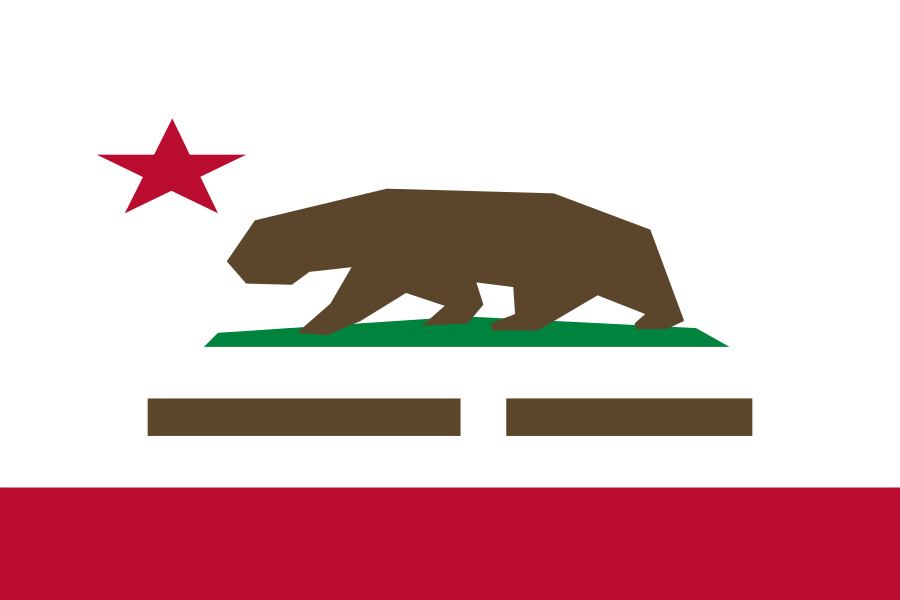

# svg-flags

Clean, Xcode-compatible SVG flags with official colors in multiple shapes.

**[Browse the gallery](https://motomatic-llc.github.io/svg-flags)**

## Why this exists

I use [HatScripts/circle-flags](https://github.com/HatScripts/circle-flags) in many different projects — it's a fantastic collection of 400+ minimal circular SVG flags. But I keep running into the same issues:

**Xcode can't render them.** The circle-flags SVGs use `<mask>` elements for circular clipping. Xcode's SVG renderer has limited support — it doesn't handle masks, CSS `<style>` blocks, or complex filters. Importing these into an Xcode asset catalog produces blank or broken images. This project uses `<clipPath>` instead, which Xcode handles correctly.

**Circle shape isn't always enough.** Circular flags work great for profile badges and map markers, but many UI contexts call for rectangular flags — table rows, settings screens, country pickers, informational displays. This project provides multiple shape variants from simplified icons to full-detail flags.

**Colors are simplified.** circle-flags maps every flag to an 11-color palette for visual consistency. That's a reasonable design choice, but it means the US flag uses &nbsp;`#d80027` instead of Old Glory Red &nbsp;`#B31942`, and &nbsp;`#0052b4` instead of Old Glory Blue &nbsp;`#0A3161`. This project uses the actual official flag colors, sourced from Wikipedia/Wikimedia Commons SVGs, and documents every color below.

| circle-flags | svg-flags |
|:---:|:---:|
|  |  |
| Simplified palette | Official colors |

**Symlinks cause problems.** The language flags in circle-flags are symlinks pointing to country flags. Symlinks break in Xcode asset catalogs, some npm packaging, and cross-platform workflows. This project duplicates files instead — every flag is a standalone SVG.

## Credits

This project is based on and inspired by [HatScripts/circle-flags](https://github.com/HatScripts/circle-flags), which is MIT licensed. The SVG geometry for circle and rect variants was adapted from that project, with modifications for Xcode compatibility and official color accuracy. Full-size variants are based on Wikimedia Commons SVGs.

## Variants

| Variant | Directory | Source | Description |
|---------|-----------|--------|-------------|
| Circle | `circle/` | circle-flags | 512×512 circular flags, `<mask>` → `<clipPath>`, real colors |
| Rect | `rect/` | circle-flags | 512×512 square, circle-flags geometry without circular clip |
| Full-size simplified | `full-size-simplified/` | circle-flags | True aspect ratio, simplified geometry for complicated flags, real colors |
| Full-size | `full-size/` | Wikipedia | True proportions & detail, based on Wikimedia Commons SVGs |

**circle** and **rect** use the same simplified geometry from circle-flags — just with official colors and Xcode-compatible SVG elements. **full-size-simplified** uses that geometry at the flag's true aspect ratio. **full-size** uses the actual detailed flag SVGs from Wikipedia with proper proportions and accurate geometry.

## Border

Circle and rect variants of mostly-white flags (like Japan) include a subtle grey border ( `#cdcfd3`) to prevent them from disappearing into white backgrounds.

The border is inside the `<clipPath>` group so only the inner half of the stroke is visible — the flag stays full-size. It's marked with a `<!-- border -->` comment:

```xml
<!-- border --><circle cx="256" cy="256" r="256" fill="none" stroke="#cdcfd3" stroke-width="4"/>
```

To remove it, delete the line or strip all borders with:

```bash
sed -i '' '/<!-- border -->/d' circle/**/*.svg rect/**/*.svg
```

## Structure

```
svg-flags/
├── circle/
│   ├── countries/     # UN member states (ISO 3166-1 alpha-2)
│   ├── other/
│   │   ├── locales/   # Non-UN places (tw.svg, northern-cyprus.svg, ...)
│   │   └── orgs/      # Organizations & symbols (nato.svg, un.svg, ...)
│   ├── historical/    # Former states (confederacy.svg, ussr.svg, ...)
│   ├── states/        # Subdivisions (us/ca.svg, us/ny.svg, ...)
│   └── languages/     # Language codes (en.svg, es.svg, ...)
├── rect/
│   └── (same subcategories)
├── full-size-simplified/
│   └── (same subcategories)
├── full-size/
│   └── (same subcategories)
└── index.html         # Visual gallery (open in browser)
```

## Categories

- **countries/** — UN member states, using [ISO 3166-1 alpha-2](https://en.wikipedia.org/wiki/ISO_3166-1_alpha-2) codes
- **other/** — Two subcategories:
  - **other/locales/** — Places with widely recognized flags that are not UN member states (e.g. Taiwan, Northern Cyprus, Kosovo)
  - **other/orgs/** — Organizations, symbols, and novelty flags (e.g. NATO, UN, Olympics, checkered flag)
- **historical/** — Flags of former states and defunct entities (e.g. Confederate battle flag, Soviet Union, Prussia)
- **states/** — Subnational divisions (e.g. US states, Canadian provinces), using [ISO 3166-2](https://en.wikipedia.org/wiki/ISO_3166-2) codes
- **languages/** — Language flags (duplicated files, not symlinks)

## Progress

### Countries (UN member states)

| Code | Name | Circle | Rect | Simplified | Full-size | Colors | Source |
|------|------|:------:|:----:|:----------:|:---------:|--------|--------|
| `fr` | [France](https://en.wikipedia.org/wiki/France) |  |  |  | [✓](full-size/countries/fr.svg) | &nbsp;`#002654`<br>&nbsp;`#CE1126` | [Wikipedia](https://en.wikipedia.org/wiki/File:Flag_of_France.svg) |
| `gr` | [Greece](https://en.wikipedia.org/wiki/Greece) |  |  |  | [✓](full-size/countries/gr.svg) | &nbsp;`#0D5EAF` | [Wikipedia](https://en.wikipedia.org/wiki/File:Flag_of_Greece.svg) |
| `de` | [Germany](https://en.wikipedia.org/wiki/Germany) |  |  |  | [✓](full-size/countries/de.svg) | &nbsp;`#000000`<br>&nbsp;`#DD0000`<br>&nbsp;`#FFCE00` | [Wikipedia](https://en.wikipedia.org/wiki/File:Flag_of_Germany.svg) |
| `jp` | [Japan](https://en.wikipedia.org/wiki/Japan) |  |  |  | [✓](full-size/countries/jp.svg) | &nbsp;`#BC002D` | [Wikipedia](https://en.wikipedia.org/wiki/File:Flag_of_Japan.svg) |
| `gb` | [United Kingdom](https://en.wikipedia.org/wiki/United_Kingdom) |  |  |  | [✓](full-size/countries/gb.svg) | &nbsp;`#C8102E`<br>&nbsp;`#012169` | [Wikipedia](https://en.wikipedia.org/wiki/File:Flag_of_the_United_Kingdom.svg) |
| `us` | [United States](https://en.wikipedia.org/wiki/United_States) |  |  |  | [✓](full-size/countries/us.svg) | &nbsp;`#B31942`<br>&nbsp;`#0A3161` | [Wikimedia](https://commons.wikimedia.org/wiki/File:Flag_of_the_United_States.svg) |
| `af` | [Afghanistan](https://en.wikipedia.org/wiki/Afghanistan) | | | | | | |
| `al` | [Albania](https://en.wikipedia.org/wiki/Albania) | | | | | | |
| `dz` | [Algeria](https://en.wikipedia.org/wiki/Algeria) | | | | | | |
| `ad` | [Andorra](https://en.wikipedia.org/wiki/Andorra) | | | | | | |
| `ao` | [Angola](https://en.wikipedia.org/wiki/Angola) | | | | | | |
| `ag` | [Antigua and Barbuda](https://en.wikipedia.org/wiki/Antigua_and_Barbuda) | | | | | | |
| `ar` | [Argentina](https://en.wikipedia.org/wiki/Argentina) | | | | | | |
| `am` | [Armenia](https://en.wikipedia.org/wiki/Armenia) | | | | | | |
| `au` | [Australia](https://en.wikipedia.org/wiki/Australia) | | | | | | |
| `at` | [Austria](https://en.wikipedia.org/wiki/Austria) | | | | | | |
| `az` | [Azerbaijan](https://en.wikipedia.org/wiki/Azerbaijan) | | | | | | |
| `bs` | [Bahamas](https://en.wikipedia.org/wiki/The_Bahamas) | | | | | | |
| `bh` | [Bahrain](https://en.wikipedia.org/wiki/Bahrain) | | | | | | |
| `bd` | [Bangladesh](https://en.wikipedia.org/wiki/Bangladesh) | | | | | | |
| `bb` | [Barbados](https://en.wikipedia.org/wiki/Barbados) | | | | | | |
| `by` | [Belarus](https://en.wikipedia.org/wiki/Belarus) | | | | | | |
| `be` | [Belgium](https://en.wikipedia.org/wiki/Belgium) | | | | | | |
| `bz` | [Belize](https://en.wikipedia.org/wiki/Belize) | | | | | | |
| `bj` | [Benin](https://en.wikipedia.org/wiki/Benin) | | | | | | |
| `bt` | [Bhutan](https://en.wikipedia.org/wiki/Bhutan) | | | | | | |
| `bo` | [Bolivia](https://en.wikipedia.org/wiki/Bolivia) | | | | | | |
| `ba` | [Bosnia and Herzegovina](https://en.wikipedia.org/wiki/Bosnia_and_Herzegovina) | | | | | | |
| `bw` | [Botswana](https://en.wikipedia.org/wiki/Botswana) | | | | | | |
| `br` | [Brazil](https://en.wikipedia.org/wiki/Brazil) | | | | | | |
| `bn` | [Brunei](https://en.wikipedia.org/wiki/Brunei) | | | | | | |
| `bg` | [Bulgaria](https://en.wikipedia.org/wiki/Bulgaria) | | | | | | |
| `bf` | [Burkina Faso](https://en.wikipedia.org/wiki/Burkina_Faso) | | | | | | |
| `bi` | [Burundi](https://en.wikipedia.org/wiki/Burundi) | | | | | | |
| `cv` | [Cabo Verde](https://en.wikipedia.org/wiki/Cape_Verde) | | | | | | |
| `kh` | [Cambodia](https://en.wikipedia.org/wiki/Cambodia) | | | | | | |
| `cm` | [Cameroon](https://en.wikipedia.org/wiki/Cameroon) | | | | | | |
| `ca` | [Canada](https://en.wikipedia.org/wiki/Canada) | | | | | | |
| `cf` | [Central African Republic](https://en.wikipedia.org/wiki/Central_African_Republic) | | | | | | |
| `td` | [Chad](https://en.wikipedia.org/wiki/Chad) | | | | | | |
| `cl` | [Chile](https://en.wikipedia.org/wiki/Chile) | | | | | | |
| `cn` | [China](https://en.wikipedia.org/wiki/China) | | | | | | |
| `co` | [Colombia](https://en.wikipedia.org/wiki/Colombia) | | | | | | |
| `km` | [Comoros](https://en.wikipedia.org/wiki/Comoros) | | | | | | |
| `cg` | [Congo](https://en.wikipedia.org/wiki/Republic_of_the_Congo) | | | | | | |
| `cd` | [Congo (DRC)](https://en.wikipedia.org/wiki/Democratic_Republic_of_the_Congo) | | | | | | |
| `cr` | [Costa Rica](https://en.wikipedia.org/wiki/Costa_Rica) | | | | | | |
| `hr` | [Croatia](https://en.wikipedia.org/wiki/Croatia) | | | | | | |
| `cu` | [Cuba](https://en.wikipedia.org/wiki/Cuba) | | | | | | |
| `cy` | [Cyprus](https://en.wikipedia.org/wiki/Cyprus) | | | | | | |
| `cz` | [Czechia](https://en.wikipedia.org/wiki/Czech_Republic) | | | | | | |
| `ci` | [Côte d'Ivoire](https://en.wikipedia.org/wiki/Ivory_Coast) | | | | | | |
| `dk` | [Denmark](https://en.wikipedia.org/wiki/Denmark) | | | | | | |
| `dj` | [Djibouti](https://en.wikipedia.org/wiki/Djibouti) | | | | | | |
| `dm` | [Dominica](https://en.wikipedia.org/wiki/Dominica) | | | | | | |
| `do` | [Dominican Republic](https://en.wikipedia.org/wiki/Dominican_Republic) | | | | | | |
| `ec` | [Ecuador](https://en.wikipedia.org/wiki/Ecuador) | | | | | | |
| `eg` | [Egypt](https://en.wikipedia.org/wiki/Egypt) | | | | | | |
| `sv` | [El Salvador](https://en.wikipedia.org/wiki/El_Salvador) | | | | | | |
| `gq` | [Equatorial Guinea](https://en.wikipedia.org/wiki/Equatorial_Guinea) | | | | | | |
| `er` | [Eritrea](https://en.wikipedia.org/wiki/Eritrea) | | | | | | |
| `ee` | [Estonia](https://en.wikipedia.org/wiki/Estonia) | | | | | | |
| `sz` | [Eswatini](https://en.wikipedia.org/wiki/Eswatini) | | | | | | |
| `et` | [Ethiopia](https://en.wikipedia.org/wiki/Ethiopia) | | | | | | |
| `fj` | [Fiji](https://en.wikipedia.org/wiki/Fiji) | | | | | | |
| `fi` | [Finland](https://en.wikipedia.org/wiki/Finland) | | | | | | |
| `ga` | [Gabon](https://en.wikipedia.org/wiki/Gabon) | | | | | | |
| `gm` | [Gambia](https://en.wikipedia.org/wiki/The_Gambia) | | | | | | |
| `ge` | [Georgia](https://en.wikipedia.org/wiki/Georgia_(country)) | | | | | | |
| `gh` | [Ghana](https://en.wikipedia.org/wiki/Ghana) | | | | | | |
| `gd` | [Grenada](https://en.wikipedia.org/wiki/Grenada) | | | | | | |
| `gt` | [Guatemala](https://en.wikipedia.org/wiki/Guatemala) | | | | | | |
| `gn` | [Guinea](https://en.wikipedia.org/wiki/Guinea) | | | | | | |
| `gw` | [Guinea-Bissau](https://en.wikipedia.org/wiki/Guinea-Bissau) | | | | | | |
| `gy` | [Guyana](https://en.wikipedia.org/wiki/Guyana) | | | | | | |
| `ht` | [Haiti](https://en.wikipedia.org/wiki/Haiti) | | | | | | |
| `hn` | [Honduras](https://en.wikipedia.org/wiki/Honduras) | | | | | | |
| `hu` | [Hungary](https://en.wikipedia.org/wiki/Hungary) | | | | | | |
| `is` | [Iceland](https://en.wikipedia.org/wiki/Iceland) | | | | | | |
| `in` | [India](https://en.wikipedia.org/wiki/India) | | | | | | |
| `id` | [Indonesia](https://en.wikipedia.org/wiki/Indonesia) | | | | | | |
| `ir` | [Iran](https://en.wikipedia.org/wiki/Iran) | | | | | | |
| `iq` | [Iraq](https://en.wikipedia.org/wiki/Iraq) | | | | | | |
| `ie` | [Ireland](https://en.wikipedia.org/wiki/Republic_of_Ireland) | | | | | | |
| `il` | [Israel](https://en.wikipedia.org/wiki/Israel) | | | | | | |
| `it` | [Italy](https://en.wikipedia.org/wiki/Italy) | | | | | | |
| `jm` | [Jamaica](https://en.wikipedia.org/wiki/Jamaica) | | | | | | |
| `jo` | [Jordan](https://en.wikipedia.org/wiki/Jordan) | | | | | | |
| `kz` | [Kazakhstan](https://en.wikipedia.org/wiki/Kazakhstan) | | | | | | |
| `ke` | [Kenya](https://en.wikipedia.org/wiki/Kenya) | | | | | | |
| `ki` | [Kiribati](https://en.wikipedia.org/wiki/Kiribati) | | | | | | |
| `kw` | [Kuwait](https://en.wikipedia.org/wiki/Kuwait) | | | | | | |
| `kg` | [Kyrgyzstan](https://en.wikipedia.org/wiki/Kyrgyzstan) | | | | | | |
| `la` | [Laos](https://en.wikipedia.org/wiki/Laos) | | | | | | |
| `lv` | [Latvia](https://en.wikipedia.org/wiki/Latvia) | | | | | | |
| `lb` | [Lebanon](https://en.wikipedia.org/wiki/Lebanon) | | | | | | |
| `ls` | [Lesotho](https://en.wikipedia.org/wiki/Lesotho) | | | | | | |
| `lr` | [Liberia](https://en.wikipedia.org/wiki/Liberia) | | | | | | |
| `ly` | [Libya](https://en.wikipedia.org/wiki/Libya) | | | | | | |
| `li` | [Liechtenstein](https://en.wikipedia.org/wiki/Liechtenstein) | | | | | | |
| `lt` | [Lithuania](https://en.wikipedia.org/wiki/Lithuania) | | | | | | |
| `lu` | [Luxembourg](https://en.wikipedia.org/wiki/Luxembourg) | | | | | | |
| `mg` | [Madagascar](https://en.wikipedia.org/wiki/Madagascar) | | | | | | |
| `mw` | [Malawi](https://en.wikipedia.org/wiki/Malawi) | | | | | | |
| `my` | [Malaysia](https://en.wikipedia.org/wiki/Malaysia) | | | | | | |
| `mv` | [Maldives](https://en.wikipedia.org/wiki/Maldives) | | | | | | |
| `ml` | [Mali](https://en.wikipedia.org/wiki/Mali) | | | | | | |
| `mt` | [Malta](https://en.wikipedia.org/wiki/Malta) | | | | | | |
| `mh` | [Marshall Islands](https://en.wikipedia.org/wiki/Marshall_Islands) | | | | | | |
| `mr` | [Mauritania](https://en.wikipedia.org/wiki/Mauritania) | | | | | | |
| `mu` | [Mauritius](https://en.wikipedia.org/wiki/Mauritius) | | | | | | |
| `mx` | [Mexico](https://en.wikipedia.org/wiki/Mexico) | | | | | | |
| `fm` | [Micronesia](https://en.wikipedia.org/wiki/Federated_States_of_Micronesia) | | | | | | |
| `md` | [Moldova](https://en.wikipedia.org/wiki/Moldova) | | | | | | |
| `mc` | [Monaco](https://en.wikipedia.org/wiki/Monaco) | | | | | | |
| `mn` | [Mongolia](https://en.wikipedia.org/wiki/Mongolia) | | | | | | |
| `me` | [Montenegro](https://en.wikipedia.org/wiki/Montenegro) | | | | | | |
| `ma` | [Morocco](https://en.wikipedia.org/wiki/Morocco) | | | | | | |
| `mz` | [Mozambique](https://en.wikipedia.org/wiki/Mozambique) | | | | | | |
| `mm` | [Myanmar](https://en.wikipedia.org/wiki/Myanmar) | | | | | | |
| `na` | [Namibia](https://en.wikipedia.org/wiki/Namibia) | | | | | | |
| `nr` | [Nauru](https://en.wikipedia.org/wiki/Nauru) | | | | | | |
| `np` | [Nepal](https://en.wikipedia.org/wiki/Nepal) | | | | | | |
| `nl` | [Netherlands](https://en.wikipedia.org/wiki/Netherlands) | | | | | | |
| `nz` | [New Zealand](https://en.wikipedia.org/wiki/New_Zealand) | | | | | | |
| `ni` | [Nicaragua](https://en.wikipedia.org/wiki/Nicaragua) | | | | | | |
| `ne` | [Niger](https://en.wikipedia.org/wiki/Niger) | | | | | | |
| `ng` | [Nigeria](https://en.wikipedia.org/wiki/Nigeria) | | | | | | |
| `kp` | [North Korea](https://en.wikipedia.org/wiki/North_Korea) | | | | | | |
| `mk` | [North Macedonia](https://en.wikipedia.org/wiki/North_Macedonia) | | | | | | |
| `no` | [Norway](https://en.wikipedia.org/wiki/Norway) | | | | | | |
| `om` | [Oman](https://en.wikipedia.org/wiki/Oman) | | | | | | |
| `pk` | [Pakistan](https://en.wikipedia.org/wiki/Pakistan) | | | | | | |
| `pw` | [Palau](https://en.wikipedia.org/wiki/Palau) | | | | | | |
| `pa` | [Panama](https://en.wikipedia.org/wiki/Panama) | | | | | | |
| `pg` | [Papua New Guinea](https://en.wikipedia.org/wiki/Papua_New_Guinea) | | | | | | |
| `py` | [Paraguay](https://en.wikipedia.org/wiki/Paraguay) | | | | | | |
| `pe` | [Peru](https://en.wikipedia.org/wiki/Peru) | | | | | | |
| `ph` | [Philippines](https://en.wikipedia.org/wiki/Philippines) | | | | | | |
| `pl` | [Poland](https://en.wikipedia.org/wiki/Poland) | | | | | | |
| `pt` | [Portugal](https://en.wikipedia.org/wiki/Portugal) | | | | | | |
| `qa` | [Qatar](https://en.wikipedia.org/wiki/Qatar) | | | | | | |
| `ro` | [Romania](https://en.wikipedia.org/wiki/Romania) | | | | | | |
| `ru` | [Russia](https://en.wikipedia.org/wiki/Russia) | | | | | | |
| `rw` | [Rwanda](https://en.wikipedia.org/wiki/Rwanda) | | | | | | |
| `kn` | [Saint Kitts and Nevis](https://en.wikipedia.org/wiki/Saint_Kitts_and_Nevis) | | | | | | |
| `lc` | [Saint Lucia](https://en.wikipedia.org/wiki/Saint_Lucia) | | | | | | |
| `vc` | [Saint Vincent and the Grenadines](https://en.wikipedia.org/wiki/Saint_Vincent_and_the_Grenadines) | | | | | | |
| `ws` | [Samoa](https://en.wikipedia.org/wiki/Samoa) | | | | | | |
| `sm` | [San Marino](https://en.wikipedia.org/wiki/San_Marino) | | | | | | |
| `sa` | [Saudi Arabia](https://en.wikipedia.org/wiki/Saudi_Arabia) | | | | | | |
| `sn` | [Senegal](https://en.wikipedia.org/wiki/Senegal) | | | | | | |
| `rs` | [Serbia](https://en.wikipedia.org/wiki/Serbia) | | | | | | |
| `sc` | [Seychelles](https://en.wikipedia.org/wiki/Seychelles) | | | | | | |
| `sl` | [Sierra Leone](https://en.wikipedia.org/wiki/Sierra_Leone) | | | | | | |
| `sg` | [Singapore](https://en.wikipedia.org/wiki/Singapore) | | | | | | |
| `sk` | [Slovakia](https://en.wikipedia.org/wiki/Slovakia) | | | | | | |
| `si` | [Slovenia](https://en.wikipedia.org/wiki/Slovenia) | | | | | | |
| `sb` | [Solomon Islands](https://en.wikipedia.org/wiki/Solomon_Islands) | | | | | | |
| `so` | [Somalia](https://en.wikipedia.org/wiki/Somalia) | | | | | | |
| `za` | [South Africa](https://en.wikipedia.org/wiki/South_Africa) | | | | | | |
| `kr` | [South Korea](https://en.wikipedia.org/wiki/South_Korea) | | | | | | |
| `ss` | [South Sudan](https://en.wikipedia.org/wiki/South_Sudan) | | | | | | |
| `es` | [Spain](https://en.wikipedia.org/wiki/Spain) | | | | | | |
| `lk` | [Sri Lanka](https://en.wikipedia.org/wiki/Sri_Lanka) | | | | | | |
| `sd` | [Sudan](https://en.wikipedia.org/wiki/Sudan) | | | | | | |
| `sr` | [Suriname](https://en.wikipedia.org/wiki/Suriname) | | | | | | |
| `se` | [Sweden](https://en.wikipedia.org/wiki/Sweden) | | | | | | |
| `ch` | [Switzerland](https://en.wikipedia.org/wiki/Switzerland) | | | | | | |
| `sy` | [Syria](https://en.wikipedia.org/wiki/Syria) | | | | | | |
| `st` | [São Tomé and Príncipe](https://en.wikipedia.org/wiki/S%C3%A3o_Tom%C3%A9_and_Pr%C3%ADncipe) | | | | | | |
| `tj` | [Tajikistan](https://en.wikipedia.org/wiki/Tajikistan) | | | | | | |
| `tz` | [Tanzania](https://en.wikipedia.org/wiki/Tanzania) | | | | | | |
| `th` | [Thailand](https://en.wikipedia.org/wiki/Thailand) | | | | | | |
| `tl` | [Timor-Leste](https://en.wikipedia.org/wiki/East_Timor) | | | | | | |
| `tg` | [Togo](https://en.wikipedia.org/wiki/Togo) | | | | | | |
| `to` | [Tonga](https://en.wikipedia.org/wiki/Tonga) | | | | | | |
| `tt` | [Trinidad and Tobago](https://en.wikipedia.org/wiki/Trinidad_and_Tobago) | | | | | | |
| `tn` | [Tunisia](https://en.wikipedia.org/wiki/Tunisia) | | | | | | |
| `tr` | [Turkey](https://en.wikipedia.org/wiki/Turkey) | | | | | | |
| `tm` | [Turkmenistan](https://en.wikipedia.org/wiki/Turkmenistan) | | | | | | |
| `tv` | [Tuvalu](https://en.wikipedia.org/wiki/Tuvalu) | | | | | | |
| `ug` | [Uganda](https://en.wikipedia.org/wiki/Uganda) | | | | | | |
| `ua` | [Ukraine](https://en.wikipedia.org/wiki/Ukraine) | | | | | | |
| `ae` | [United Arab Emirates](https://en.wikipedia.org/wiki/United_Arab_Emirates) | | | | | | |
| `uy` | [Uruguay](https://en.wikipedia.org/wiki/Uruguay) | | | | | | |
| `uz` | [Uzbekistan](https://en.wikipedia.org/wiki/Uzbekistan) | | | | | | |
| `vu` | [Vanuatu](https://en.wikipedia.org/wiki/Vanuatu) | | | | | | |
| `ve` | [Venezuela](https://en.wikipedia.org/wiki/Venezuela) | | | | | | |
| `vn` | [Vietnam](https://en.wikipedia.org/wiki/Vietnam) | | | | | | |
| `ye` | [Yemen](https://en.wikipedia.org/wiki/Yemen) | | | | | | |
| `zm` | [Zambia](https://en.wikipedia.org/wiki/Zambia) | | | | | | |
| `zw` | [Zimbabwe](https://en.wikipedia.org/wiki/Zimbabwe) | | | | | | |

### Other locales (non-UN entities)

| Code | Name | Circle | Rect | Simplified | Full-size | Colors | Source |
|------|------|:------:|:----:|:----------:|:---------:|--------|--------|
| `xk` | [Kosovo](https://en.wikipedia.org/wiki/Kosovo) | | | | | | |
| `northern-cyprus` | [Northern Cyprus](https://en.wikipedia.org/wiki/Northern_Cyprus) | | | | | | |
| `tw` | [Taiwan](https://en.wikipedia.org/wiki/Taiwan) | | | | | | |

### Organizations & symbols

| Code | Name | Circle | Rect | Simplified | Full-size | Colors | Source |
|------|------|:------:|:----:|:----------:|:---------:|--------|--------|
| `checkered` | [Checkered flag](https://en.wikipedia.org/wiki/Racing_flags#Chequered_flag) |  |  | | | &nbsp;`#000000` | — |
| `nato` | [NATO](https://en.wikipedia.org/wiki/NATO) |  |  | | [✓](full-size/other/orgs/nato.svg) | &nbsp;`#004990` | [Wikipedia](https://en.wikipedia.org/wiki/File:Flag_of_NATO.svg) |
| `olympics` | [Olympics](https://en.wikipedia.org/wiki/Olympic_symbols) |  |  | | | &nbsp;`#0081C8`<br>&nbsp;`#EE334E`<br>&nbsp;`#FCB131`<br>&nbsp;`#00A651` | [Wikipedia](https://en.wikipedia.org/wiki/File:Olympic_flag.svg) |
| `un` | [United Nations](https://en.wikipedia.org/wiki/United_Nations) |  |  | | | &nbsp;`#009EDB` | [Wikipedia](https://en.wikipedia.org/wiki/File:Flag_of_the_United_Nations.svg) |

### US states

| Code | Name | Circle | Rect | Simplified | Full-size | Colors | Source |
|------|------|:------:|:----:|:----------:|:---------:|--------|--------|
| `us/ca` | [California](https://en.wikipedia.org/wiki/California) |  |  |  | [✓](full-size/states/us/ca.svg) | &nbsp;`#BA0C2F`<br>&nbsp;`#5C462B`<br>&nbsp;`#00843D`<br>&nbsp;`#B58150` | [Wikimedia](https://commons.wikimedia.org/wiki/File:Flag_of_California.svg) |

### Historical

| Code | Name | Circle | Rect | Simplified | Full-size | Colors | Source |
|------|------|:------:|:----:|:----------:|:---------:|--------|--------|
| `confederacy` | [Confederate battle flag](https://commons.wikimedia.org/wiki/File:Battle_flag_of_the_Confederate_States_of_America_(3-5).svg) |  |  |  | [✓](full-size/historical/confederacy.svg) | &nbsp;`#bf0a30`<br>&nbsp;`#002868` | [Wikimedia](https://commons.wikimedia.org/wiki/File:Battle_flag_of_the_Confederate_States_of_America_(3-5).svg) |

## SVG Design Rules

All SVGs in this project follow these rules for maximum compatibility:

- No `<mask>` elements (Xcode doesn't support them)
- No `<style>` tags or CSS
- No `class` attributes
- No `<use>` / `xlink:href` references (Xcode has inconsistent support)
- No symlinks — every file is standalone
- Circle variants use `<clipPath>` with `<circle>` for clipping
- All styling via inline `fill` attributes
- `viewBox`-based sizing for clean scaling
- Official flag colors sourced from [Wikipedia](https://en.wikipedia.org/wiki/Main_Page)/[Wikimedia Commons](https://commons.wikimedia.org/) SVGs (see Colors column in progress tables)

## Usage

### Xcode Asset Catalog

Drag any SVG directly into your asset catalog. Works out of the box — no conversion needed.

### SwiftUI

```swift
Image("us") // after adding to asset catalog
```

### HTML

```html

```

## License

MIT — see [LICENSE](LICENSE). Based on [circle-flags](https://github.com/HatScripts/circle-flags) by HatScripts.
